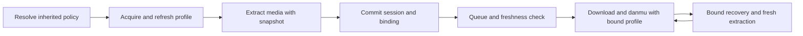

# Multiple cookie profiles: implementation plan

Status: implementation complete; all eight work packages and the combined post-pull Windows validation are complete. Final evidence and platform limits are recorded under “Astra completion” below.

Prepared: 2026-09-30. Scope: rust-srec configuration, credentials, monitoring, recording, REST interfaces, and frontend. The user requested fixed selection plus both rotation and failover. Defaults and implementation choices below are recommendations that make that scope concrete.

## 1. Intended behavior and scope

A cookie profile represents one account's complete authentication material for one platform. Its cookie string can already contain several `name=value` pairs. Multiple profiles represent separate accounts; their cookie strings are never concatenated.

Users can save named profiles, select one explicitly, or choose an ordered pool. A pool supports round-robin selection or primary/backup selection, with optional failover. Streamer and template configuration can override a platform's selection without copying its secrets.

Required outcomes:

- Existing installations retain their current cookie precedence, refresh target, and single-account behavior until a scope is converted. Shared admission/deadline changes, typed detection-error corrections, and isolation of explicit raw-cookie overrides are explicit exceptions described in sections 6, 7, and 9.
- Fixed selection always uses the selected account, including refresh and re-login.
- Rotation distributes independent checks across eligible accounts.
- A recording uses a consistent account for extraction, download startup, URL renewal, and danmu connections.
- Confirmed credential failures can cause bounded failover without incorrectly declaring the streamer offline.
- Each account has independent refresh, validation, cooldown, and stale-write protection.
- Config reads, UI rendering, and status queries never consume a rotation slot.
- Restart, outbox replay, queue waits, and session resume preserve account identity or force fresh extraction before starting work.

The first release includes all of these outcomes. Implementation milestones below are dependency steps, not permission to call the feature complete after fixed selection alone.

Outside this release: weighted/random selection, least-loaded selection, per-account recording quotas, proxy pools, simultaneous recordings of one streamer with several accounts, distributed multi-process coordination, a new secrets-encryption system, and multi-account command-line configuration. Shared extractor changes still require validation of CLI consumers.

## 2. Current implementation and affected seams

Paths here are relative to this plan. Proposed files are identified separately in section 15.

| Concern | Existing implementation | Required change |
| --- | --- | --- |
| Config storage | [database/models/config.rs](../rust-srec/src/database/models/config.rs) | Platform/template scalar cookies and streamer JSON remain the legacy representation; add typed selection settings. |
| Inheritance | [config/resolver.rs](../rust-srec/src/config/resolver.rs), [config/merged.rs](../rust-srec/src/config/merged.rs) | Resolve a policy and provenance, independently of account acquisition. |
| Cached context | [config/context.rs](../rust-srec/src/config/context.rs), [config/cache.rs](../rust-srec/src/config/cache.rs) | Cache policy, not a randomly chosen profile or profile secrets. |
| Credential identity | [credentials/types.rs](../rust-srec/src/credentials/types.rs) | Add profile identity and revision while retaining a legacy source variant. |
| Refresh and persistence | [credentials/service.rs](../rust-srec/src/credentials/service.rs), [credentials/tracker.rs](../rust-srec/src/credentials/tracker.rs), [repositories/credential_store.rs](../rust-srec/src/database/repositories/credential_store.rs) | Profile-scoped locking, health, conditional writes, and notifications. |
| Detection | [monitor/service.rs](../rust-srec/src/monitor/service.rs), [monitor/detector.rs](../rust-srec/src/monitor/detector.rs) | Acquire credentials once for each logical operation and preserve typed failure reasons. |
| Durable handoff | [monitor/events.rs](../rust-srec/src/monitor/events.rs), [repositories/monitor_outbox.rs](../rust-srec/src/database/repositories/monitor_outbox.rs) | Carry non-secret binding identity and reject stale/replayed binding changes. |
| Recording and resume | [runtime_coordinator/download_pipeline.rs](../rust-srec/src/services/runtime_coordinator/download_pipeline.rs), [session/download_start.rs](../rust-srec/src/session/download_start.rs), [session/lifecycle.rs](../rust-srec/src/session/lifecycle.rs) | Pin the successful account across fresh starts, queue refreshes, and hysteresis resume. |
| Download feedback | [downloader/manager/attempt.rs](../rust-srec/src/downloader/manager/attempt.rs), [session/classifier.rs](../rust-srec/src/session/classifier.rs) | Account-aware recovery at the coordinator; preserve existing engine finalization. |
| Parse/player | [api/routes/parse.rs](../rust-srec/src/api/routes/parse.rs), [api/routes/stream_proxy.rs](../rust-srec/src/api/routes/stream_proxy.rs) | Share account selection; bind a parsed playback source to its authentication context. |
| Management | [api/routes/credentials.rs](../rust-srec/src/api/routes/credentials.rs), [frontend network editor](../rust-srec/frontend/src/components/config/shared/network-settings-card.tsx) | Profile CRUD, per-profile actions, and selection editor. |
| Import/export | [config/backup.rs](../rust-srec/src/config/backup.rs), [services/config_import.rs](../rust-srec/src/services/config_import.rs) | Export profiles and remap all references transactionally. |

The current resolver chooses one credential source. Refresh trackers and locks identify that source by its owning config scope. Downloads later read `merged_config.cookies`, and reactive login persistence reloads the scope after extraction. Those assumptions must be replaced together: changing only the scalar field to a list would allow URL/account mismatches and writes to the wrong account.

The existing monitor batch detector has no implemented platform batch path. Do not introduce one for this feature. The existing parse batch endpoint remains supported, with an independent credential operation for each URL.

## 3. Selection contract

| Setting | Selection and failure behavior |
| --- | --- |
| `inherit` | Continue to the next configuration layer, skipping local legacy material. At platform scope it has the same anonymous authentication result as `none`. |
| `none` | Stop inheritance and suppress configured authentication material. Platform-required anonymous cookies may still be generated by an extractor. |
| `fixed` | Use exactly one profile. Supported refresh/re-login can repair it; another account is never selected. |
| `pool`, `round_robin` | Reserve the next eligible starting profile for an independent operation. On eligible failure, traverse the remaining pool if failover is enabled. |
| `pool`, `priority` | Begin with the first eligible profile in the saved order. Try later profiles on eligible failure if failover is enabled. |

Recommended defaults: `round_robin`, `failover: true`, `max_attempts: 3`. New profile creation does not change a saved selection or automatically enlarge a pool.

Example selections:

```json
{ "mode": "inherit" }
```

```json
{ "mode": "none" }
```

```json
{ "mode": "fixed", "credential_id": "account-a" }
```

```json
{
  "mode": "pool",
  "credential_ids": ["account-a", "account-b", "account-c"],
  "strategy": "round_robin",
  "failover": true,
  "max_attempts": 3
}
```

Use tagged Rust enums and matching Zod discriminated unions. Reject unknown mode/strategy values, unknown fields inside a selection, duplicate IDs, blank IDs, and empty pools. Permit one-member pools. Bound `max_attempts` to 1..10; it counts candidate preparation/extraction cycles, including failed preparation before extraction and a repeated extraction after refresh. A successful proactive refresh belongs to the initial cycle; a repair after an extraction failure consumes another cycle. Fixed mode allows at most an initial cycle and one cycle after an eligible repair. Provider status checks and repairs each have a once-per-profile-per-operation bound and share the same overall deadline.

Omitted fields on update mean unchanged. Resetting a selection uses the explicit `inherit` object. Do not use an empty cookie string, an empty array, or JSON null as a new inheritance control. Database NULL means the scope has no new selection and may still need legacy interpretation.

### Rotation and availability

- Cursor identity is the resolved policy owner, platform ID, and selection generation. Streamers inheriting the same policy share its cursor. Separate overrides have separate cursors.
- Reserve and advance once per independent operation under a short synchronous critical section. Failover traverses a local ordered candidate list without advancing the global cursor again.
- Share health by profile ID across all policies. Unknown/unvalidated profiles are eligible; lack of a validation provider is not a failure.
- Skip administratively disabled profiles, confirmed invalid profiles, and profiles with an unexpired cooldown.
- With `failover: false`, normal selection still skips already-unavailable profiles, but an operation does not switch accounts after its chosen profile fails.
- A profile may serve concurrent operations. This release promises rotation, not a per-account concurrency quota.
- Cursors are in memory and may restart from the first eligible profile after restart. Credential health and active-session bindings persist.
- A successful offline result ends the operation. Do not try other accounts to search for a different live result.
- Pool exhaustion returns a typed unavailable result with an optional retry time. It never falls through to a different scope or anonymous authentication.
- Priority mode reconsiders the primary on future unbound operations after recovery; it does not preempt a running recording on a backup.

Define selection generation as an opaque fingerprint of canonical policy content and its resolved owner/platform identities. It contains no secret material and does not change on label edits or credential refresh. Template reassignment must separately revalidate streamer-local references against the new ownership context, even when the fingerprint is unchanged. Session binding epochs, rather than this content fingerprint, provide monotonic ordering for binding changes. Prune cursor entries when policies are replaced/retired and bound idle entry retention.

## 4. Ownership and inheritance

Profiles have one platform and one owner: platform, template, or streamer. There are no global or cross-platform profiles.

Availability rules:

| Selection owner | Profiles it may reference |
| --- | --- |
| Platform | Profiles owned by that platform. |
| Template, for platform P | Profiles owned by that template for P, or by platform P. |
| Streamer | Profiles owned by that streamer, its assigned template for its platform, or its platform. |

The matching platform is a platform-config ID. Existing platform-name uniqueness is case-sensitive, while some consumers compare names without case. New template selections live inside `platform_overrides[platform_name].credential_selection`. New streamer selections live inside `streamer_specific_config.credential_selection`. Platform selections use a new nullable JSON-text column, `credential_selection`. Require new managed override keys to match the stored platform name exactly; return the canonical name in validation errors. Do not silently merge existing differently cased keys. If legacy rows are ambiguous under a consumer's case-insensitive lookup, require an explicit platform ID for conversion and management.

Resolution proceeds in this exact order:

1. Streamer: explicit new policy; otherwise the current legacy streamer-cookie behavior.
2. Assigned template for this platform: explicit new policy; otherwise the legacy adapter's top-level template cookies and platform-specific refresh/access tokens.
3. Platform: explicit new policy; otherwise current legacy platform cookies or supported re-login-only material.
4. Anonymous operation if no layer supplies credentials.

An explicit `inherit` skips both new and legacy credentials at that layer. An explicit `none` terminates resolution. A fixed/pool policy is a complete override; do not union lists or inherit tokens from another layer. The legacy adapter must retain two distinct outputs, since current cookie consumption and refresh-source selection disagree:

| Legacy consumer | Contract before conversion |
| --- | --- |
| Merged cookies | Apply platform, template, then streamer; the last present string wins, including empty/whitespace strings. Absent/null does not override. |
| Refresh target | Choose the first nonblank cookie source in streamer, template, platform order. SOOP platform login material can supply a login-only source. |
| Monitor extraction | Start with merged cookies; a successful refresh replaces cookies for that check only with the returned material. A failed/no-op refresh keeps the existing best-effort behavior. |
| Download and danmu | Retain the current merged-config read at startup for a legacy session; do not silently substitute the refresh-source cookie. |
| Registered parse | Use the same merged-cookie/refresh-source split unless explicit request cookies were supplied. |
| Unregistered parse | Use the matching platform's nonblank cookies and supported login material; explicit request cookies, including empty, suppress stored refresh. |

Create golden fixtures before replacing these paths: absent/null/empty/whitespace/nonblank at each layer, refresh success/no-op/failure, registered/unregistered parse, and download/danmu consumers. A blank streamer cookie with a nonblank parent intentionally has distinct effective cookies and refresh provenance. For mixed legacy/managed hierarchies, an explicit managed policy is an inheritance boundary: a higher legacy override must not obtain a refresh source or login material by reading through a lower managed/none policy. Preserve the two legacy outputs within the uninterrupted legacy portion only. Once converted, a managed binding replaces this split with a consistent snapshot for all consumers.

Legacy SOOP re-login material is special: `config/resolver.rs` and `database/repositories/credential_store.rs` obtain username/password from the platform row even when cookies belong to a template or streamer. Preserve that rule for entirely legacy resolution. Managed profiles never inherit those fields. Conversion must preview the source of copied login material and explain that subsequent platform password changes no longer propagate to the new bundle. A manually created cookie-only profile has no re-login capability until its own login material is supplied.

Strip `credential_selection`, `cookies`, and profile authentication fields out of generic extras for managed/none execution, including SOOP `username`/`password`, refresh/access tokens, and session cookies. For managed profiles, inject only the selected profile's allowlisted authentication material. Preserve `stream_password` as room configuration. Account-specific device/token fields need the same ownership rule when a platform adapter uses them for authentication. Do not globally remove legacy SOOP login extras before the legacy adapter has reproduced their current behavior; explicit raw-cookie requests must also exclude stored account login material.

Validate references inside the same database transaction as a policy write. Template reassignment, platform changes, retirement, and import must validate affected policies too. Reject a change that would leave an explicit reference inaccessible; return the referring configs so the caller can update them. Creating or cloning a template remaps its locally owned profile IDs instead of aliasing the original owner's secrets.

This requires new transaction/publication work for platform and template updates: `database/repositories/config.rs` currently writes directly and `config/service.rs` invalidates caches afterwards. Extend serialized writer admission with a `BEGIN IMMEDIATE` transaction that validates the current graph and applies the write; retain detached, supervised post-commit publication even if the HTTP request is canceled. Reuse the existing streamer/import ownership where present; do not describe ordinary platform/template writes as already having that guarantee.

## 5. Persistence model

Add new migrations; never modify shipped migrations. This design needs new tables and additive columns, not a rebuild of the existing config/session tables.

### `credential_profiles`

| Field | Purpose |
| --- | --- |
| `id` | Stable generated profile ID. |
| `platform_config_id` | Required FK to the profile's platform. |
| `owner_kind` | `platform`, `template`, or `streamer`. |
| `template_id`, `streamer_id` | Nullable owner FKs. CHECK constraints enforce exactly the combination allowed by `owner_kind`. Platform ownership uses `platform_config_id`. |
| `label` | Display label; trimmed and nonempty. |
| `enabled` | Administrative eligibility flag. |
| `cookies` | Complete cookie string; can be empty only when a supported login-only bundle is present. |
| `refresh_token`, `access_token` | Optional account-specific tokens. |
| `reauth_config` | Optional typed, platform-validated login material serialized as JSON. |
| `revision` | Increments when authentication inputs or enabled state change, including successful refresh. Label changes do not change it. |
| `version` | Optimistic management version; increments on any profile mutation. |
| `created_at`, `updated_at` | Existing repository timestamp convention. |

Use indexes on platform and owner IDs. Use owner FK restrictions rather than uncontrolled secret deletion by cascade; extend the existing retirement flow to remove profiles after dependents are settled. Profile IDs/platform/owner are immutable through ordinary edits. Moving a profile means creating a new one and changing references explicitly.

Implement owner deletion as a shared transaction procedure, not a new FK alone. First validate surviving policy references and active bindings, then remove profiles belonging to an owner being physically removed, then delete that owner in the same transaction. A reference inside that same retiring owner is removed with it; a surviving external reference blocks deletion. Health rows may cascade from the explicitly deleted profiles. Route every existing physical delete through this procedure:

- Streamer reap in `database/repositories/streamer/committed.rs` and the repository fallback in `database/repositories/streamer.rs`.
- Template immediate/deferred deletion in `database/repositories/config_retirement.rs` (`delete_or_defer` and `reap`), including replace-import.
- Direct platform/template deletion in `database/repositories/config.rs`.

The existing retirement table supports template/job/pipeline presets only. Do not insert a platform retirement kind into its shipped CHECK constraint. Platform deletion remains a transactional conflict while streamers, any profiles owned by other scopes for that platform, surviving policies, or active sessions depend on it; an otherwise unreferenced platform can delete its own profiles and row together. Preserve the importer's current platform-retention behavior. Streamer/template retirement can settle sessions asynchronously, then reap their profiles and owners; no network/engine wait belongs inside the deletion transaction. Land these paths with profile storage before any API can create profiles.

Validate cookie input at the management boundary: reject CR/LF and other invalid HTTP-header bytes, apply existing request-size limits, and keep valid provider cookie syntax intact. Do not split an account into profiles by semicolons. Validate login-only material against the platform adapter's required fields. Limit labels to 1..128 characters after trimming; labels are display metadata, not unique account identifiers.

### `credential_profile_health`

One row per profile, FK with delete cascade. Fields: profile ID, observed profile revision, validity (`unknown`, `valid`, `needs_refresh`, `invalid`), last check/refresh timestamps, cooldown deadline, consecutive account-throttle count, refresh-failure count/last-failure time, last-notified failure count, and a bounded reason code. Validity and cooldown are separate because a valid account may be throttled.

Persist only conclusions for the revision that produced them. On revision change, discard stale health and seed any new conclusion from the successful refresh transaction. Provider/network failures do not mark a profile invalid. Human-readable UI messages are derived from reason codes; raw provider responses are not persisted as health text.

Map `DailyCheckTracker` to profile ID plus revision and the existing UTC-date boundary; persist the last successful status-check result/time in health. Automatic invalid-account retries remain suppressed until replacement or explicit validation. Map `RefreshFailureTracker` to profile revision with its existing six-hour inactivity window and first-failure/every-third-failure notification cadence; compare/update failure and notification state atomically. A material/enabled revision change resets old failure state; successful repair clears it. Keep legacy tracker keys and `last_cookie_check_*` JSON markers inside the legacy adapter. Conversion starts managed health as unknown instead of asserting that a scope-wide legacy marker validates the copied account; retain shared template markers until its other platforms no longer use them.

### Policy and session fields

- `platform_config.credential_selection`: nullable JSON text.
- Template and streamer selections use their existing JSON configuration fields.
- `live_sessions.credential_binding`: nullable JSON text containing only binding kind, profile ID/revision or legacy provenance, and a session binding epoch. Include the resolved policy owner/generation needed to detect stale policy decisions. Never store cookie values here.

Add the nullable session column with plain `ALTER TABLE ... ADD COLUMN`, without a JSON CHECK or profile FK on the existing table. Validate binding structure at repository boundaries. Existing rows default to NULL and require fresh extraction; this avoids rebuilding `live_sessions` and preserves its indexes/triggers. New profile tables may use their own CHECK constraints.

JSON references do not have SQL foreign keys. The repository must therefore enumerate profile references across all three config locations and active sessions before deleting or changing ownership relationships, under serialized writer admission. Test this explicitly. Avoid a second, independently writable membership table that could disagree with the JSON source of truth.

Historical ended-session bindings may retain a deleted profile's non-secret ID; display a deleted-profile label. Active sessions and explicit config references prevent physical deletion. Disabling remains available without deleting a referenced profile.

## 6. Credentials module and concurrency

Extend the existing credentials module with selection and execution behavior. Preserve `CredentialManager` as the provider interface; Bilibili and SOOP remain its current concrete adapters. Extend `CredentialStore` and its SQL implementation for profile persistence and keep the legacy adapter until removal is a separate compatibility decision.

The external execution interface should offer one operation that runs an extraction closure with an acquired credential snapshot and returns its result plus a non-secret binding. The module owns selection, provider validation/refresh, eligible retries, health publication, and attempt accounting. Monitoring and parse callers should not each implement their own rotation loop.

Supporting interfaces load an existing binding and perform explicitly targeted management actions. Session creation and engine lifecycle remain in their current modules; the credentials module does not create sessions or start download engines.

Core internal types:

- `CredentialSelection`: persisted policy enum.
- `ResolvedCredentialPolicy`: effective policy, platform, owner, and generation; safe to cache.
- `CredentialIdentity`: `Profile(id)` or `Legacy(scope, platform)`.
- `CredentialSnapshot`: identity, revision/provenance, and secret material; redacted Debug, no public serialization.
- `CredentialBinding`: non-secret identity, observed revision, policy generation, and session binding epoch when assigned.
- `CredentialAttemptOutcome`: success, account authentication failure, account throttle, platform throttle, ordinary retryable error, or terminal/content outcome.
- `CredentialUnavailable`: reason, affected policy, and optional retry time.

Execution sequence:

1. Resolve policy without choosing an account. Reuse the current session binding when the purpose requires it.
2. Reserve an eligible candidate. Reload its current row before using it.
3. Under a per-identity async refresh lock, reload again and perform any necessary supported validation/refresh. Do not hold the global selection lock across awaits.
4. Pass a redacted snapshot to the extractor. Admission waits, refresh, and extraction all consume the same operation deadline.
5. Persist generated session cookies against the exact source/revision supplied to that extraction. Do this before returning its final binding; never re-resolve a scope to find a write target afterward.
6. Classify the outcome while typed provider information remains available. Report health only if the source is still current.
7. Return success and binding, repair/retry the same profile, or try an eligible alternate within the remaining budget.

Move `RateLimiterManager` ownership from the monitor into a shared service in `ServiceContainer`, used by monitor, parse/resolve, validation, refresh, and QR provider operations. Each networked provider action and each extraction cycle gets one platform admission; cached status reads need none. Candidate URL resolution within a cycle remains part of that admitted extraction. Provider auth endpoints use their profile's platform bucket even when hosted on another domain; keep provider-internal pacing as well. Additional accounts do not multiply the configured platform limit. Playback segments retain the proxy's existing request behavior and do not consume monitor tokens.

This is an intentional scheduling change for legacy and managed paths: today monitor admission precedes its timeout, one token covers refresh plus extraction, and parse/manual credential routes bypass that limiter. Start the overall deadline before admission, use it throughout lock/provider/extraction waits, and remove the monitor's old outer acquisition to avoid double charging. Apply the shared admission contract to legacy/raw parse too while preserving their credential-source semantics. Bound each QR generate/poll request separately; the user's time scanning a QR code is not an operation deadline. Expose timeout/backoff clearly because added admission can reduce throughput or delay parse behind monitoring. Add configuration/docs coverage and regression fixtures for both legacy and managed token counts.

Refresh/check writes use a transaction and compare identity, revision, enabled state, and owner liveness. Refresh updates cookie/token material atomically. A provider's absent replacement token preserves the existing token according to the current provider contract. A user's replacement of an account bundle replaces the whole bundle and clears omitted tokens, preventing tokens from a previous account being retained accidentally.

Late results after disable/re-enable, manual login, import, or retirement cannot change new material or health. Label edits remain compatible with an in-flight refresh. On `SourceChanged`, discard stale media and allow a fresh attempt within the existing budget; do not write an old result to the new revision.

Extend the committed writer/publication mechanism to profile mutations and platform/template policy writes as specified in section 4. Publication must complete even if the HTTP caller disconnects after commit. Invalidate config policy caches only when their resolution changes; a profile refresh invalidates credential material/health caches without changing the pool cursor. Management responses and health reads have no selection side effects. Test cancellation after commit for platform, template, streamer, conversion, and import independently.

For managed selections, `MergedConfig` exposes policy metadata and does not fabricate a scalar `cookies` value. Set that deprecated field to absent for managed/none policies, and move each runtime cookie consumer to the acquired snapshot. Legacy contexts may retain their existing scalar/source sidecar until conversion. Provider auth fields must not remain reachable through a fallback path that could undo `none` or mix accounts.

## 7. Failure classification, refresh, and cooldown

Extend [extractor/error.rs](../crates/platforms/src/extractor/error.rs) with structured authentication/rate-limit information where platform responses support it. Preserve platform reason codes and optional retry delay separately from display text. Keep ambiguous failures conservative. Do not identify an expired account by searching error-message strings. Introduce the typed carrier before integrating bound extraction:

1. Add authentication and rate-limit variants to the public `ExtractorError` and corresponding provider mappings (including SOOP's current login-required `ValidationError`). Carry account/platform/unknown throttle scope explicitly.
2. Preserve that category in a typed `crate::Error` carrier and `CredentialAttemptOutcome` through detection, parse, monitor, and scheduler; never flatten it to `Error::Monitor(String)` before deciding health/failover.
3. During `get_url()` candidate resolution, return confirmed auth/throttle failures to the execution layer. If all candidates fail with network/parsing/unknown errors, return an ordinary error, not `LiveStatus::Offline`. Only a positive platform offline/no-streams/content/filter result ends the check normally. Test auth failures during both initial extraction and URL resolution.
4. Audit exhaustive matches and wrappers across the workspace, including `strev-cli/src/error.rs`. Adding variants to the existing exhaustive public enum is a source-compatibility change for external consumers; record it in crate changelog/docs and validate affected consumers. Do not add `#[non_exhaustive]` as an incidental fix: that attribute would itself break downstream exhaustive matches and is not required to carry typed errors.

The corrected error-versus-offline distinction also applies to legacy single-account checks, without enabling account switching there.

| Failure | Profile health | Operation action |
| --- | --- | --- |
| Confirmed expired/revoked login | Needs refresh while repair is possible; invalid only when unrecoverable or repair explicitly rejects the account | At most one refresh/re-login action for that profile, then eligible pool failover. |
| Refresh provider explicitly requires login | Invalid | Skip until credentials change or a manual validation/refresh proves recovery. |
| Supported refresh not needed | Preserve/mark valid | Continue with this profile. |
| Unsupported validation/refresh | Unknown remains usable | Try extraction with supplied cookies. |
| Confirmed account-specific throttle | Set cooldown | Eligible pool failover; honor provider retry delay. |
| Platform/IP throttle or unknown throttle scope | No account invalidation | Shared backoff; stop alternate-account attempts for this operation. |
| DNS/TLS/timeout/5xx/parsing/JS failure | Unchanged | Existing retry/backoff path; no account failover. |
| Offline/no streams/filter exclusion | Unchanged | End the logical check with its ordinary result. |
| Missing/banned streamer, region restriction | Unchanged | Preserve existing terminal handling. |
| Private/age-restricted content or generic 403 | Unchanged unless a platform supplies a specific account-auth reason | Preserve content handling; never treat every 403 as an expired cookie. |
| Store/commit failure | Unchanged | Surface the persistence error; do not try another account to conceal it. |

A transient transport failure during refresh leaves the profile needing refresh and follows ordinary backoff; it is not proof that its refresh token or login is invalid. Only the typed account conclusions in this table can exclude it as invalid. This rule also applies when a status check fails before extraction.

For account throttling without a retry delay, propose exponential cooldown starting at 60 seconds, capped at 15 minutes. Honor an explicit longer provider delay rather than shortening it to the default cap. Persist cooldown deadlines so restart cannot immediately retry all throttled accounts. After expiry permit one probe per profile at a time, with cancellation-safe ownership; concurrent operations use other eligible candidates. Success clears the throttle count. Cancellation alone does not poison health.

The outer monitor deadline includes rate-limit admission, credential actions, extraction, and failover. Do not add a full timeout for every alternate. Nested engine retries and scheduler retries do not multiply this operation budget. Report exhaustion once as `CredentialUnavailable`, not one streamer failure per attempted account. A transient provider/network/store failure remains an ordinary error under the table above, not credential exhaustion.

If all eligible profiles are cooling down, expose the earliest retry time. If all are disabled or require login, expose an actionable status and schedule another check at the existing backoff cadence. Handle `CredentialUnavailable` separately from the streamer's error circuit breaker: do not increment `consecutive_error_count`, enter `TemporalDisabled`, or end a healthy active recording solely for credential unavailability. Keep the last live state and expose separate credential status; a pending start/recovery remains unavailable and retries on backoff or a credential change. User stop, confirmed offline, and terminal content results retain their normal lifecycle effects. Ordinary transport/engine failures keep their existing bounded failure/lifecycle rules. Cached invalid status prevents repeated provider calls until material changes or an explicit user action retries validation.

## 8. Recording identity, handoff, and recovery

The binding is part of an extracted media result. URLs, headers, platform extras, and binding form one versioned result and must move together.



### New session and queue

Carry the binding through `LiveStatus`, the live-details payload, `MonitorEvent::StreamerLive`, `StreamerLivePayload`, and the session download-start sidecar. For managed operations, keep authenticated media URLs/headers, generated session cookies, and snapshots in an ephemeral sidecar; durable outbox/events contain only binding and safe descriptive metadata. A bounded cache may supply the matching in-memory media bundle; on a cache miss, eviction, replay, or restart, reconstruct it by bound extraction before starting the engine. Never serialize the secret sidecar with an event. Add compatible deserialization defaults to persisted events. Save the session binding in the same committed lifecycle operation that owns session creation and durable event publication. Revalidate profile existence, current revision, scope accessibility, and session liveness in that transaction; an extraction that raced profile deletion cannot create a dangling session binding.

Before engine startup, load the bound profile and verify its revision and policy eligibility. If either changed, re-extract before using media. A queue freshness check prefers the same profile. If it legitimately fails over before the engine starts, replace the full media result and commit the new binding epoch together. The old behavior of falling back to cached URLs after a freshness-check error is allowed only if binding/revision/eligibility are still valid; otherwise abort this start and schedule recovery.

Replace the monitor's streamer-ID-only `in_flight` key with a typed check key containing streamer ID, purpose (`discovery`, `bound_poll`, `queue_start`, or `recovery`), policy generation, and optional session ID/binding epoch/revision. Determine the binding from committed session state before coalescing; a session already exists while its download is queued. Only equivalent operations may share a result. A binding or policy change while a check runs invalidates its handoff even when that check was correctly deduplicated. Test a simultaneous unbound discovery, queue freshness check, and bound poll; none may borrow another purpose's account result.

Build `DownloadConfig` and `CollectionSpec` from that bound material, never from a new round-robin selection or `merged_config.cookies` for a managed profile. Resolve case-insensitive Cookie header duplication explicitly: selected account material is the base, extractor-generated cookie updates must be attributed to that snapshot, and only one resulting Cookie header reaches the engine. Preserve non-auth headers from the successful extraction.

SOOP's danmu protocol accepts supplied cookies and carries them into its connection/resume specification. After reactive login, persist its generated `session_cookies` against the selected revision, then pass the resulting snapshot to both download and danmu startup/reconnect. Test that the old merged cookie cannot replace the newly minted one. This defines consistent managed behavior without claiming that every SOOP guest connection requires authentication; the legacy path retains its characterized behavior from section 4.

### Active recording

The recording retains the account across segments, periodic monitor checks, URL renewal, engine retry, and danmu reconnect. Routine checks on an active recording use its binding and do not advance rotation.

Account failover during a recording is a coordinated recovery, not an unnoticed monitor-side switch. Under existing per-session ownership, settle/stop the affected engine attempt, obtain fresh media using the recovery policy, commit the new binding epoch, and start the next attempt with its danmu authentication updated. Maintain the logical session when allowed by the existing lifecycle; preserve segment numbering and completed outputs. An account switch can cause a recording gap and is not advertised as seamless.

Download engines continue consuming a single cookie string. Add an explicit coordinator diagnostic trigger rather than assuming they already emit authentication failures:

| Engine outcome | Managed-session recovery |
| --- | --- |
| Mesio `HttpClientError` 401/403 | Intercept before terminal session finalization and permit one bound diagnostic extraction for this failed attempt. The status alone does not invalidate the account or authorize failover. |
| Typed account failure, when an engine can supply one | Enter the same diagnostic path with that evidence; the execution layer still owns repair/health/budget rules. |
| Unexpected ffmpeg/streamlink failure without structured HTTP evidence | Permit one bound diagnostic extraction within the session's existing bounded recovery budget; do not parse stderr strings to label the account invalid. |
| User cancellation, normal completion, confirmed offline, unsupported engine/configuration, or local IO/resource failure | Preserve existing handling; do not launch an authentication diagnostic. |

Treat a successful diagnostic on the same account as a URL renewal and use its full fresh media bundle. Only typed account-auth/throttle evidence permits repair or pool switching; an ambiguous 403/content result follows existing content handling. After an inconclusive diagnostic, retain the original engine error and its terminal/retry behavior. Do not globally mark all `HttpClientError` values recoverable. Track diagnostic use by session/attempt so duplicate callbacks cannot repeat it, and charge replacement attempts to the existing session retry/backoff limit even if extraction succeeded; repeated engine failures must not create an unlimited extract/restart loop. Update `downloader/engine/traits.rs`, `downloader/manager/attempt.rs`, `session/classifier.rs`, and coordinator ownership together, before an old terminal callback can end the session being recovered. Danmu-only failure does not invalidate the account globally unless a provider identifies an account-wide login failure.

### Edits, disable, and deletion

Policy changes and profile disabling affect new acquisitions immediately. An already-running engine may finish its current attempt with its in-memory snapshot. Its next authenticated reconnect/recovery re-evaluates current policy; fixed/none changes never silently retain the old account for a new attempt. Stopping current work immediately remains the existing streamer stop/disable action.

Physical profile deletion is rejected while explicit policies or active sessions reference it. Return references with the conflict. Retirement/import first settle affected sessions through existing runtime coordination before removing credentials. Ended-session audit IDs may outlive a deleted profile.

### Restart, cancellation, and replay

Persist non-secret identity, revision, and binding epoch. Use current-profile equality and epoch comparison to prevent an old monitor/outbox event from replacing a newer binding. Allocate/increment the epoch inside the session's serialized transaction and reject events for ended or replaced sessions. Resumed/replayed work with missing, disabled, changed, or inaccessible credentials must obtain fresh media or return unavailable; never attach arbitrary current cookies to an old URL.

Legacy events without a binding force a fresh check under current configuration before a new engine attempt. Add the non-secret binding/epoch to `DownloadStartPayload` for hysteresis resume. Always perform a bound freshness extraction before restarting a managed attempt after hysteresis; the sidecar supplies identity and ordering, not authority to reuse an old URL. On application restart, fresh extraction is likewise required before resuming network work even when the saved profile ID still exists. Cancellation releases probe ownership and pending pipeline reservations; an already reserved rotation slot may remain consumed. Session end releases runtime pins; it does not erase profile health.

## 9. Parse, player, and direct request behavior

Use the same execution interface for parse, batch parse, and URL resolution. A registered streamer resolves its hierarchy; an unregistered URL resolves the matching platform policy. Each batch element is its own bounded operation and retains the existing batch-size limit.

Add optional `credential_id` for an explicitly selected profile. It must be accessible in the URL's resolved context and match its platform. Reject requests containing both `credential_id` and explicit raw `cookies`.

Explicit raw cookies remain an ephemeral fixed override. They do not enter the managed pool, mutate stored profiles, or receive another profile's refresh/login material. An explicitly empty string keeps its established anonymous-override meaning. Managed profile IDs in a request imply fixed selection for that request. The existing parse path suppresses stored refresh for explicit cookies but can still inherit SOOP login extras; deliberately remove those account-auth extras for explicit raw overrides and test/document this isolation correction alongside the legacy admission changes.

### Managed playback handles

The current proxy takes raw `headers` in a query string and copies them into rewritten HLS URLs; `/api/parse/resolve` accepts client-owned `stream_info` and cookies. Neither path is a safe carrier for a managed cookie snapshot. Add a server-side playback context service and a managed request/response variant:

- A successful managed parse returns safe display metadata, a non-secret binding summary, an opaque playback handle, and opaque stream/resource IDs. Keep cookies, provider-auth headers, original signed URLs, and the full media bundle server-side. Treat the opaque handle itself as sensitive even though it contains no credential material.
- Bind each context to the authenticated principal, resolved scope/platform, selected profile/revision, policy generation, and extracted media sources. Generate handles with at least 128 bits of cryptographic randomness. Preserve the existing proxy authorization in addition to principal matching; a handle or profile ID must not grant access to another user's context. In authentication-disabled deployments, bind to the deployment's existing local anonymous context and retain its configured origin restrictions.
- Use a bounded in-memory store (initial defaults: 1,024 contexts, 15-minute idle expiry, 12-hour absolute expiry) with bounded resource metadata. Active media requests renew idle expiry only. Eviction, expiry, or restart returns an explicit expired-context result requiring a new parse. Document that playback can need renewal after the absolute limit. Never persist material in URLs or the configuration backup.
- Managed resolve requests contain a handle and one server-issued stream ID; managed proxy requests contain a handle and one resource ID. Reject mixtures with arbitrary target URLs, client headers, raw cookies, or a different profile. The server resolves the target and attaches its exact bound headers/cookies. Managed requests never fall through to the legacy raw-header handler on a lookup failure.
- Rewrite HLS manifests, nested playlists, encryption-key and segment references to registered resource IDs under the same handle. Apply the existing SSRF/DNS/redirect protections on every fetch. Carry credential headers only to their approved origin or explicitly trusted platform/CDN origins; a manifest or redirect cannot forward managed cookies to an arbitrary host. Bound resource registrations and reuse existing IDs for repeated URLs.
- Before resolve/fetch, revalidate context ownership and profile eligibility/revision. Revision/policy changes invalidate the media bundle and return a renewal-required result; do not attach current cookies to a previously extracted URL. The frontend renews through bound extraction first; only a new independent parse may rotate by default.
- Redact handles and upstream signed URLs from logs, use private/no-store response handling and `Referrer-Policy: no-referrer`, and avoid persistent frontend caches for playback credentials/handles. Add leakage tests for serialized parse results, resolve requests, proxy URLs, and all rewritten manifest URI forms.

The raw-cookie request path retains its explicit ephemeral override and legacy DTO compatibility, but cannot read managed material or target a managed context. The frontend must choose the managed handle path for every profile-backed source. No managed cookies, refresh tokens, or re-login inputs are serialized to the browser. Wire the new service through `ServiceContainer`, `AppState`, parse routes, proxy state, OpenAPI, and both web BFF and desktop player integrations.

## 10. REST and management contracts

Use the existing authentication/authorization middleware and backend URL conventions. Do not add an unauthenticated credential-management route. Register schemas and paths in [api/openapi.rs](../rust-srec/src/api/openapi.rs).

All paths below are under `/api/credentials`:

| Method and path | Contract |
| --- | --- |
| `GET /profiles?scope_type=...&scope_id=...&platform_id=...` | List owned and accessible inherited profile summaries, ownership, and health. No raw secrets. |
| `POST /profiles` | Create a profile from owner, platform, label, enabled flag, and full material bundle. Returns summary and version. |
| `GET /profiles/{id}` | Summary, capabilities, health, and references; no raw secret values. |
| `PATCH /profiles/{id}` | Expected version plus label/enabled changes or an explicit replacement material bundle. Reject stale version. |
| `DELETE /profiles/{id}` | Expected version; reject live/config references with conflict details. |
| `POST /profiles/{id}/validate` | Explicit validation; unsupported returns a capability result, not invalid. Does not rotate. |
| `POST /profiles/{id}/refresh` | Targeted repair using that profile's provider and material. Does not rotate. |
| `POST /convert-legacy` | Transactionally convert one specified scope/platform's legacy material to a profile and fixed selection. Supports idempotency. |

Save policies through existing platform/template/streamer update routes, extending platform/template writes with the committed transaction/publication behavior from section 4. Profile mutation and selection update must be transactional when an action logically requires both, such as first-use conversion. Ordinary add/edit of an unselected profile need not update configuration.

Expose an effective-selection summary on scope credential status routes: configured policy, resolved owner, candidate summaries and eligibility, current active-session binding when applicable, and unavailable reason. A status query does not select the "next" account. Preserve old single-source response compatibility for legacy/fixed cases where it is unambiguous; old scope-level refresh on a pool returns a structured conflict requiring a profile ID.

Recommended error mapping: 404 for missing profiles/scopes, 422 for invalid policy/platform/material, 409 for stale version/references/ambiguous legacy action, and the existing runtime unavailable response convention with a stable reason code. Invalid cookie values, tokens, and provider bodies never appear in error text.

### QR login

Extend QR generation/polling with a target: create a profile at an explicit owner/platform, or replace an explicit profile at an expected version. Bind the target to the login session so poll requests cannot redirect a successful login to another profile. Persist a completed login exactly once and return the resulting profile ID; repeated successful polling is idempotent. Losing a version race must not overwrite a newer manual login.

Generation is currently stateless; add a `credential_login_sessions` table and repository rather than trusting a target supplied at poll time. Store an opaque login ID, initiating principal, immutable target/expected version, provider auth code, creation/expiry timestamps, pending/completed/conflict state, and resulting profile ID/version. Target/receipt IDs are validated by the repository rather than owner FKs that could block retirement. The provider auth code is sensitive; omit it from managed DTOs/logs and configuration backups. The provider's QR image/URL is intentionally returned only to the authenticated initiating dialog; it is ephemeral login material and must not enter logs or persistent frontend caches. Expire at the provider deadline or five minutes after generation, whichever is earlier. Keep completed receipts for ten minutes to support idempotent polling, then prune; pending expired sessions require generating a new QR code.

Managed polling accepts only the login ID and verifies the same principal. Serialize concurrent provider polls per login session. Commit profile create/replace and the completion receipt in one transaction; if canceled after commit, a repeat poll returns that receipt. After restart, unexpired rows and completed receipts remain usable; if the provider no longer accepts the auth code, report expired and require a new QR. A crash after provider success but before local commit may likewise require a new QR when the provider response is not replayable; do not claim exactly-once provider delivery. Delete/retire of a target makes the pending login conflict without recreating its owner. Replace-import invalidates pending targets whose owner or version changed.

Keep legacy scope-only QR requests on their old path while that scope is unconverted. Once a scope has a managed selection, require an explicit profile target. A QR login updates only the target profile; it does not automatically change pool membership or fixed selection.

### Secret editing

Management summaries include `has_cookies`, token-presence flags, capabilities, and revision/version. The frontend edits labels/status without fetching secrets. Replacing secrets opens an empty replacement form with clear semantics; masked placeholders are never submitted as actual cookies. Explicit authenticated backup export remains the recovery mechanism for complete stored material.

## 11. Frontend behavior

Extract reusable authentication controls from the current network-settings card:

- Profile list: label, owner/platform, enabled state, validity, cooldown/retry time, and active-session use.
- Profile editor: complete cookie bundle and provider-specific token/login inputs, plus clear distinction between metadata edit and material replacement.
- Selection editor: inherit/none/fixed/pool, profile dropdown or ordered multi-select, strategy, failover toggle, and advanced attempt limit.
- Per-profile validate/refresh and supported QR login actions. Display unsupported capabilities honestly.
- Effective-policy display: inherited owner, candidate count, and pinned account for an active recording; avoid promising which profile a concurrent future check will choose.

Platform configuration is the main shared-profile management location. Template platform overrides and streamer overrides can select accessible profiles and create local ones. A new template/streamer must be saved before attaching locally owned profiles; the UI explains this inline. Unsaved selection edits remain form-local; profile CRUD is an explicit immediate save action and invalidates the relevant queries. Do not have a later config-form save overwrite refreshed credentials.

Conversion previews cookies and re-login provenance without revealing values. For SOOP, explicitly show when platform login material will be copied into a local profile and cease following later platform edits. The player stores managed handles only for the current playback, handles expiry/revision conflicts by renewing, and never constructs a `headers` query parameter from managed material.

Adding a second profile preserves the existing fixed selection until the user saves a pool policy. Disabling a selected profile displays the resulting unavailability. Inherited profiles show their owner; local secret forms never pretend to edit a copied profile.

Update Zod schemas, server functions, cards/badges, create/edit/default values, streamer JSON editor support, parse/player controls, and QR dialog. Query keys include owner/platform/profile ID as appropriate. Update all maintained Lingui catalogs. Keep both TanStack Start SSR and desktop CSR paths working through the existing `createServerFn` wrapper.

## 12. Compatibility, migration, import/export, and rollback

### Additive upgrade and explicit conversion

1. Ship additive schema and a legacy source adapter. Existing cookie fields remain authoritative when no explicit new policy exists at their layer. Do not scan all cookies and guess account/platform ownership during startup.
2. The UI presents legacy material as a single legacy entry. Refresh keeps using the legacy conditional store with the conversion/source guards below and the shared admission changes in section 6.
3. On conversion, under writer admission reload the exact legacy source, create one owned profile, write a fixed policy, and clear redundant legacy authentication fields only where they are exclusively owned by that converted scope/platform. Preserve unrelated JSON.
4. Template top-level cookies can serve several platforms. Convert only the requested platform's effective material and write its platform override; retain generic cookies for other unconverted platforms. Do not duplicate a cookie into guessed platforms automatically.
5. A conversion request records/compares the original legacy source and effective legacy cookie inputs so an in-flight old refresh or manual login cannot overwrite converted material. The legacy store must reject writes once an explicit policy at that scope/platform supersedes legacy authentication. Repeat conversion returns the existing result, not a second account.
6. Fresh/new scopes use profiles. Legacy scalar writes remain supported only for their still-legacy portion. Unrelated config updates may echo unchanged legacy fields; actual credential changes targeting a converted managed selection return a conflict. Never collapse a pool into a scalar for an older client.

Material copied at conversion is the exact legacy provider input for the specified platform, including supported legacy re-login material. It becomes a self-contained bundle; later edits to parent credentials do not implicitly change it. New profiles never acquire another profile's tokens or inherited account login by accident.

When section 4's legacy effective cookies and refresh source disagree, show both sources in the conversion preview and require an explicit material-source choice in the conversion request. Do not silently choose the parent account behind an empty local override. A blank override may be converted to explicit `none`; an account conversion must identify a valid cookie or login-only bundle. The implementation agent can build this UI/API contract without asking for a user decision about a particular live configuration. Tests must show SOOP platform password changes propagate before conversion and do not propagate afterwards.

Guard all legacy write entrypoints: `CredentialStore` refresh/reactive persistence; scope-only QR completion; generic platform/template/streamer updates; and import. The current material comparison includes cookies, refresh/access tokens, and re-login inputs, but does not prove that the source is still legacy. Within writer admission, additionally compare source scope/platform and current selection state. For a template converted only for platform P, a stale refresh for P must be rejected even if the shared cookie text is unchanged and remains valid for Q. A refresh for still-legacy Q may update those shared legacy fields without changing P's managed bundle.

For generic updates, compare authentication fields with the current stored values inside the write transaction: omitted fields are unchanged; exact echoes are permitted; differing values are rejected for converted portions, including stale old echoes. Preserve JSON null/string distinctions. Shared template top-level material may still be edited for unconverted platforms; platform-specific converted entries and cleared exclusive fields cannot be rewritten through the legacy route. Validate import against the same graph; a legacy-format import may update still-legacy material but must return a conflict instead of silently converting a managed target back to scalars. Explicit new-format policy/profile changes remain supported atomically.

### Export/import

The current export schema is `0.1.8`, and its importer accepts any version starting with `0.`. Export schema `1.0.0` whenever the selected export graph contains profiles or any explicit new policy (including `inherit`/`none`, even with no profiles), so the older importer rejects semantics it cannot preserve. If the exported graph contains only legacy data, emit the existing `0.1.8` shape with no new fields; this retains old-instance interoperability. Filtering must include every referenced profile/owner needed by the exported policies, or reject an incomplete export rather than dropping dependencies. Test the version choice on filtered graphs as well as full backups. This is a backup-schema version, not an application release version; the existing version-comparison helper already handles `1.0.0`. The new importer accepts supported legacy `0.x` formats and `1.0.0`, rejects unsupported future formats, and reads legacy material through the compatibility adapter.

Export profiles with their stable UUIDs, owners, platform identities, labels, enabled states, and complete material. Policies reference those exported IDs, which are resolved through an import mapping rather than assumed to refer to an arbitrary existing row. Include any still-legacy material using the existing format. Exclude health, cursor positions, cooldowns, live bindings, QR login sessions, and playback contexts from configuration backups. Backups remain sensitive authenticated artifacts; do not log their contents.

Import validates the whole profile/reference graph before commit. Resolve/remap platform, template, streamer, and profile IDs in one transaction through the existing `ConfigurationImportService`. Preserve an exported profile UUID when it is free. If it already exists, update it only when the resolved owner and platform match; an ID collision with a different owner/platform rejects the import before commit. Do not match accounts by label or cookie contents. This makes repeating an import deterministic without account guessing. An explicit owner-cloning operation creates fresh IDs for locally owned profiles; shared platform profiles remain shared through their remapped references.

Merge mode retains omitted existing profiles and bindings. Replace mode marks removed owners/dependencies for retirement in the committed change, retains profile rows needed by active sessions, and uses post-commit runtime coordination to settle work before physical deletion. Do not await engine/network shutdown inside a database transaction. Imported material replacements invalidate old revisions and require fresh media on subsequent starts. A canceled HTTP request cannot prevent committed cache/runtime publication. Failed validation or persistence leaves both configuration and profiles unchanged.

### Rollback and rollout

Take a consistent database backup before running an older binary after conversion. Older binaries do not understand managed profiles, policy semantics, or bindings and may fail migration-version checks. Additive schema alone is not a guarantee of downgrade compatibility. The supported rollback is restoring the matching pre-upgrade database backup with the previous binary; do not invent a lossy pool-to-scalar export.

Land code in milestones with legacy defaults intact. Expose pool configuration only once handoff, failure classification, and recovery tests pass. Document migration/rollback, profile management, inheritance, and failure behavior in both EN/ZH configuration, platform, and backup pages.

## 13. Lifecycle, observability, and operational limits

Extend credential events with profile ID, label, platform, scope, and safe reason codes. Existing notifications can still describe legacy scope-only credentials. Rate-limit repeated invalid/refresh-failed/pool-exhausted notifications; successful round-robin selections are not user notifications. A meaningful recovery can clear the unavailable status.

Structured logs may contain operation/session/profile IDs, strategy, attempt number, outcome category, and retry delay. Redact cookies, access/refresh tokens, re-login credentials, playback handles, QR auth codes, and secret-containing media URLs/headers. Replace the current info-level `best_stream.url` logging in `services/runtime_coordinator/download_pipeline.rs` and audit detector/resolve/proxy logging that receives the same managed media. Review Debug/Serialize implementations on material-bearing types, download-start sidecars, and QR requests; extend existing log-capture regression coverage.

Use structured logs and credential status for this release; the current metrics collector serves web-push state and is not an existing credential telemetry exporter. Log logical operations, extraction attempts, repairs, failovers, and exhaustion with platform/strategy/reason. Do not add a metrics subsystem to this feature. UI health should distinguish unsupported validation, invalid credentials, temporary cooldown, and administrative disable. Use the per-profile failure/notification cadence in section 5 and rate-limit pool-level exhaustion messages separately.

Selection/refresh coordination is process-local, matching the application's existing runtime. Multiple independent backend processes sharing one SQLite database are not guaranteed fair round-robin or single provider refresh by this feature. Do not claim distributed coordination from transactional stale-write protection alone.

## 14. Validation and acceptance matrix

Use fake credential providers, fake extractors, controlled clocks, temporary SQLite databases, and bounded Tokio waits. Avoid real platform network calls in automated tests. Test observable contracts through the credentials execution interface; retain focused provider fixtures for response classification.

| Area | Required cases |
| --- | --- |
| Policy/schema | Every mode round-trips; malformed enum/extra field rejected; empty/duplicate pool rejected; one-member pool; attempt limits; missing updates vs explicit inherit. |
| Inheritance | Streamer/template/platform precedence; exact-case platform override keys and ambiguous legacy names; per-platform template overrides; none stops inherited cookies and re-login; explicit inherit skips local legacy; managed policies bound legacy source traversal; no list union; no credentials at global scope. |
| Ownership | Wrong platform/foreign owner rejected; reassignment and retirement cannot strand references; profile clone remapping; disabled references save but resolve unavailable. |
| Owner deletion | Streamer reap through committed/fallback paths, deferred/immediate template reap, and direct platform/template delete with profiles; delete order satisfies RESTRICT; live/external references block; same-owner references disappear atomically; replace-import settles and reaps without rollback loops. |
| Legacy | Golden consumer fixtures for absent/null/empty/whitespace/nonblank cookies at every layer, refresh success/no-op/failure, parse raw overrides, download and danmu; platform SOOP login inheritance before conversion and independent copies afterwards; explicit conversion source choice; shared template P/Q conversion and guarded stale P versus valid Q refresh. |
| Rotation | Shared inherited cursor; independent override cursors; concurrent reservation; canceled operations; skipped invalid/disabled/cooling accounts; status reads do not advance; restart reset. |
| Failover | Round-robin and priority; enabled/disabled failover; typed auth survives extraction and get_url resolution; all-candidate URL errors are not offline; positive offline does not try another profile; unknown throttle remains shared; fixed never changes account; no implicit anonymous fallback. |
| Budget/rate limit | Deadline includes admission, lock waits and refresh; max attempts includes failed preparation and same-profile repair; no repeated candidate except bounded repair/source-change retry; managed/legacy/raw parse, refresh and QR use shared admission without double charging; bounded diagnostic and engine retries; exhaustion reported once. |
| Health | Per-profile isolation; UTC-day cached status; revision reset; persistent six-hour refresh-failure window and first/every-third notification cadence; cooldown persistence; one half-open probe; cancellation releases probe; explicit validation recovers invalid state; unsupported provider stays usable. |
| Credential unavailability | Repeated exhaustion during a live session never increments the generic error count or enters TemporalDisabled; existing engine continues; pending startup/recovery backs off; material change wakes recovery; confirmed offline/user stop and ordinary errors retain their own rules. |
| Races | Single refresh owner; unrelated label edit allowed; new login/disable/re-enable/import/retirement reject stale health and secret writes; every legacy write entrypoint rejects converted targets; current-value echoes versus stale legacy form submissions; cancellation after each committed config/profile/import mutation still publishes. |
| Reactive login | Generated cookies persist to the exact selected ID/revision; source-change rejects stale result; account B cannot receive account A's session cookies. |
| Recording | Detection/startup/danmu use the same managed snapshot, including SOOP reactive cookies; queue refresh replaces full media bundle; purpose/session/epoch-sensitive coalescing; header cookie precedence; unrelated polls cannot change an active pin; hysteresis carries binding and forces fresh media. |
| Recovery/replay | Restart forces fresh media; old event cannot replace newer binding; missing/deleted/disabled source is not silently substituted; mesio 401/403 triggers one diagnostic without global invalidation; ffmpeg/streamlink generic failure stays bounded; stop/IO/content failures do not trigger auth repair; account switch settles old engine and preserves session/output bookkeeping. |
| Parse/player | Registered/unknown URLs and each batch element; explicit profile/raw-cookie precedence; mutually exclusive managed/raw DTOs; principal/scope/resource binding; expiry, bounded eviction and restart; revision/policy invalidation; nested HLS/key/segment rewriting; unauthorized resource IDs and cross-origin redirects cannot expose cookies. |
| REST/QR | Access control; redacted summaries; stale edits; reference conflicts; immutable target/principal at QR generation; TTL and restart; concurrent/repeated polling idempotent; atomic profile-plus-receipt commit; crash before local commit asks for fresh QR if provider cannot replay; old ambiguous pool refresh/write rejected. |
| Import/migration | Additive upgrade and plain session-column ALTER preserve rows/triggers/indexes; conversion rollback/idempotency; legacy-only exports remain 0.1.8; explicit policies/profiles use 1.0.0; filtered dependency closure/versioning; older importers reject 1.0.0; repeated import/ID collisions/remapping; malformed references reject whole transaction; legacy import cannot overwrite managed scopes; merge/replace with active sessions. |
| Frontend | Profile CRUD; selection order/modes; inherited ownership; provider capability states; immediate profile save vs unsaved policy form; no masked secret writes; QR race handling; SSR/CSR builds. |
| Leakage | Managed cookies, provider auth headers, refresh/re-login inputs and provider QR auth codes stay out of ordinary DTOs, persistent frontend caches, logs and durable events; QR images/URLs appear only in the initiating dialog; playback URLs/manifests contain no credential headers or original signed URLs; handle redaction and referrer/cache headers; explicit secret exports tested separately. |

Extend [credential_refresh_races.rs](../rust-srec/tests/credential_refresh_races.rs) and [credential_store_contracts.rs](../rust-srec/tests/credential_store_contracts.rs), plus runtime coordinator/session/import contract tests. New selector/execution tests belong beside the module; add SQLite integration tests where transaction/foreign-key behavior is the contract.

Implementation validation commands, from repository root unless stated:

```sh
cargo fmt --all -- --check
cargo clippy --locked -p rust-srec --all-targets -- -D warnings
cargo clippy --locked -p platforms-parser --all-targets -- -D warnings
cargo clippy --locked -p strev -p mesio --all-targets -- -D warnings
cargo nextest run --locked -p rust-srec
cargo nextest run --locked -p platforms-parser
cargo nextest run --locked -p strev -p mesio
cargo build --locked --workspace --exclude rust-srec-desktop
```

Run focused filters while developing, then the affected-package suites. Because shared extractor errors and runtime contracts change, run the relevant wider workspace checks when integration is assembled. Use `cargo test --locked -p <package> <filter>` if nextest is unavailable. Run doctests when changed public examples require them. On Windows use default features; reproduce relevant Linux CI feature selections separately rather than using Windows `--all-features`.

Migration checks: upgrade a populated legacy fixture, verify all legacy values are preserved, check conversion rollback and replay, and run SQLite integrity/foreign-key checks. No table rebuild is proposed; if implementation introduces one, follow the repository's table-rebuild procedure.

From `rust-srec/frontend`:

```sh
pnpm fmt:check
pnpm lint
pnpm typecheck
pnpm test
pnpm build
pnpm build:desktop
```

After updating user docs, run `pnpm run docs:build` from `rust-srec/docs` and check EN/ZH links. Install dependencies or provide protobuf prerequisites only as required by the repository instructions. Record unavailable platform checks as unverified, not passed.

Acceptance scenario: configure A/B/C at a platform, observe independent checks rotating, pin a live recording to B, expire B, recover through fresh extraction with C, refresh A without touching B/C, and verify a streamer fixed to A never uses another account. Restart, import/export, a long queue wait, and a concurrent QR login must preserve the same rules.

## 15. Implementation work packages and file map

Implement these in dependency order. Each package includes its tests and a reviewed diff; intermediate work retains the legacy path.

| Step | Work and principal files | Exit condition |
| --- | --- | --- |
| 1. Compatibility fixtures, types, schema, and safe deletion | Golden fixtures for each legacy consumer; new migrations; `credentials/types.rs`; proposed `credentials/selection.rs`; profile/health DB models and repository; plain session-column ALTER; all owner deletion sites in section 5. | Legacy baseline is recorded; typed storage and constraints pass; streamer/template reap and platform deletion remain correct with profiles. No profile-creation API or selection side effects yet. |
| 2. Resolution, transactional writes, and conversion | `config/resolver.rs`, `context.rs`, `merged.rs`, `service.rs`, `cache.rs`; config/credential repositories; streamer committed state; update routes; conversion operation and source preview. | Legacy cookie/source fixtures stay valid; explicit policies bound inheritance; reference validation and source guards cover all writers; platform/template post-commit publication survives cancellation. |
| 3. Typed failures and shared admission | `crates/platforms/src/extractor/error.rs` and platform adapters; `rust-srec/src/error.rs`; monitor detector/service/rate limiter; parse/provider entrypoints; `services/container.rs` and builder; CLI consumers. | Auth/throttle information survives extraction and get_url; URL-resolution failures are not offline; shared admission/deadline semantics work for legacy/managed callers; workspace consumers compile. |
| 4. Profile refresh, health, and unavailable state | `credentials/service.rs`, `store.rs`, `tracker.rs`; SQL repository; provider adapters; monitor/scheduler status handling and notifications. | Per-profile refresh/revision isolation, tracker migration, cooldown/probes and cancellation contracts pass; credential unavailability bypasses the generic streamer circuit breaker. |
| 5. Bound execution, recording, and playback | Proposed `credentials/execution.rs`; monitor typed check key/events; session lifecycle/download-start; runtime coordinator and engine diagnostic feedback; danmu; proposed `services/playback_context.rs`; parse/proxy DTOs, routes and frontend player. | Fixed-profile identity survives startup, queue races, hysteresis/restart, diagnostics and replay; managed media stays server-side; playback handles, authorization and HLS leakage tests pass. |
| 6. Rotation and failover | Selector/execution module; profile cooldown/probe coordination; download feedback/session classifier; coordinator recovery. | Both pool strategies, typed failover, retry budgets and account switching work without bypassing session finalization or engine retry limits. |
| 7. Management REST, QR, and frontend | Credential/config DTOs/routes/OpenAPI; new QR-session migration/model/repository and proposed `credentials/login_sessions.rs`; frontend schemas/server functions; profile/selection controls under `components/credentials`; network/override/player/QR editors; catalogs. | Every mode and targeted action works; QR completion/TTL/restart semantics pass; conversion explains login-copy behavior; web and desktop builds agree. |
| 8. Import, retirement integration, and completion | `config/backup.rs`, `api/routes/export_import.rs`, `services/config_import.rs`; export filtering; retirement/reconciliation integration; notification payloads; EN/ZH docs and crate API-change notes. | Legacy/new export versioning, dependency closure, idempotent imports, active-session retirement, full integration suites and user docs pass. |

Steps 3 through 6 must complete before a pool can be activated in the supported product flow. Backend validation must not accept a policy whose runtime behavior is absent in a shipped intermediate build. Basic safe owner deletion lands in step 1; step 8 verifies its full import/session integration and is required for shipping. A step is an implementation checkpoint, not a reason to stop the authorized feature at a partial milestone.

## 16. Decision record and completion criteria

Decisions fixed by this plan:

- Separate account profiles from selection policy.
- Support fixed, round-robin pool, and priority pool, plus explicit inherit/none.
- Preserve legacy cookie/source behavior through consumer-specific fixtures and explicit per-platform conversion; document the intentional admission/deadline and detection-error corrections.
- Use scope ownership and platform matching; reuse profile references through the configuration hierarchy.
- Cache policy; acquire secret material at execution time.
- Pin account identity for a recording and re-extract before account/revision changes affect a new attempt.
- Fail over only on supported typed account failures; retain shared rate limits and bounded operation budgets.
- Make health, refresh, QR updates, import, and notifications profile-aware.
- Extend committed persistence/publication to platform/template/profile writes and update every owner deletion path; keep lower-level engines single-cookie consumers.
- Keep managed playback material server-side behind authorized, bounded playback contexts; persist target-bound QR receipts with explicit expiry/restart rules.
- Keep credential exhaustion separate from generic streamer circuit breaking and move typed error/admission foundations ahead of recording integration.

Implementation is complete only when all requested modes work across configuration, monitoring, recording, parse/player, refresh/login, import/export, and restart; compatibility fixtures pass; relevant Rust/frontend/platform checks are accounted for; and user documentation describes the same behavior. Any platform whose responses cannot distinguish an account failure must retain conservative behavior and report that capability limit instead of claiming automatic failover for every error.

Plan validation: review repository paths/commands, JSON examples, and internal consistency. This document itself requires no application build or platform login. Application tests listed above are implementation requirements, not checks already performed.

## Implementation progress (2026-09-30)

- Pre-change characterization baseline: existing `credential_store_contracts` and `credential_refresh_races` suites passed, 15/15 tests (isolated fixtures).
- In progress: typed selection/identity/binding, redacted profile material and summaries, additive profile/health/login-session schema, transactional profile repository, and shared owner-profile deletion checks. New profile contract tests cover optimistic edits, material replacement, stale health, references, owner cleanup, and HTTP header validation. These additions are not yet validated or exposed as a completed feature.
- 2026-10-01: all eight packages are in implementation/integration. Storage/resolution, shared admission, bound execution, management/QR, managed playback, import/export and EN/ZH documentation changes are present; end-to-end acceptance is still pending. Tests use isolated SQLite databases; the local application database and pre-existing runtime markers remain untouched.
- Verified: `cargo clippy --locked -p platforms-parser -p strev -p mesio --all-targets -- -D warnings` passed; their Nextest suites passed 305 tests with 35 skipped. `cargo check --locked -p rust-srec --tests` passed at the integration checkpoint (remaining unused-code warnings are being resolved while routes are connected).
- Verified: docs production build passed. Frontend formatting, lint and typecheck passed; web and desktop production builds passed, including protobuf generation. The full frontend suite initially had one obsolete template-tab expectation; that expectation was updated and its focused regression passed. Full rerun is pending.
- Added, awaiting the current backend test run: legacy consumer matrices, populated additive migration/integrity checks, conversion source/replay/cancellation fixtures, profile ownership and stale-write contracts, selector/failover tests, session binding and unavailable-state contracts, targeted QR receipts, and managed playback leakage/redirect/expiry tests.
- Backend focused checkpoint: 105 of 110 selected library tests passed. Five failures were identified in conversion fixtures/publication synchronization, strict selection deserialization, a scheduler unavailable-state assertion, and a REST permission expectation. Fixes and reruns are in progress; this is not a passing backend suite. A parallel integration build exhausted the Windows page file; subsequent Nextest builds use `--build-jobs 1 --test-threads 4` (Cargo/Clippy use `-j 1`).
- Frontend full rerun passed: 126 files, 1,007 tests. Subsequent strict template-policy and expired-playback-message changes passed formatting/lint/typecheck and 156 relevant focused tests; final web/desktop rebuilds are running.
- Verified external backend integration checkpoint: all 24 tests across `credential_store_contracts`, `credential_refresh_races`, `credential_profile_contracts`, `credential_legacy_compatibility`, `credential_profile_migration`, `credential_profile_owner_deletion`, and `credential_template_clone` passed. This includes the 125-case legacy cookie/source matrix, populated upgrade/replay plus SQLite integrity/FKs, active-binding deletion conflicts, and clone remapping. The updated focused library suite is rebuilding to verify the five earlier fixes and subsequent regressions.
- The next focused library checkpoint passed 118 of 119 tests. Its remaining conversion failure exposed an invalid `platform_config.updated_at` assignment; that assignment is removed and awaits the final rerun. Final review also added coverage for restart recovery, targeted refresh isolation, shared admission races, HLS variables/redirect isolation, and engine diagnostic redaction. All eight packages have implementation present; final integrated Rust, frontend, and docs checks are still in progress.

### Handoff to Claude (2026-10-01)

Codex work stopped at the user's request. All eight packages have implementation present, but completion is **not yet verified**. No commits, pushes, tags, releases, or live-database migrations were performed. Preserve the pre-existing local database/runtime marker files and all untracked work.

- Final frontend checks passed: formatting, lint, TypeScript, 126 test files / 1,008 tests, web production build, and desktop frontend production build. Final EN/ZH docs production build passed. Generated protobuf version-only noise was restored.
- Latest Rust command was `cargo clippy --locked -j 1 -p rust-srec -p platforms-parser -p strev -p mesio -p mesio-engine --all-targets -- -D warnings`. It reached backend library tests and failed on three `unnecessary_map_on_constructor` fixture lints. Those three constructors are now corrected to `Some(Box::new(...))` in `monitor/service.rs` and `services/runtime_coordinator/contract_tests.rs`; **no rerun after those final fixes**. Earlier compile errors and large-enum lints were fixed. This is not a passing final Clippy result.
- Latest additions still need the final Rust run: exact captured legacy source persistence (including post-refresh token capture and replacement-race regression); per-profile invalid notification with atomic dedup; targeted A refresh isolation from B/C; cold-restart pending B-to-C recovery; shared admission race/overflow; conversion precedence and cancellation; managed HLS variables, strict manifest handling and per-variant redirect isolation; managed engine and extractor log redaction sentinel tests.
- Previously passing Rust checkpoints remain those listed above (24 external integration tests; 118/119 focused library tests before the final corrections; earlier 305 platform/CLI tests with 35 skipped). They do not substitute for validation of the final tree.
- Next: run formatting/check, final affected-package Clippy, full affected Nextest suites, and `cargo build --locked --workspace --exclude rust-srec-desktop -j 1`; resolve actual failures, review the final diff including new files, and update this record. Use `--build-jobs 1 --test-threads 4` for Nextest to avoid the observed Windows page-file exhaustion. Do not run application startup against the local database.
- Managed HLS limitations are documented in both locales: non-URI attribute variable substitution, content-steering JSON and interstitial asset-list JSON are unsupported; LL-HLS query hints are accepted but not forwarded. No real-provider account tests or Linux build matrix were run.

### Validation and review (Claude, 2026-10-01)

- Backend checks now pass on the final tree: `cargo fmt --all -- --check`; `cargo clippy --locked -p rust-srec -p platforms-parser -p strev -p mesio -p mesio-engine --all-targets -- -D warnings`; Nextest for the same packages, 3,073 passed and 42 skipped; `cargo build --locked --workspace --exclude rust-srec-desktop`. The frontend and docs checks were not rerun after Codex's final run; no frontend or docs files changed afterwards.
- Fixes needed to reach that state:
  - Template, platform and streamer writes regressed: an update on a missing row raised `RowNotFound` instead of a zero-row update, and template creation stamped `updated_at` with the current time instead of the model's value.
  - Test-only fixes: a `type_complexity` lint; five new tests that built a reqwest client without installing the rustls provider; the timestamp inventory missing the new tables and columns; a one-connection fixture deadlock in an execution race test.
  - The credential-profile routes are now merged inside `credentials::router()`, so the OpenAPI mount scanner can see them.
- An area-by-area review against this plan found these defects. Each is now fixed with a regression test:
  - A no-op provider refresh bumped the revision.
  - An offline half-open probe never cleared its cooldown.
  - Disabled profiles were sent to the provider before their write was rejected.
  - Unsaved templates and streamers lost their legacy cookies field.
  - Live managed HLS stopped after 2,048 resources; they are now evicted least-recently-used.
  - `credential_unavailable` was missing from the notification catalog.
  - Templates deferred by a live recording were never reaped.
  - Pending-credential recovery started engines in hysteresis sessions.
  - A converted legacy session dropped its hysteresis-resume handoff.
  - Legacy parse failed where the managed pre-check should have deferred.
  - Danmu kept the old account after a switch.
  - An `inherit` above cookie-less Douyu/Douyin legacy setups dropped their device tokens.
- After those fixes: Rust fmt, Clippy, Nextest (3,082 passed, 42 skipped) and the frontend format/lint/typecheck/tests (127 files, 1,011 tests) pass, and the docs build passes. The web and desktop production builds were not rerun.
- Still open (reported, not implemented):
  - Shared platform backoff for legacy, raw-cookie and anonymous 429s.
  - Actionable unavailable reasons.
  - Reusing diagnostic media.
  - Re-extracting on start-time revalidation.
  - Waking a pending start on a credential change.
  - Returning referring configs from graph validation.
  - Committed-writer publication for direct platform/template deletes.
  - Omitted-equals-unchanged for template and streamer policies, and backend pool defaults.
  - Error-code mapping alignment.
  - Failover/exhaustion logging.
  - Periodic QR session pruning.
  - Managed-playback vendor tags and renewal fallback.
  - The §14 tests for check-key coalescing, managed hysteresis and an end-to-end mesio 401/403 diagnostic.
  - The §14 acceptance scenario.

### Handoff to Astra (2026-10-02)

- Pulled `origin/main` from `76dc20aa` to `46bada77` with autostash. The English/Chinese Lingui catalog conflicts were merged preserving upstream and local messages, and compiled catalogs were regenerated with `pnpm run compile`. All work is unstaged again; the recovery autostash `e7dc1fd6` remains available. No local application database or runtime marker was changed by the pull/conflict resolution.
- Post-pull checks: no unmerged paths or localization conflict markers; `git diff --check` and frontend `pnpm run typecheck` pass; `HEAD` matches `origin/main`. Full Rust/frontend tests and production builds have not been rerun on this updated tree.
- Continue from Claude's open-item list above, checking each against current code and completing the remaining behavior, regressions, and §14 acceptance scenario. Prior passing results describe older checkpoints, not this new combined tree. Use one Rust build job and bounded test concurrency to avoid the previously observed Windows page-file exhaustion.

### Astra continuation (2026-10-02, in progress)

- Audited the restored code against Claude's open list. Later local work already implements shared legacy/raw/anonymous throttling, actionable unavailable reasons, diagnostic-media reuse, one fresh retry after start-time credential revalidation, pending-start wakeups, referring-config conflicts, committed direct deletes, omitted-policy preservation/defaults, stable API errors, failover/exhaustion logs, periodic QR pruning, and playback renewal fallback/vendor-tag filtering. Those items were not actually absent despite the older handoff note.
- Strengthened coverage beyond the existing key-comparison and synthetic-terminal tests: concurrent monitor operations now exercise real coalescing with controlled extraction; real mesio FLV/HLS requests to a loopback 401/403 server exercise manager diagnostics before session finalization and their bounded retry budget. Added an actual blocked-slot credential-change test and a serialized backup/restore/restart/concurrent QR-completion acceptance test. These additions are awaiting Rust validation.
- Found and fixed a remaining managed HLS leak: relative signed paths in optional prefetch/vendor URL hints were not removed by the absolute-URL check. Added a regression for relative, root-relative and protocol-relative forms.
- Post-pull validation so far: affected-package Clippy passed before these final additions; frontend formatting, lint, typecheck, all 128 files / 1,017 tests, and web production build passed. Web build reports dependency module-directive warnings but exits successfully. Final Rust checks, desktop frontend build, and docs build remain pending. All fixtures remain isolated from the local application database.
- The new concurrent monitor regression passed. The real-engine regression exposed HLS 401 being flattened into a generic network error; initial/variant playlist failures and exhausted live-refresh failures now retain typed HTTP status through the watcher/reactor. Its expanded 401/403 FLV/initial-HLS/variant-HLS/live-refresh cases await rerun.
- Provider review found Bilibili QR/token HTTP 429 responses and SOOP refresh retry delays were being flattened. Provider errors now preserve the delay, managed and legacy QR apply shared backoff, and legacy QR requests use the same 30-second request budget. Added a controlled-clock regression for the full two-hour Retry-After value. Crate API compatibility notes and EN/ZH platform docs were updated.
- Desktop frontend production build passed; its generated protobuf version-only changes were reviewed and restored. The docs build passed after the relative-URL documentation change; the subsequent provider-delay prose change is included in the final docs verification below. Final Rust checks are still in progress.
- Fixed a pending-start wake race: successful managed bound polls now retry idle starts, covering cooldown expiry and a login notification that arrived while startup held its reservation. A source change during startup extraction receives one fresh retry, just like start-time revalidation. Added monitor/coordinator regressions. Bilibili response-error mapping omits provider bodies and signed request URLs.
- The first expanded Clippy attempt found only incorrect imports in the new backup/QR acceptance fixture; those imports are corrected. The complete affected-package Nextest build/run is now in progress. The final EN/ZH docs build passed with the provider-delay documentation included.

Acceptance coverage (all listed fixtures passed in the combined Nextest run):

| Scenario | Regression evidence |
| --- | --- |
| A/B/C rotation, B pin, expired B to fresh C, targeted A refresh, fixed A isolation | `credentials::execution::tests::acceptance_rotation_pinning_recovery_targeted_refresh_and_fixed_isolation` |
| Serialized backup/restore with platform-ID remapping, restart, fixed-policy resolution, concurrent QR completion racing bound extraction | `services::config_import::tests::credential_profiles::acceptance_backup_restart_and_concurrent_qr_keep_account_identity` |
| Slot wait crosses freshness threshold while pinned account material changes | `services::runtime_coordinator::contract_tests::managed_credentials::queued_managed_start_replaces_media_after_login_changes_the_pinned_account` |
| Cold restart with unavailable B, recovery to C in the same session | `pending_credential_start_recovers_with_next_account_in_the_same_session` in the coordinator managed-credentials suite |
| Managed hysteresis re-extracts without changing the account/epoch | `managed_hysteresis_resume_keeps_the_binding_and_extracts_fresh_media` in that suite |
| Initial extraction/start-validation races receive one fresh retry; successful bound polls wake idle starts | `login_racing_startup_extraction_retries_once_without_another_config_event`, `a_start_rejected_by_a_changed_account_re_extracts_once`, and monitor `overlapping_discovery_queue_and_bound_polls_extract_only_equivalent_results_once` |
| Real mesio 401/403 through FLV, initial HLS, selected HLS and live refresh, before terminal finalization; one diagnostic and bounded renewal | `real_mesio_http_auth_responses_reach_one_diagnostic_before_session_finalization` in the coordinator managed-credentials suite |
| Provider retry delay retained through QR/token adapters and shared admission | `credentials::platforms::bilibili::tests::qr_and_refresh_throttles_preserve_provider_delay_across_all_admission_paths` |

These deterministic fixtures fake provider account responses/QR delivery and use isolated databases or loopback HTTP. They do not claim real-provider account validation or the Linux CI feature matrix.

- Combined affected-package Nextest run passed: **3,110 passed, 42 skipped**, including every acceptance regression listed above and the migration/integrity/legacy fixtures. Final affected-package Clippy, doctests and workspace build are now being run. Formatting and `git diff --check` pass.
- Final affected-package Clippy passed with `--all-targets -- -D warnings` and one build job. Workspace build, doctests and an incremental Nextest confirmation after the last redaction edit remain in progress.
- `cargo build --locked --workspace --exclude rust-srec-desktop -j 1` passed. Only the normal Windows linker import-library notices were emitted. Doctests and the final incremental Nextest confirmation are the remaining checks.
- Doctests for the five affected packages passed: **14 passed, 12 ignored**. The final incremental Nextest confirmation is running; no code changes were made after final Clippy.

### Astra completion (2026-10-02)

All remaining checklist items are implemented and reviewed against the current combined tree. Existing fixes made after Claude's note were preserved. This continuation also corrected relative vendor-URL leakage in managed HLS, preserved mesio HTTP status through initial/selected/live HLS playlist failures, retained provider Retry-After through Bilibili QR/token and SOOP refresh, and closed pending-start races during login/cooldown recovery. The acceptance table above identifies the deterministic regression coverage, including real mesio requests to a loopback HTTP server.

Final validation:

- Rust formatting and `git diff --check`: passed.
- Clippy for `rust-srec`, `platforms-parser`, `strev`, `mesio` and `mesio-engine`, with `--locked -j 1 --all-targets -- -D warnings`: passed.
- Nextest for those five packages with `--locked --build-jobs 1 --test-threads 4`: **3,110 passed, 42 skipped**. The final incremental rerun after the last redaction edit passed with the same counts; these are results for the final combined tree. Migration upgrade/integrity, legacy fixtures, committed-publication, ownership, refresh, playback, coalescing and acceptance regressions are included.
- Affected-package doctests with `-j 1` and `--test-threads 4`: **14 passed, 12 ignored**.
- `cargo build --locked --workspace --exclude rust-srec-desktop -j 1`: passed with default Windows features.
- Frontend `pnpm fmt:check`, `pnpm lint`, `pnpm typecheck`, and full `pnpm test`: passed (**128 files, 1,017 tests**). Web and desktop frontend production builds passed. Protobuf version-only generation noise was restored; compiled EN/ZH Lingui catalogs remain included.
- EN/ZH documentation production build: passed, including link validation. Platform docs and crate API-change notes describe the final behavior.

Validation used Node 26.7.0, pnpm 12.4.1 and the repository Rust toolchain. The web build emits dependency module-directive warnings; docs emit the existing large-chunk warning; Windows Rust linking emits import-library notices. None failed a check. Real-provider account tests, the Linux/macOS CI matrix and native Tauri packaging were not run; the desktop production check above is the frontend build. The configured skipped/ignored cases remain unverified locally.

The final diff was reviewed for scope, credential identity, retry/cancellation behavior and secret handling. `HEAD` remains `46bada77` (`origin/main`); all work remains unstaged. No commit, push, tag, release or application startup against the live database was performed. The local `srec.db` and three runtime-marker files retain their September 27 timestamps. Recovery autostash `e7dc1fd6` and unrelated work were preserved.

### PR preparation (2026-10-03)

- Verified Astra's completion record against the final test/build logs and acceptance fixtures. Created `feat/multi-cookie-profiles` with the completed implementation, then rebased onto `origin/main` at `5d53a4af` (upload-status UI). Translation conflicts were resolved preserving both features, and Lingui catalogs were regenerated. The service-container merge retains the upload avatar lookup alongside credential services.
- Post-rebase validation passed: Rust formatting, backend Clippy with all targets and warnings denied, and the full `rust-srec` Nextest suite (**2,580 passed, 7 skipped**). The other four packages are unchanged by the rebase and retain the passing affected-package validation above.
- Post-rebase frontend formatting, lint, type checking and the full suite passed (**129 files, 1,027 tests**), as did web and desktop frontend production builds. EN/ZH docs production build passed. Generated protobuf compiler-version-only noise was excluded.
- The PR contains only feature implementation, tests, documentation and required generated catalogs. Local database/runtime files and recovery stashes remain outside the commit. Non-Windows CI, native Tauri packaging and real-provider account checks retain the limitations documented above.
