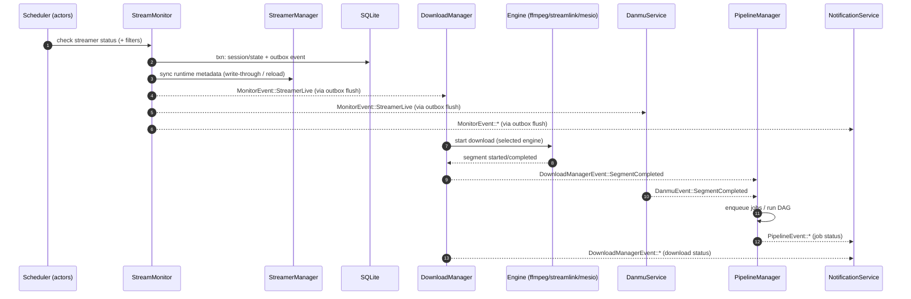
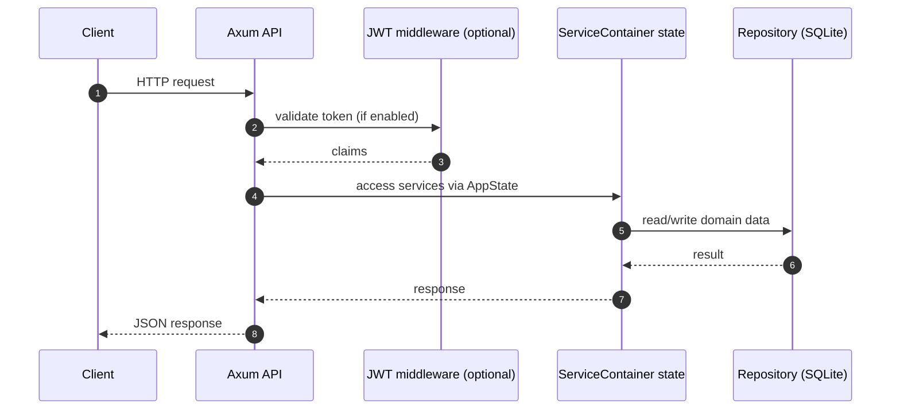

# System Architecture

`rust-srec` is an automated stream recorder built around a clear separation of concerns:

- A **control plane** (REST API + configuration + orchestration)
- A **data plane** (live status detection + downloads + danmu + post-processing)
- A **persistence layer** (SQLite + filesystem outputs)

It is implemented as a set of long-running Tokio services managed by the runtime `ServiceContainer`.


## High-level topology

```mermaid
flowchart TB
  subgraph Client["Clients"]
    FE[Web UI]
    EXT[External API clients / automation]
  end

  subgraph API["Control Plane"]
    AX[Axum API Server]
    DOCS[Swagger UI / OpenAPI]
    AUTH[JWT auth (optional)]
  end

  subgraph Runtime["Runtime (ServiceContainer)"]
    CFG[ConfigService\n(merge + cache + hot reload)]
    SM[StreamerManager\n(in-memory + DB write-through)]
    SCH[Scheduler\n(actor model)]
    MON[StreamMonitor\n(detect + filters + outbox)]
    DL[DownloadManager\n(concurrency + retry + engines)]
    DM[DanmuService\n(websocket capture)]
    PL[PipelineManager\n(job queue + DAG + workers)]
    NOTI[NotificationService\n(monitor/download/pipeline)]
    HEALTH[HealthChecker + maintenance]
  end

  subgraph Exec["Execution"]
    ENGINES[Download engines\n(ffmpeg / streamlink / mesio)]
    WCPU[CPU worker pool]
    WIO[IO worker pool]
  end

  subgraph Storage["Persistence"]
    DB[(SQLite)]
    FS[(Filesystem\noutput/logs/data)]
    CACHE[(In-memory caches)]
  end

  FE -->|REST| AX
  EXT -->|REST| AX
  AX --> AUTH
  AX --> DOCS

  AX --> Runtime

  CFG <--> DB
  CFG <--> CACHE
  SM <--> DB

  SCH --> MON
  MON --> DL
  MON --> DM

  DL --> ENGINES
  ENGINES --> FS

  DL --> PL
  DM --> PL
  PL --> WCPU
  PL --> WIO
  WCPU --> FS
  WIO --> FS
  PL <--> DB

  NOTI --> DB
  HEALTH --> DB
  HEALTH --> FS
```

## Runtime root: `ServiceContainer`

The `ServiceContainer` (in `rust-srec/src/services/container.rs`) wires everything together:

- Initializes repositories and services (DB, config cache, managers)
- Starts background tasks (scheduler actors, pipeline workers, outbox flushers)
- Subscribes to event streams and forwards events between services
- Owns the `CancellationToken` used for graceful shutdown

This gives the project one clear place to reason about lifecycle, dependencies, and shutdown order.

## Core components (what each one actually does)

### `ConfigService` (configuration + hot reload)

`ConfigService` is the configuration control plane. It loads and merges a 4-level hierarchy:

1. Global defaults
2. Platform configuration
3. Template configuration
4. Streamer-specific overrides

It also caches merged results and broadcasts `ConfigUpdateEvent` so runtime services can respond to
changes without a restart.

See also: [Configuration](./configuration.md)

### `StreamerManager` (runtime state source of truth)

`StreamerManager` maintains the in-memory streamer metadata used by orchestration and downloads,
with **write-through persistence** to SQLite.

Important correctness detail: on startup it performs **restart recovery** by resetting any streamers
left in `Live` back to `NotLive`, so the normal `NotLive → Live` edge can trigger downloads again.

### `Scheduler` (actor model orchestration)

The scheduler is a supervisor that manages self-scheduling actors:

- `StreamerActor`: owns the timing and state loop for one streamer
- `PlatformActor`: coordinates batch detection for batch-capable platforms
- `Supervisor`: handles actor lifecycle, restart tracking, and shutdown reporting

Actors call into `StreamMonitor` for real status checks; the scheduler also reacts to configuration
events to spawn/stop actors dynamically.

### `StreamMonitor` (detect + filter + sessions + outbox)

`StreamMonitor` is the data-plane detector. It:

- Resolves platform information and checks live status
- Applies filters (time/keyword/category, etc.)
- Creates/ends sessions and updates streamer state transactionally
- Emits `MonitorEvent` **via a DB-backed outbox** for consistency

**Outbox pattern:** Monitor events are written in the same DB transaction as state/session updates,
then a background task flushes the outbox to a Tokio `broadcast` channel. This reduces the chance of
“state changed but event lost” during crashes or restarts.

### `DownloadManager` (downloads + engine abstraction)

The download manager owns:

- Concurrency limits (including extra slots for high priority downloads)
- Retry and circuit breaker logic per engine/config key
- Engine abstraction:
  - External processes: `ffmpeg`, `streamlink`
  - In-process Rust engine: `mesio`

It emits `DownloadManagerEvent` for lifecycle, segment boundaries, and (optionally) progress.

### `DanmuService` (chat capture)

Danmu collection is session-scoped but writes files per segment:

- A websocket connection stays alive for the session
- Segment boundaries (from download events) open/close danmu files (e.g. XML)
- Danmu events are forwarded to the pipeline for paired/session coordination

### `PipelineManager` (job queue + DAG + worker pools)

The pipeline manager is the post-processing engine:

- Maintains a DB-backed job queue (with recovery on restart)
- Executes a DAG pipeline model (fan-in / fan-out)
- Uses separate worker pools for CPU-bound and IO-bound processors
- Coordinates multi-stage triggers:
  - Segment pipelines (single output file)
  - Paired-segment pipelines (video + danmu for the same segment index)
  - Session-complete pipelines (once all segments are complete)

See also: [DAG Pipeline](./pipeline.md)

### `NotificationService` (event fan-out)

Notifications subscribe to monitor/download/pipeline events and deliver them to configured channels
(Discord / Email / Webhook), with retry, circuit breakers, and dead-letter persistence.

See also: [Notifications](./notifications.md)

## Key flows

### Recording lifecycle (end-to-end)



### API request flow (control plane)



## Event-driven communication

Most cross-service coordination happens via Tokio `broadcast` channels.

| Stream | Publisher | Typical consumers | Notes |
|---|---|---|---|
| `ConfigUpdateEvent` | `ConfigService` | `Scheduler`, `DownloadManager`, `PipelineManager`, `ServiceContainer` | Drives hot reload and cleanup when streamers become inactive |
| `MonitorEvent` | `StreamMonitor` | `ServiceContainer`, `NotificationService` | Emitted through the DB outbox (best-effort delivery under restarts) |
| `DownloadManagerEvent` | `DownloadManager` | `PipelineManager`, `Scheduler`, `NotificationService` | Segment boundaries are the main trigger for pipelines |
| `DanmuEvent` | `DanmuService` | `PipelineManager` | Used for paired-segment and session-complete coordination |
| `PipelineEvent` | `PipelineManager` | `NotificationService` | Job lifecycle events for observability |

::: tip About throttling
`PipelineManager` contains an optional throttling subsystem (`ThrottleController`) that can emit
events and apply download concurrency adjustments if a `DownloadLimitAdjuster` is wired in.
:::

## Observability, health, and shutdown

- Logging uses `tracing` with a reloadable filter and log retention cleanup
- Health endpoints:
  - `GET /api/health/live` (no auth; suitable for container liveness)
  - `GET /api/health` and `GET /api/health/ready` (require auth when JWT is configured)
- Shutdown:
  - The `ServiceContainer` holds a `CancellationToken` and propagates it to background tasks
  - `SIGINT`/`SIGTERM` triggers a graceful shutdown sequence
