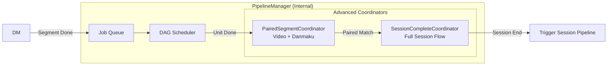
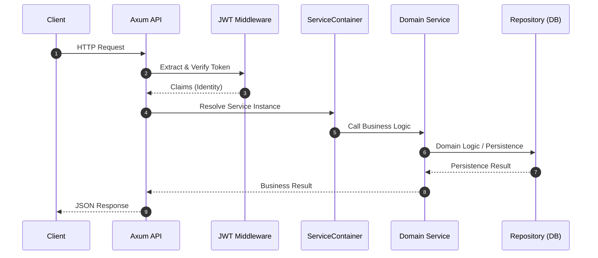

# System Architecture

rust-srec is built with a modular service-oriented architecture using Rust's async runtime (Tokio).


```mermaid
flowchart TB
    subgraph Client["Frontend Layer"]
        FE[Frontend - TanStack Start + React 19]
        API_CLIENT[API Client / External Integrations]
    end
    
    subgraph API["API Layer (Control)"]
        AXUM[Axum Web Server]
        SWAGGER[Swagger UI / OpenAPI]
        JWT[JWT Auth Middleware]
    end
    
    subgraph Core["Core Components Layer"]
        direction TB
        CS[ConfigService - Configuration]
        SM[StreamerManager - Lifecycle]
        DM[DownloadManager - Engines]
        PM[PipelineManager - Post-processing]
        DS[DanmuService - Danmaku Capture]
        NS[NotificationService - Alerts]
        HC[HealthChecker - Monitoring]
    end
    
    subgraph Engine["Execution Layer"]
        MONITOR[Stream Detector]
        DWENG[Engines (FFmpeg/Mesio/Streamlink)]
        DAG_SCHED[DAG Scheduler]
        WORKER_POOL[Worker Pool (CPU/IO)]
    end
    
    subgraph Storage["Persistence Layer"]
        DB[(SQLite - Core Data)]
        FS[(Filesystem - Recordings/Logs)]
        CACHE[(Memory Cache - Config/State)]
    end
    
    FE --> |REST API| AXUM
    AXUM --> JWT --> Core
    
    CS <--> CACHE
    CS <--> DB
    SM --> MONITOR
    DM --> DWENG
    PM --> DAG_SCHED
    DAG_SCHED --> WORKER_POOL
    WORKER_POOL --> FS
    
    MONITOR -.-> |Detection Result| SM
```

## ServiceContainer

The `ServiceContainer` is the heart of rust-srec, responsible for initializing, dependency injection, and lifecycle management of all long-running services.

### Core Services

1.  **ConfigService**: Manages the 4-level configuration hierarchy, merging, persistence, and broadcasting updates.
2.  **StreamerManager**: Handles streamer state transitions (Idle <-> Monitoring <-> Recording) and manages **Detector** tasks.
3.  **DownloadManager**: Receives detection results, resolves URLs, and schedules download engines.
4.  **DanmakuService**: Concurrently captures chat messages and saves them as XML/JSON.
5.  **PipelineManager**: The central processing hub, managing job queues, DAG execution, and **Paired/Session** coordinators.
6.  **NotificationService**: Pushes system events (live, failure, completion) to Discord, Email, or Webhooks.

### Internal Coordinators

Within `PipelineManager`, specialized coordinators handle complex trigger logic:



## Event-Driven Communication

Services communicate through high-performance asynchronous broadcast channels:

| Event Type | Publisher | Main Subscribers | Description |
|------------|-----------|------------------|-------------|
| `ConfigUpdateEvent` | `ConfigService` | `Streamer`, `Download`, `Pipeline` | Triggers configuration hot-reload |
| `MonitorEvent` | `StreamMonitor` | `Download`, `Danmu`, `Notification` | Broadcasts streamer state changes |
| `DownloadEvent` | `DownloadManager` | `PipelineManager`, `Notification` | Triggers segment post-processing |
| `DagCompletionInfo` | `DagScheduler` | `PipelineManager`, `Notification` | Reports DAG execution results |
| `ThrottleEvent` | `ThrottleController` | `DownloadManager` | Auto-adjusts download rate based on queue depth |

## Request Flow



::: tip Developer Note
rust-srec leverages Rust's multithreading and async capabilities. Most blocking operations (IO, transcoding) are executed in a dedicated `WorkerPool`, ensuring the API remains highly responsive.
:::
::: tip Troubleshooting
If you encounter issues, the `logs` directory contains detailed trace/debug information. You can adjust the log level via the `RUST_LOG` environment variable.
:::
