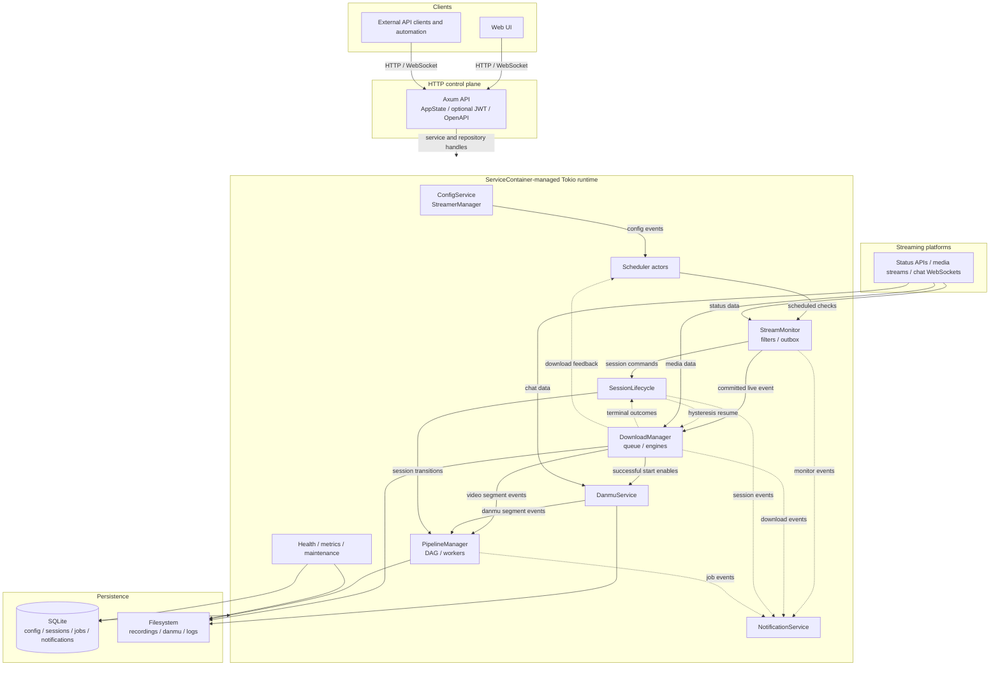
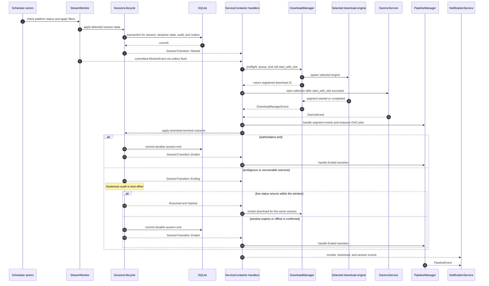
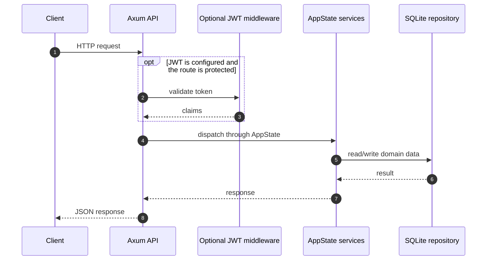

# System Architecture

`rust-srec` is an automated stream recorder built around a clear separation of concerns:

- A **control plane** (REST API + configuration + orchestration)
- A **data plane** (live status detection + downloads + danmu + post-processing)
- A **persistence layer** (SQLite + filesystem outputs)

It is implemented as a set of long-running Tokio services managed by the runtime `ServiceContainer`.

## High-level topology


```mermaid
flowchart TB
  subgraph Clients["Clients"]
    FE["Web UI"]
    EXT["External API clients and automation"]
  end

  subgraph Control["HTTP control plane"]
    API["Axum API<br/>AppState / optional JWT / OpenAPI"]
  end

  subgraph Runtime["ServiceContainer-managed Tokio runtime"]
    CFG["ConfigService<br/>StreamerManager"]
    SCH["Scheduler actors"]
    MON["StreamMonitor<br/>filters / outbox"]
    SESS["SessionLifecycle"]
    DL["DownloadManager<br/>queue / engines"]
    DM["DanmuService"]
    PL["PipelineManager<br/>DAG / workers"]
    NOTI["NotificationService"]
    OPS["Health / metrics / maintenance"]
  end

  subgraph Sources["Streaming platforms"]
    SRC["Status APIs / media streams / chat WebSockets"]
  end

  subgraph Storage["Persistence"]
    DB[("SQLite<br/>config / sessions / jobs / notifications")]
    FS["Filesystem<br/>recordings / danmu / logs"]
  end

  FE -->|"HTTP / WebSocket"| API
  EXT -->|"HTTP / WebSocket"| API
  API -->|"service and repository handles"| Runtime

  CFG -->|"config events"| SCH
  SCH -->|"scheduled checks"| MON
  MON -->|"session commands"| SESS
  MON -->|"committed live event"| DL
  DL -->|"successful start enables"| DM
  DL -->|"video segment events"| PL
  DM -->|"danmu segment events"| PL
  SESS -->|"session transitions"| PL
  SESS -.->|"hysteresis resume"| DL
  DL -.->|"terminal outcomes"| SESS
  DL -.->|"download feedback"| SCH

  MON -.->|"monitor events"| NOTI
  DL -.->|"download events"| NOTI
  SESS -.->|"session events"| NOTI
  PL -.->|"job events"| NOTI

  SRC -->|"status data"| MON
  SRC -->|"media data"| DL
  SRC -->|"chat data"| DM

  DM --> FS
  DL --> FS
  PL --> FS
  Runtime <--> DB
  OPS --> DB
  OPS --> FS
```

Arrows between runtime services show logical event routes. `ServiceContainer` implements that
wiring with broadcast subscriptions, bounded queues, and handler tasks rather than direct service
coupling.

Three ownership boundaries are important in this topology:

- `ServiceContainer` is the composition root and event-wiring layer, not the owner of domain state.
- `StreamMonitor` detects and filters platform status; `SessionLifecycle` exclusively owns the
  in-memory session state machine and durable start/end decisions.
- A live event starts the download path first. Danmu collection starts only after the download
  manager's `start_with_slot` call returns a real download ID.

## Runtime root: `ServiceContainer`

The `ServiceContainer` (in `rust-srec/src/services/container.rs`) wires everything together:

- Initializes repositories and services (DB, config cache, managers)
- Starts background tasks (scheduler actors, pipeline workers, outbox flushers)
- Subscribes to event streams and forwards events between services
- Owns the `CancellationToken` used for graceful shutdown

This gives the project one clear place to reason about lifecycle, dependencies, and shutdown order.

## Core components (what each one actually does)

### `ConfigService` (configuration + hot reload)

`ConfigService` is the configuration control plane. It loads and merges a 4-level hierarchy:

1. Global defaults
2. Platform configuration
3. Template configuration
4. Streamer-specific overrides

It also caches merged results and broadcasts `ConfigUpdateEvent` so runtime services can respond to
changes without a restart.

See also: [Configuration](./configuration.md)

### `StreamerManager` (runtime state source of truth)

`StreamerManager` maintains the in-memory streamer metadata used by orchestration and downloads,
with **write-through persistence** to SQLite.

Important correctness detail: on startup it performs **restart recovery** by resetting any streamers
left in `Live` back to `NotLive`, so the normal `NotLive → Live` edge can trigger downloads again.

### `Scheduler` (actor model orchestration)

The scheduler is a supervisor that manages self-scheduling actors:

- `StreamerActor`: owns the timing and state loop for one streamer
- `PlatformActor`: coordinates batch detection for batch-capable platforms
- `Supervisor`: handles actor lifecycle, restart tracking, and shutdown reporting

Actors call into `StreamMonitor` for real status checks; the scheduler also reacts to configuration
events to spawn/stop actors dynamically.

### `StreamMonitor` (detect + filter + outbox)

`StreamMonitor` is the data-plane detector. It:

- Resolves platform information and checks live status
- Applies filters (time/keyword/category, etc.)
- Delegates session changes to `SessionLifecycle`
- Emits `MonitorEvent` **via a DB-backed outbox** for consistency

**Outbox pattern:** Monitor events are written in the same DB transaction as state/session updates,
then a background task flushes the outbox to a Tokio `broadcast` channel. This reduces the chance of
“state changed but event lost” during crashes or restarts.

### `SessionLifecycle` (single owner of session state)

`SessionLifecycle` owns the recording state machine, including hysteresis and terminal-cause
classification. Fresh starts and durable ends commit their required database changes before
broadcasting `Started` or `Ended`. Hysteresis `Ending` and `Resumed` are in-memory transitions: their
audit rows are best-effort, and the session `end_time` remains unset until the lifecycle reaches
`Ended`. Download terminal events feed back into this service. `Ended` drives session-complete
pipelines, danmu cleanup, and download bookkeeping; a resumed `Started` restarts the same session.

### `DownloadManager` (downloads + engine abstraction)

The download manager owns:

- Concurrency limits (including extra slots for high priority downloads)
- Failure classification and circuit breakers keyed by engine type, configuration, and optional
  streamer scope
- Failure/rejection events and retry-after hints; scheduler actors decide when to check again and
  re-enter the download-start path
- Engine abstraction:
  - External processes: `ffmpeg`, `streamlink`
  - In-process Rust engine: `mesio`

It emits `DownloadManagerEvent` for lifecycle, segment boundaries, and (optionally) progress.

For persisted session segments, the backend keeps three separate timestamps:

- `created_at`: when the segment started recording
- `completed_at`: when the segment finished recording
- `persisted_at`: when the segment metadata row was stored in SQLite

### `DanmuService` (chat capture)

Danmu collection is session-scoped but writes files per segment:

- A websocket connection stays alive for the session
- Segment boundaries (from download events) open/close danmu files (e.g. XML)
- Danmu events are forwarded to the pipeline for paired/session coordination

### `PipelineManager` (job queue + DAG + worker pools)

The pipeline manager is the post-processing engine:

- Maintains a DB-backed job queue (with recovery on restart)
- Executes a DAG pipeline model (fan-in / fan-out)
- Uses separate worker pools for CPU-bound and IO-bound processors
- Coordinates multi-stage triggers:
  - Segment pipelines (single output file)
  - Paired-segment pipelines (video + danmu for the same segment index)
  - Session-complete pipelines (once all segments are complete)

See also: [DAG Pipeline](./pipeline.md)

### `NotificationService` (event fan-out)

Notifications subscribe to monitor/download/session/pipeline events and deliver them to configured
channels (Discord / Email / Gotify / Telegram / Webhook), with retry, circuit breakers, and
dead-letter persistence. Optional browser Web Push delivery is handled by `WebPushService`.

See also: [Notifications](./notifications.md)

## Key flows

### Recording lifecycle (end-to-end)


```mermaid
sequenceDiagram
  autonumber
  participant SCH as Scheduler actors
  participant MON as StreamMonitor
  participant SESS as SessionLifecycle
  participant DB as SQLite
  participant SC as ServiceContainer handlers
  participant DL as DownloadManager
  participant ENG as Selected download engine
  participant DM as DanmuService
  participant PL as PipelineManager
  participant NOTI as NotificationService

  SCH->>MON: check platform status and apply filters
  MON->>SESS: apply detected session state
  SESS->>DB: transaction for session, streamer state, audit, and outbox
  DB-->>SESS: commit
  SESS-->>SC: SessionTransition::Started
  MON-->>SC: committed MonitorEvent via outbox flush

  SC->>DL: preflight, queue, and call start_with_slot
  DL->>ENG: spawn selected engine
  DL-->>SC: return registered download ID
  SC->>DM: start collection after start_with_slot succeeds
  ENG-->>DL: segment started or completed
  DL-->>SC: DownloadManagerEvent
  DM-->>SC: DanmuEvent
  SC->>PL: handle segment events and enqueue DAG jobs

  SC->>SESS: apply download terminal outcome
  alt authoritative end
    SESS->>DB: commit durable session end
    SESS-->>SC: SessionTransition::Ended
    SC->>PL: handle Ended transition
  else ambiguous or recoverable outcome
    SESS-->>SC: SessionTransition::Ending
    Note over SESS: Hysteresis audit is best-effort
    alt live status returns within the window
      SESS-->>SC: Resumed and Started
      SC->>DL: restart download for the same session
    else window expires or offline is confirmed
      SESS->>DB: commit durable session end
      SESS-->>SC: SessionTransition::Ended
      SC->>PL: handle Ended transition
    end
  end
  SC-->>NOTI: monitor, download, and session events
  PL-->>NOTI: PipelineEvent
```

### API request flow (control plane)


```mermaid
sequenceDiagram
  autonumber
  participant C as Client
  participant A as Axum API
  participant J as Optional JWT middleware
  participant S as AppState services
  participant R as SQLite repository

  C->>A: HTTP request
  opt JWT is configured and the route is protected
    A->>J: validate token
    J-->>A: claims
  end
  A->>S: dispatch through AppState
  S->>R: read/write domain data
  R-->>S: result
  S-->>A: response
  A-->>C: JSON response
```

Most protected routes use JWT middleware when JWT is configured. The full health and readiness
handlers validate bearer tokens themselves and return `401` when JWT authentication is not
configured; liveness remains public. WebSocket, media, and stream-proxy routes use their documented
query-parameter authentication paths.

## Event-driven communication

Most cross-service coordination happens via Tokio `broadcast` channels.

| Stream | Publisher | Typical consumers | Notes |
|---|---|---|---|
| `ConfigUpdateEvent` | `ConfigService`, `StreamerManager` | `Scheduler`, `ServiceContainer` | Drives actor changes, runtime reconfiguration, and cleanup |
| `MonitorEvent` | `StreamMonitor` | `ServiceContainer`, `NotificationService` | Emitted through the DB outbox (best-effort delivery under restarts) |
| `DownloadManagerEvent` | `DownloadManager` | `Scheduler`, `NotificationService`, `ServiceContainer` handlers | Handlers feed segments to `PipelineManager` and terminal outcomes to `SessionLifecycle` |
| `SessionTransition` | `SessionLifecycle` | `ServiceContainer` handlers, `NotificationService` | `Ended` drives cleanup and session pipelines; resumed `Started` restarts the same session |
| `DanmuEvent` | `DanmuService` | `ServiceContainer` handlers | Handlers feed segment pairing to `PipelineManager` and terminal signals to download/session handling |
| `PipelineEvent` | `PipelineManager` | `NotificationService` | Job lifecycle events for observability |

::: tip About throttling
`PipelineManager` contains an optional throttling subsystem (`ThrottleController`) that can emit
events and apply download concurrency adjustments if a `DownloadLimitAdjuster` is wired in.
:::

### Output-root write gate

The download manager runs an **output-root write gate** (in `downloader::output_root_gate`) that operates at the filesystem boundary, complementing the engine-level circuit breakers that operate at the network/process boundary. It exists so that a single filesystem failure (disk full, stale bind mount, lost permissions) does not cascade into dozens of per-streamer retries that would flood the logs and DB outbox.

```
Healthy ──(record_failure: pre-start ENOENT / runtime ENOSPC / startup probe)──► Degraded
                                                                                    │
                              (mark_healthy: next real ensure_output_dir succeeds)  │
Healthy ◄───────────────────────────────────────────────────────────────────────────┘
```

Key properties:

- **Lock-free fast path.** `check()` on a Healthy root is an atomic load plus a `DashMap::get`. No mutex on the hot path, no cost when there are no tracked failures.
- **Single-flight cooldown via CAS.** When a root is `Degraded`, only one caller per cooldown window (30s default) is allowed through to attempt the real `create_dir_all`. Other concurrent callers fast-reject with the cached error. Mirrors the half-open pattern in `CircuitBreaker`.
- **No background probe task.** The real `ensure_output_dir` call is the probe — the gate piggybacks on actual download attempts. A single one-shot probe runs at container startup to surface broken mounts from second zero.
- **Recovery hook.** On `Degraded → Healthy` transition the gate clears `consecutive_error_count`, `disabled_until`, and `last_error` for every streamer whose backoff was caused by the gate (filtered by the `"output-root blocked:"` prefix). The whole affected fleet cascades out of backoff on the same tick.
- **One notification per transition.** The `Healthy → Degraded` CAS is also what decides which caller emits the critical `output_path_inaccessible` notification, so users see exactly one alert per incident regardless of how many concurrent streamers are affected.

Exposed in `/health` as a single aggregated `output-root` component listing each Degraded root with its classified `io::ErrorKind`, rejected count, and staleness. See the [notifications doc](./notifications.md#critical-infrastructure-events) for the event shape and the [Docker troubleshooting guide](../getting-started/docker.md#freeing-up-disk-space-when-using-bind-mounts) for the stale-mount failure mode.

## Observability, health, and shutdown

- Logging uses `tracing` with a reloadable filter and log retention cleanup
- Health endpoints:
  - `GET /api/health/live` (no auth; suitable for container liveness)
  - `GET /api/health` and `GET /api/health/ready` require a valid bearer token and return `401` when
    JWT authentication is not configured
- Shutdown:
  - The `ServiceContainer` holds a `CancellationToken` and propagates it to background tasks
  - `SIGINT` triggers graceful shutdown on all supported platforms; `SIGTERM` is additionally
    handled on Unix
