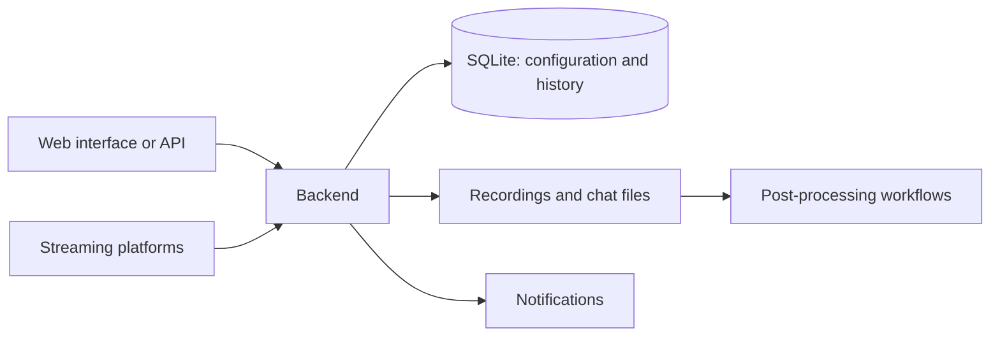

# System overview {#system-architecture}

Rust-Srec monitors configured channels, records live video and chat, and runs post-processing workflows. The web interface and API control the same backend.

```mermaid
flowchart LR
    UI[Web interface or API] --> B[Backend]
    P[Streaming platforms] --> B
    B --> DB[(SQLite: configuration and history)]
    B --> FILES[Recordings and chat files]
    FILES --> W[Post-processing workflows]
    B --> N[Notifications]
```

## Recording lifecycle

1. The backend checks a streamer's live status using its effective settings and schedule.
2. When recording is allowed and capacity is available, a download engine writes video files. Enabled danmu collection writes the matching chat files.
3. Size or duration limits can split a recording into segments. Segment workflows process completed files; paired workflows wait for video and chat from the same segment.
4. When the session ends and earlier processing finishes, its session-complete workflow runs.
5. Notifications report subscribed events. Sessions and outputs remain available in the interface.

## Deployment and storage

The standard installation uses one backend and one SQLite database. Docker packages the backend and frontend separately; desktop runs its recording services locally. Recorded files live on the filesystem, while the database stores configuration, sessions, jobs, and file records.

Back up both the database and files. A configuration export is not a recording backup, and deleting a database record does not necessarily delete the file. See [Backup and restore](../operations/backup-restore.md) and [deletion behavior](../operations/data-governance.md#deletion-semantics).

## Configure and operate the recorder

- [Configuration layers](./configuration.md): defaults, templates, and overrides.
- [Recording engines](./engines.md): compatibility and engine options.
- [Workflows](./pipeline.md): processing triggers and file routing.
- [Monitoring](../operations/monitoring.md): health, logs, and recovery actions.

For service boundaries, event delivery, database transactions, and Rust interfaces, see [Runtime architecture](../development/architecture.md).

This section is now in [Runtime architecture](../development/architecture.md#high-level-topology).

This section is now in [Runtime architecture](../development/architecture.md#runtime-root-servicecontainer).

This section is now in [Runtime architecture](../development/architecture.md#service-container-responsibilities).

This section is now in [Runtime architecture](../development/architecture.md#core-components-what-each-one-actually-does).

This section is now in [Runtime architecture](../development/architecture.md#runtimecoordinator-recording-startup-and-cancellation).

This section is now in [Runtime architecture](../development/architecture.md#configservice-configuration-hot-reload).

This section is now in [Runtime architecture](../development/architecture.md#streamermanager-committed-metadata-snapshots).

This section is now in [Runtime architecture](../development/architecture.md#scheduler-actor-model-orchestration).

This section is now in [Runtime architecture](../development/architecture.md#streammonitor-detect-filter-outbox).

This section is now in [Runtime architecture](../development/architecture.md#sessionlifecycle-single-owner-of-session-state).

This section is now in [Runtime architecture](../development/architecture.md#downloadmanager-downloads-engine-abstraction).

This section is now in [Runtime architecture](../development/architecture.md#danmuservice-chat-capture).

This section is now in [Runtime architecture](../development/architecture.md#pipelinemanager-job-queue-dag-worker-pools).

This section is now in [Runtime architecture](../development/architecture.md#notificationservice-event-fan-out).

This section is now in [Runtime architecture](../development/architecture.md#repository-row-writes).

This section is now in [Runtime architecture](../development/architecture.md#downloader-rust-interfaces).

This section is now in [Runtime architecture](../development/architecture.md#ffmpeg-recording-events).

This section is now in [Runtime architecture](../development/architecture.md#key-flows).

This section is now in [Runtime architecture](../development/architecture.md#recording-lifecycle-end-to-end).

This section is now in [Runtime architecture](../development/architecture.md#api-request-flow-control-plane).

This section is now in [Runtime architecture](../development/architecture.md#scheduler-state-and-backoff).

This section is now in [Runtime architecture](../development/architecture.md#reliable-lifecycle-feedback).

This section is now in [Runtime architecture](../development/architecture.md#event-driven-communication).

This section is now in [Runtime architecture](../development/architecture.md#output-root-write-gate).

This section is now in [Runtime architecture](../development/architecture.md#service-ownership).

This section is now in [Runtime architecture](../development/architecture.md#observability-health-and-shutdown).

This section is now in [Runtime architecture](../development/architecture.md#backend-rust-interfaces).

This section is now in [Runtime architecture](../development/architecture.md#actor-terminal-and-wake-policies).

