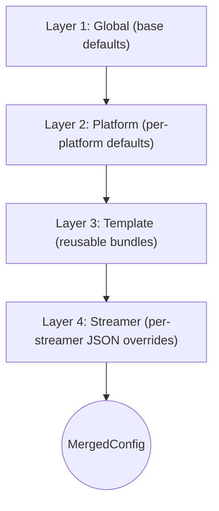

# Configuration

`rust-srec` resolves an effective, per-streamer configuration by merging a 4-layer hierarchy
stored in the SQLite database.

This page is a correctness-first reference of how the merge works in the codebase. For deployment
and step-by-step setup, follow the docs quick start instead:

- `../getting-started/configuration.md`

## The 4-layer hierarchy

The effective config is merged in this order (low priority to high priority):

1. Global config (`global_config` table)
2. Platform config (`platform_config` table)
3. Template config (`template_config` table, optional per streamer)
4. Streamer overrides (`streamers.streamer_specific_config` JSON)

The merge is performed by:

- `MergedConfigBuilder` (applies each layer)
- `ConfigResolver` (loads DB records and builds `MergedConfig`)
- `ConfigService` (caches resolved configs and broadcasts updates)

## What gets produced: `MergedConfig`

`MergedConfig` is the resolved configuration the runtime uses for monitoring, downloads, danmu,
and pipelines.

Key fields (grouped by concern):

- Output: `output_folder`, `output_filename_template`, `output_file_format`
- Limits: `min_segment_size_bytes`, `max_download_duration_secs`, `max_part_size_bytes`
- Danmu: `record_danmu`, `danmu_sampling_config`
- Network: `proxy_config`, `cookies`
- Engine: `download_engine`, `download_retry_policy`, `engines_override`
- Stream selection: `stream_selection`
- Pipelines: `pipeline`, `session_complete_pipeline`, `paired_segment_pipeline`
- Platform extractor options: `platform_extras`
- Timing: `fetch_delay_ms`, `download_delay_ms`, `session_gap_time_secs`
- Session UX: `auto_thumbnail`

Some knobs are global-only runtime settings (not part of `MergedConfig`), such as concurrency
limits and log filter directives.

## Where each setting is configured

Not every field is available at every layer. The list below reflects what the resolver and
builder actually read.

- Global-only (base defaults + runtime knobs): `session_gap_time_secs`, `auto_thumbnail`,
  concurrency/job limits, scheduler delays, log filter directives
- Platform-only: `fetch_delay_ms`, `download_delay_ms`, `platform_specific_config`
- Template-only: `platform_overrides`, `engines_override`, `danmu_sampling_config`
- Streamer-only: `streamer_specific_config` (JSON object; see below)

::: tip Stream selection naming
Platform and template store `stream_selection_config` (JSON) which becomes
`MergedConfig.stream_selection`.
Streamer overrides also use the key `stream_selection_config`.
:::

## Merge rules (important details)

The builder is intentionally conservative: most fields are "override if present".

### Scalars: higher layer overrides

For most string/number/bool fields, a higher layer replaces the value when it provides one.

### Cookies: "present wins" (including empty strings)

Cookies are treated as a single optional string. If a higher layer provides `cookies`, it
overrides lower layers.

::: tip Cookies best practice
Avoid setting cookies to an empty string. An empty string is still "present" and will override
lower layers, effectively disabling fallback cookies.
:::

### Stream selection: merged by `StreamSelectionConfig::merge`

Stream selection is merged with special semantics:

- `preferred_formats`: overrides only if `Some(non_empty_vec)`
- `preferred_media_formats`, `preferred_qualities`, `preferred_cdns`: override only if non-empty
- `min_bitrate`, `max_bitrate`: override only if non-zero

This allows a template to specify only the parts it cares about without losing platform defaults.

### Event hooks: merged key-by-key

`event_hooks` is merged per field (e.g. `on_online`, `on_offline`, ...). A higher layer overrides
only the hooks it sets; unset hooks fall back to lower layers.

### Pipelines: higher layer replaces the whole pipeline

Pipelines are parsed from JSON into a `DagPipelineDefinition`. When a layer provides a pipeline,
it replaces the previous pipeline definition as a whole (there is no step-by-step merge).

See:

- `./pipeline.md`

### Platform extras: shallow JSON merge, `null` does not override

Platform extractor options are carried via `platform_extras` (a JSON blob) and merged with a
shallow object merge:

- If both sides are JSON objects, keys from the higher layer overwrite keys from the lower layer.
- `null` values in the higher layer are ignored (they do not override).
- If either side is not an object, the higher layer wins.

This is implemented in `platforms_parser::extractor::platform_configs::merge_platform_extras`.

::: tip Clearing a platform_extras key
`platform_extras` uses a shallow merge and ignores `null` in the overlay. This means a higher
layer cannot "unset" a lower-layer key via `null`; it can only override with a non-null value.
:::

## Platform extractor options (`platform_extras`)

`platform_extras` is sourced and merged from these places:

- Platform layer: `platform_config.platform_specific_config`
- Template layer: `template_config.platform_overrides[platform_name]`
- Streamer layer: `streamers.streamer_specific_config.platform_extras`

The same merge function is applied each time in layer order.

::: tip About credentials in platform extras
Some platform records may contain credential-related keys (e.g. `refresh_token`). These keys are
stripped out when producing `platform_extras` so extractor config never carries credentials.
:::

## Credentials (`cookies` + `refresh_token`) are resolved separately

The runtime derives a `credential_source` (a sidecar on `ResolvedStreamerContext`) for
authentication and refresh-token handling. It is intentionally not part of `MergedConfig` and
must not be exposed via serialized config APIs.

Precedence (highest to lowest):

1. Streamer override: `streamer_specific_config.cookies`
   (+ optional `streamer_specific_config.refresh_token`)
2. Template: `template_config.cookies`
   (+ optional `template_config.platform_overrides[platform].refresh_token`)
3. Platform: `platform_config.cookies`
   (+ optional `platform_config.platform_specific_config.refresh_token`)

## Streamer overrides: `streamer_specific_config`

`streamer_specific_config` is an untyped JSON object. Unknown keys are ignored.

Supported keys that affect `MergedConfig`:

- `output_folder`, `output_filename_template`, `output_file_format`
- `min_segment_size_bytes`, `max_download_duration_secs`, `max_part_size_bytes`
- `record_danmu`, `cookies`, `download_engine`
- `proxy_config` (JSON object)
- `stream_selection_config` (JSON object)
- `event_hooks` (JSON object)
- `download_retry_policy` (JSON object)
- `danmu_sampling_config` (JSON object)
- `pipeline`, `session_complete_pipeline`, `paired_segment_pipeline` (JSON objects)
- `platform_extras` (JSON object)

Keys used by the credentials subsystem (not part of `MergedConfig`):

- `refresh_token`

::: tip Invalid JSON is ignored
Most JSON fields in platform/template/global records are parsed best-effort. If JSON parsing
fails, the resolver logs a warning and falls back to defaults or the previous layer.
:::

## Engine selection and `engines_override`

### `download_engine`

`download_engine` is a string that selects which download engine configuration to use. It can be:

- A built-in engine type string (`ffmpeg`, `streamlink`, `mesio`)
- A custom engine configuration ID stored in the `engine_configuration` table

### `engines_override` (template-only)

Templates can provide `engines_override`, a JSON object of:

- `engine_id` -> `override_value`

When a download starts, the Download Manager checks whether there is an override entry for the
selected engine ID. If so, it:

1. Loads the base engine config (default config for built-in types, DB config for custom IDs)
2. Applies the override using JSON Merge Patch semantics (`json_patch::merge`)
3. Creates a dedicated engine instance for that override

## Hot reload, cache, and update events

`ConfigService` caches resolved streamer configs in memory:

- TTL: 1 hour (default)
- Concurrent request deduplication: only one in-flight resolve per streamer
- Hard resolve timeout: 30 seconds (prevents stuck in-flight entries)

When configs change via API/UI, the service invalidates relevant cache entries and broadcasts a
`ConfigUpdateEvent` so the scheduler and managers can react.

Typical invalidation patterns:

- `GlobalUpdated`: invalidate all streamers
- `PlatformUpdated`: invalidate streamers on that platform
- `TemplateUpdated`: invalidate streamers using that template
- `StreamerMetadataUpdated`: invalidate that streamer
- `EngineUpdated`: invalidate all streamers (engine usage is not tracked)

For the runtime behavior and how these updates route through the system, see:

- `./architecture.md`
