# Configuration Layers

rust-srec uses a **4-layer configuration hierarchy** that allows flexible, inheritance-based settings from global defaults down to individual streamer overrides.

## Layer Hierarchy

```mermaid
flowchart TB
    subgraph Hierarchy["Configuration Hierarchy (Priority: Low → High)"]
        direction TB
        G[🌍 Global Config<br/>Base defaults for all streamers]
        P[📦 Platform Config<br/>Platform-specific settings]
        T[📋 Template Config<br/>Reusable config bundles]
        S[🎯 Streamer Config<br/>Per-streamer overrides]
    end
    
    G --> P
    P --> T
    T --> S
    
    style G fill:#e1f5fe
    style P fill:#e8f5e9
    style T fill:#fff3e0
    style S fill:#fce4ec
```

## Merging Logic

When resolving a streamer's configuration, the system performs a recursive merge from the lowest to the highest priority level. This logic is implemented by the `MergedConfigBuilder`.

### Merging Path

### Merging Principles
1. **Scalar Overlay**: For simple values like `output_format`, the high-priority value completely replaces the lower one.
2. **List/Set Logic**: Depending on the field, lists are either appended or completely overridden.
3. **Authentication (Cookies)**: Generally follows the "override if present" principle. If a streamer has specific cookies, they are used instead of platform or global ones.

## Hot-Reloading

rust-srec supports dynamic configuration updates without restarts. When you change settings via the Web UI or API:

1. **DB Persistence**: The new configuration is first saved to the SQLite database.
2. **Cache Invalidation**: `ConfigService` marks the relevant internal caches as stale.
3. **Events**: `ConfigService` publishes a `ConfigUpdateEvent`.
4. **Service Reaction**:
    - `StreamerManager` may update the polling frequency for monitoring.
    - `DownloadManager` will apply new templates or formats for the **next segment**.
    - Ongoing downloads and processing jobs are typically unaffected to maintain stability.

## Technical Details

### ConfigService
Acts as the central hub, maintaining an in-memory snapshot of active configurations to minimize database overhead.

### ConfigResolver
Responsible for resolving and merging the final `MergedConfig` for a specific streamer ID by checking templates, platform defaults, and global fallbacks.

### MergedConfig
A read-only structure containing all resolved parameters required by download engines and post-processing pipelines.

::: tip Best Practice
Leverage **Templates** as much as possible. For example, create a "High Quality" template with `force_origin_quality` set to true and assign it to multiple streamers. This way, if you need to adjust global retry policies, you only need to update the template once.
:::

## Layer Details

### 1. Global Config (Base)

Default settings for all streamers.

| Field | Description |
|-------|-------------|
| `output_folder` | Base output directory |
| `filename_template` | Default filename pattern |
| `output_format` | Default format (mp4, flv) |
| `record_danmu` | Enable danmaku recording |
| `concurrency_limits` | Max concurrent downloads |

### 2. Platform Config

Platform-specific overrides. Each streaming platform has its own config.

| Field | Description |
|-------|-------------|
| `fetch_delay_ms` | Delay between live checks |
| `download_delay_ms` | Delay before starting download |
| `cookies` | Platform authentication |
| `headers` | Custom HTTP headers |

### 3. Template Config

Reusable configuration bundles. Streamers can reference a template.

| Field | Description |
|-------|-------------|
| `name` | Template name |
| `output_folder` | Override output folder |
| `output_format` | Override format |
| `platform_overrides` | Per-platform settings |

### 4. Streamer Config

Per-streamer overrides for fine-grained control.

| Field | Description |
|-------|-------------|
| `cookies` | Streamer-specific auth |
| `output_folder` | Custom output path |
| `download_retry_policy` | Retry behavior |

## Example: Config Resolution

```mermaid
flowchart TB
    subgraph Resolution["Config Resolution for Streamer 'Alice'"]
        G["Global:<br/>output_format = flv<br/>record_danmu = false"]
        P["Platform (Bilibili):<br/>record_danmu = true"]
        T["Template (HQ):<br/>output_format = mp4"]
        S["Streamer (Alice):<br/>(no overrides)"]
        F["Final Config:<br/>output_format = mp4 ✓<br/>record_danmu = true ✓"]
    end
    
    G --> P --> T --> S --> F
```

