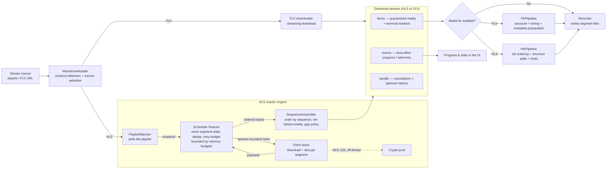
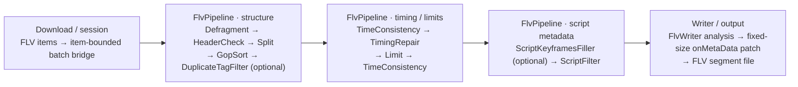
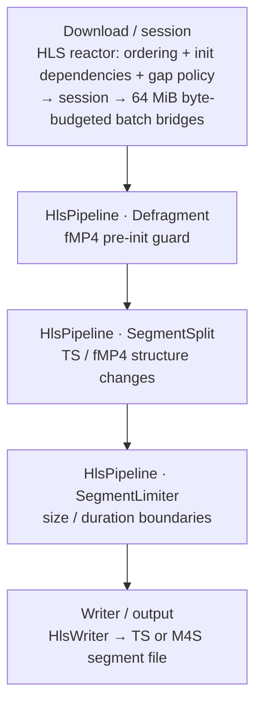

# Mesio Engine

Mesio is rust-srec's **in-process Rust download engine**. Unlike `FFMPEG` and `Streamlink`, it is not an external program — it runs inside the recorder, which is why it has the lowest CPU and memory footprint of the three engines and supports multithreaded HLS downloads. This page covers how Mesio works under the hood; for a side-by-side comparison of all three engines and their features, see [Engines](./engines.md).

## Architecture

A single `MesioDownloader` picks the protocol (HLS or FLV) and the source, then produces one **download session** regardless of protocol. The session exposes two streams — a guaranteed **items** stream of media data and terminal markers, and a best-effort **events** stream of progress/telemetry — plus a control handle for cancellation and optional metrics.

## HLS reactor engine

For HLS, all download state lives in one place — the **Scheduler Reactor**. It owns:

- **Segment identity and de-duplication**, so segments are not re-fetched when a playlist refresh rotates auth tokens (for example Twitch signed URLs, where the rotating query parameters can be stripped so the same segment is recognized across refreshes).
- **The retry budget**, including transparently retrying a signed URL that expires mid-download against a newer one.
- **Bounded concurrent fetch tasks**, whose in-flight downloads, decryption work, and output buffers are each capped by explicit memory budgets — so a fast or encrypted stream can no longer grow memory without limit.

Decryption runs on a separate **crypto pool**, off the scheduling loop, so a burst of encrypted segments stays responsive instead of piling up. The **SequenceAssembler** then guarantees ordered output, writes fMP4 init segments before the media that depends on them (avoiding codec-mismatch corruption), and emits explicit gaps instead of silently stalling when segments drop out of the live window.

## Download sessions

Mesio's HLS and FLV downloaders share this single session model, so progress reporting, retry handling, and cancellation behave consistently across both protocols. The **items** stream is authoritative — it carries the media and terminal markers the recorder relies on — while the **events** stream is best-effort telemetry used to render progress and statistics in the UI. The **handle** carries cancellation and the optional performance metrics.

## Media-fix pipelines

The download session and the media-fix pipeline are separate layers. When stream processing and the matching Mesio fix setting are enabled, session items pass through one synchronous operator chain on a blocking worker before reaching the writer. Otherwise, they go directly to the writer.

The diagrams below show the enabled fix paths. Operator order is fixed; nodes marked optional depend on the FLV configuration.

### FLV fix path

### HLS fix path

- The **FLV pipeline** validates stream structure, splits on configured sequence-header changes, sorts bounded GOP windows, filters configured duplicates, repairs timestamp continuity, and applies file-size or duration boundaries. When keyframe indexing is enabled it also prepares an AMF `onMetaData` reservation. The FLV writer records final statistics and patches metadata and the keyframe index in place before closing the file; it never shifts the completed file tail.
- The **HLS pipeline** guards fMP4 initialization ordering, analyzes TS stream structure, rotates output when codecs, resolution, program layout, or fMP4 initialization data changes, re-emits the applicable fMP4 init after a rotation, and applies file-size or duration boundaries. HLS channel bridges are byte-budgeted, while the FLV bridge remains item-bounded.

The HLS download reactor reports or skips unavailable media according to the configured gap policy. The fix pipeline receives only delivered media and explicit split or terminal markers; it cannot reconstruct bytes that the source never delivered and it does not transcode media payloads.

## Mesio-exclusive features

Mesio-specific processing options are documented on the [Engines](./engines.md) page:

- [FLV Consistency Fix](./engines.md#_2-flv-consistency-fix) — repair FLV structure and timing, and finalize AMF metadata without moving the file tail.
- [Raw Data Mode](./engines.md#_3-raw-data-mode) — write stream bytes straight to disk with no packet parsing, for the absolute minimum CPU/memory overhead.
- [HLS Consistency Fix](./engines.md#_4-hls-consistency-fix-mesio-exclusive) — guard segment structure and rotate output at discontinuities or meaningful stream changes before writing.

> [!NOTE]
> The full engine design lives alongside the source at [`crates/mesio/docs/HLS_ENGINE_ARCHITECTURE.md`](https://github.com/hua0512/rust-srec/blob/main/crates/mesio/docs/HLS_ENGINE_ARCHITECTURE.md) and [`crates/mesio/docs/DOWNLOADER_ENGINE_ARCHITECTURE_PLAN.md`](https://github.com/hua0512/rust-srec/blob/main/crates/mesio/docs/DOWNLOADER_ENGINE_ARCHITECTURE_PLAN.md).
