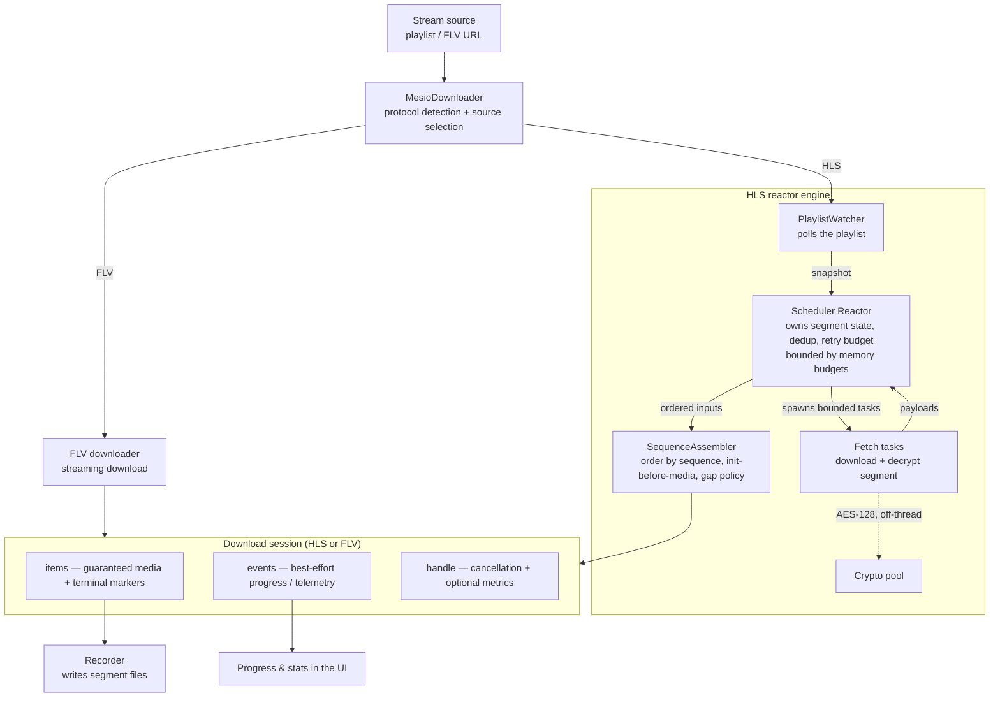

# Mesio Engine

Mesio is rust-srec's **in-process Rust download engine**. Unlike `FFMPEG` and `Streamlink`, it is not an external program — it runs inside the recorder, which is why it has the lowest CPU and memory footprint of the three engines and supports multithreaded HLS downloads. This page covers how Mesio works under the hood; for a side-by-side comparison of all three engines and their features, see [Engines](./engines.md).

## Architecture

A single `MesioDownloader` picks the protocol (HLS or FLV) and the source, then produces one **download session** regardless of protocol. The session exposes two streams — a guaranteed **items** stream of media data and terminal markers, and a best-effort **events** stream of progress/telemetry — plus a control handle for cancellation and optional metrics.

## HLS reactor engine

For HLS, all download state lives in one place — the **Scheduler Reactor**. It owns:

- **Segment identity and de-duplication**, so segments are not re-fetched when a playlist refresh rotates auth tokens (for example Twitch signed URLs, where the rotating query parameters can be stripped so the same segment is recognized across refreshes).
- **The retry budget**, including transparently retrying a signed URL that expires mid-download against a newer one.
- **Bounded concurrent fetch tasks**, whose in-flight downloads, decryption work, and output buffers are each capped by explicit memory budgets — so a fast or encrypted stream can no longer grow memory without limit.

Decryption runs on a separate **crypto pool**, off the scheduling loop, so a burst of encrypted segments stays responsive instead of piling up. The **SequenceAssembler** then guarantees ordered output, writes fMP4 init segments before the media that depends on them (avoiding codec-mismatch corruption), and emits explicit gaps instead of silently stalling when segments drop out of the live window.

## Download sessions

Mesio's HLS and FLV downloaders share this single session model, so progress reporting, retry handling, and cancellation behave consistently across both protocols. The **items** stream is authoritative — it carries the media and terminal markers the recorder relies on — while the **events** stream is best-effort telemetry used to render progress and statistics in the UI. The **handle** carries cancellation and the optional performance metrics.

## Mesio-exclusive features

Two recording features only Mesio provides are documented on the [Engines](./engines.md) page:

- [Raw Data Mode](./engines.md#_3-raw-data-mode) — write stream bytes straight to disk with no packet parsing, for the absolute minimum CPU/memory overhead.
- [HLS Consistency Fix](./engines.md#_4-hls-consistency-fix-mesio-exclusive) — detect and resolve timestamp discontinuities and missing segments before data is written.

> [!NOTE]
> The full engine design lives alongside the source at [`crates/mesio/docs/HLS_ENGINE_ARCHITECTURE.md`](https://github.com/hua0512/rust-srec/blob/main/crates/mesio/docs/HLS_ENGINE_ARCHITECTURE.md) and [`crates/mesio/docs/DOWNLOADER_ENGINE_ARCHITECTURE_PLAN.md`](https://github.com/hua0512/rust-srec/blob/main/crates/mesio/docs/DOWNLOADER_ENGINE_ARCHITECTURE_PLAN.md).
