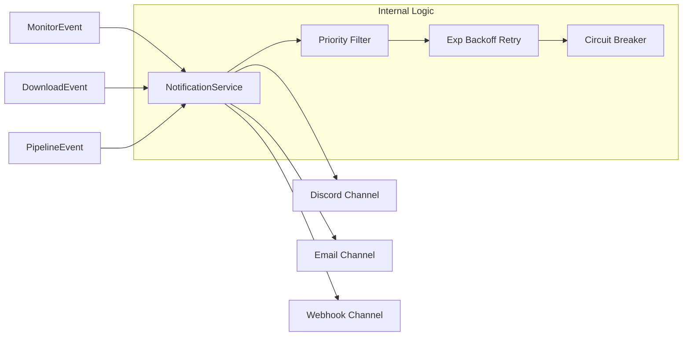

# Notification System

rust-srec features a flexible and robust notification system for real-time alerts on streaming status, system errors, and task progress.

## System Architecture

The notification system follows an event-driven pattern. When significant changes occur within the system, components publish an event. The `NotificationService` subscribes to these events and forwards them to various configured channels.



## Notification Channels

The following channels are currently supported:

| Channel | Description | Common Configuration |
|---------|-------------|----------------------|
| **Discord** | Formatted messages via Discord Webhook. | Webhook URL, Username, Avatar |
| **Email** | Email notifications via SMTP. | SMTP Server, Port, Login/Password |
| **Webhook** | Custom JSON POST requests to an endpoint. | Target URL, Custom Headers |

## Priority & Filtering

Not every event requires immediate attention. The system uses `NotificationPriority` for classification:

- **High**: Critical failures (e.g., out of disk space), fatal monitoring errors.
- **Info**: Live alerts, pipeline completion.
- **Debug/Low**: Minor state changes, retry attempts (typically not sent).

You can set a `min_priority` in your configuration to only receive notifications above that level.

## Reliability Guarantees

To ensure delivery even during network flakiness, the system includes:

1. **Retry Mechanism**: Failed notifications enter a retry queue with an Exponential Backoff algorithm.
2. **Circuit Breaker**: If a channel fails consistently (e.g., an invalid Webhook URL), the system "trips" and stops attempting until it's reset, preserving system resources.
3. **Dead Letter Queue (DLQ)**: Notifications that fail after all retries are moved to a DLQ for manual inspection via the API.

## Configuration Example

Enable notifications in your global or platform configuration:

```json
{
  "notifications": {
    "enabled": true,
    "min_priority": "info",
    "channels": [
      {
        "type": "discord",
        "webhook_url": "https://discord.com/api/webhooks/..."
      }
    ]
  }
}
```

::: tip Hint
You can set different notification policies per streamer. For example, use a dedicated high-priority channel for your favorite streamers.
:::
