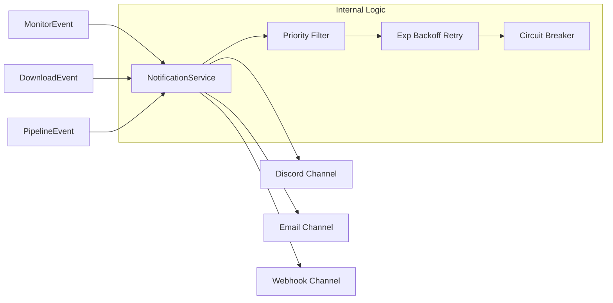

# Notification System

rust-srec features a flexible and robust notification system for real-time alerts on streaming status, system errors, and task progress.

## System Architecture

The notification system follows an event-driven pattern. When significant changes occur within the system, components publish an event. The `NotificationService` subscribes to these events and forwards them to various configured channels.


```mermaid
flowchart LR
    E1[MonitorEvent] --> NS[NotificationService]
    E2[DownloadEvent] --> NS
    E3[PipelineEvent] --> NS
    
    NS --> C1[Discord Channel]
    NS --> C2[Email Channel]
    NS --> C3[Webhook Channel]
    
    subgraph NS_Inner["Internal Logic"]
        NS --> Filter[Priority Filter]
        Filter --> Retry[Exp Backoff Retry]
        Retry --> CB[Circuit Breaker]
    end
```

## Notification Channels

The following channels are currently supported:

| Channel | Description | Common Configuration |
|---------|-------------|----------------------|
| **Discord** | Formatted messages via Discord Webhook. | Webhook URL, Username, Avatar |
| **Email** | Email notifications via SMTP. | SMTP Server, Port, Login/Password |
| **Webhook** | Custom JSON POST requests to an endpoint. | Target URL, Custom Headers |

## Critical Infrastructure Events

Two events are emitted when the recording filesystem itself is in trouble:

| Event | Fires when | Can auto-recover? |
|-------|------------|-------------------|
| `out_of_space` | Proactive: the configured disk usage threshold is crossed while recordings are still running. | N/A (advisory) |
| `output_path_inaccessible` | **The [output-root write gate](./architecture.md#output-root-write-gate) has actually blocked recordings** because `create_dir_all` or a mid-stream write failed with ENOENT / ENOSPC / EACCES / EROFS / timeout on a tracked output root. Emitted **exactly once per `Healthy → Degraded` transition** — not once per failed attempt. | Genuine ENOSPC: yes, automatically within ~30 seconds of the disk being freed. Stale Docker bind mount: **no**, container must be restarted. See the [Docker troubleshooting guide](../getting-started/docker.md#freeing-up-disk-space-when-using-bind-mounts). |

Every notification event is locale-aware when the `RUST_SREC_LOCALE` environment variable is set — stream online/offline, download lifecycle, segments, pipeline jobs, system alerts, and credential events — and the text is delivered through external channels (Telegram, Gotify, Discord, webhook, email, web push) in the configured locale. Supported locales: `en`, `zh-CN`. The `output_path_inaccessible` description additionally branches on the underlying `io::ErrorKind` so a `NotFound` (stale mount) gets different recovery instructions than a `StorageFull` (genuine ENOSPC).

## Priority & Filtering

Not every event requires immediate attention. The system uses `NotificationPriority` for classification:

- **Critical**: System-wide failures that block recording (`output_path_inaccessible`, `fatal_error`, `pipeline_queue_critical`).
- **High**: Significant warnings that may still allow recording to continue (`out_of_space`, `download_rejected`).
- **Normal**: Live/offline events, pipeline lifecycle, system startup/shutdown.
- **Low**: Minor state changes, segment-level progress (typically filtered out).

You can set a `min_priority` in your configuration to only receive notifications above that level.

## Reliability Guarantees

To ensure delivery even during network flakiness, the system includes:

1. **Retry Mechanism**: Failed notifications enter a retry queue with an Exponential Backoff algorithm.
2. **Circuit Breaker**: If a channel fails consistently (e.g., an invalid Webhook URL), the system "trips" and stops attempting until it's reset, preserving system resources.
3. **Dead Letter Queue (DLQ)**: Notifications that fail after all retries are moved to a DLQ for manual inspection via the API.

## Configuration Example

Enable notifications in your global or platform configuration:

```json
{
  "notifications": {
    "enabled": true,
    "min_priority": "info",
    "channels": [
      {
        "type": "discord",
        "webhook_url": "https://discord.com/api/webhooks/..."
      }
    ]
  }
}
```

::: tip Hint
You can set different notification policies per streamer. For example, use a dedicated high-priority channel for your favorite streamers.
:::
