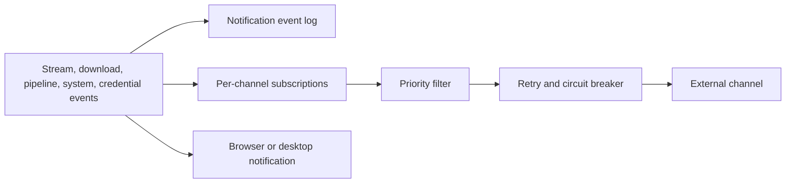

# Notification System

Rust-Srec records notification events and can deliver selected events to external channels. Channel delivery is configured independently from the interface language and from browser-only notifications.


```mermaid
flowchart LR
  E[Stream, download, pipeline, system, credential events] --> L[Notification event log]
  E --> S[Per-channel subscriptions]
  S --> P[Priority filter]
  P --> R[Retry and circuit breaker]
  R --> C[External channel]
  E --> B[Browser or desktop notification]
```

## Configure an External Channel

1. Open **Notifications** and select **Add Channel**.
2. Choose Webhook, Telegram, Gotify, or Email and enter a recognizable channel name.
3. Set **Minimum Priority**, message language, and **Enabled**.
4. Save the channel, then use its test action. A saved channel is not proven until the receiver gets the test.
5. Open the subscription manager and select the event types that should be sent to that channel.

Channel settings and subscriptions are separate. Creating a destination without subscribing it to events does not make it receive every event automatically.

## Available Destinations

| Destination | v0.5 web interface | Requirements |
|---|---|---|
| Webhook | Create, edit, test | HTTPS endpoint; optional headers or auth |
| Telegram | Create, edit, test | Bot token and chat ID |
| Gotify | Create, edit, test | Server URL and application token |
| Email | Create, edit, test | SMTP host, sender, recipients; credentials optional only when the relay permits it |
| Discord | Existing channels can be represented; new selection is disabled in the v0.5 form | Backend/API supports Discord webhook settings |
| Web Push | Configure per browser | VAPID keys and HTTPS, or localhost |
| Live polling | Configure per browser | The application tab must remain open |
| Desktop notification | Desktop build only | Operating-system notification permission |

Discord is therefore a backend capability with a web-interface limitation, not a generally selectable v0.5 UI channel.

## Priority

Priorities use a 0-10 numeric scale in the API and UI settings:

| Level | Value | Examples |
|---|---:|---|
| Low | 2 | Stream offline, segment progress, pipeline start/completion |
| Normal | 5 | Stream online, download completion, system startup/shutdown |
| High | 8 | Download error/rejection, pipeline failure, credential refresh failure, Baidu Netdisk re-login failure |
| Critical | 10 | Fatal error, output path inaccessible, out of space, invalid credential |

All five external channels apply the same enabled/priority policy. Their test action sends a Normal-priority startup event through that policy: a disabled channel or a minimum above Normal suppresses the test too. Email configurations constructed with the Rust defaults start at High; set an appropriate minimum when testing.

A channel filters events below its minimum. The API also accepts the legacy labels `low`, `normal`, `high`, and `critical` where documented; `info` is not a valid priority.

## Language

Each external channel can follow the server language or override it with `en` or `zh-CN`. `RUST_SREC_LOCALE` sets the default for backend-rendered messages. This is independent of the language selected by a user in the web interface.

## Telegram Formatting

Telegram channel settings accept `HTML`, `Markdown`, and `MarkdownV2` (case-insensitive), or an empty `parse_mode` for plain text. Formatted messages use Telegram's explicit entities: dynamic content stays literal, the title is bold, and the footer is italic. Long messages are truncated on character boundaries within a conservative 4,096 UTF-16-unit limit. Other mode values return a configuration error. See the [Telegram Bot API](https://core.telegram.org/bots/api#sendmessage).

## Web Push

Generate a VAPID key pair and set all three variables before starting the backend:

```bash
docker run --rm ghcr.io/hua0512/rust-srec-vapid:v0.5.1
```

```dotenv
WEB_PUSH_VAPID_PUBLIC_KEY=...
WEB_PUSH_VAPID_PRIVATE_KEY=...
WEB_PUSH_VAPID_SUBJECT=mailto:operations@example.com
```

Then open **Notifications**, enable Web Push for the current browser, grant browser permission, choose priority, and send a test. Browsers require a secure context; use HTTPS outside localhost.

## Delivery Behavior

Transient external-channel failures retry with backoff. Repeated failures temporarily pause a channel; exhausted deliveries are retained as failures. These mechanisms do not guarantee delivery. Test a channel after changing its settings and use a second destination for critical events.

When the ordinary notification queue is full, the oldest pending notification and its retries are removed. A zero queue limit disables ordinary delivery. An already-running send can still finish. Notifications already accepted before a channel edit continue using the original destination; failed reloads retain the loaded configuration.

Web Push uses a separate 2,048-event queue. When full or unavailable, it drops new events at every priority, including critical. Drops are counted by `notification_stats.web_push_dropped` and are not replayed. Event history and external channels continue independently. Oversized push payloads fail before sending; shutdown attempts to send queued events within its time limit.

Email delivery is immediate; the old `batch_window_secs` setting is ignored. For channel implementations and delivery-worker contracts, see [Notification internals](../development/notifications.md).

## Critical Storage Events

- `out_of_space` indicates that the disk threshold has been crossed.
- `output_path_inaccessible` means the [output-root write gate](../development/architecture.md#output-root-write-gate) has blocked new recording work because a tracked root cannot be written.

Freeing genuine disk exhaustion can recover automatically after the next probe. A stale Docker bind mount may require a container restart; see [Storage and Capacity](../operations/storage.md).

<div id="queue-and-web-push-delivery" class="legacy-section">

This section is now in [Notification System](./notifications.md#delivery-behavior).

</div>

<div id="backend-notification-interfaces" class="legacy-section">

This section is now in [Notification internals](../development/notifications.md#backend-notification-interfaces).

</div>
