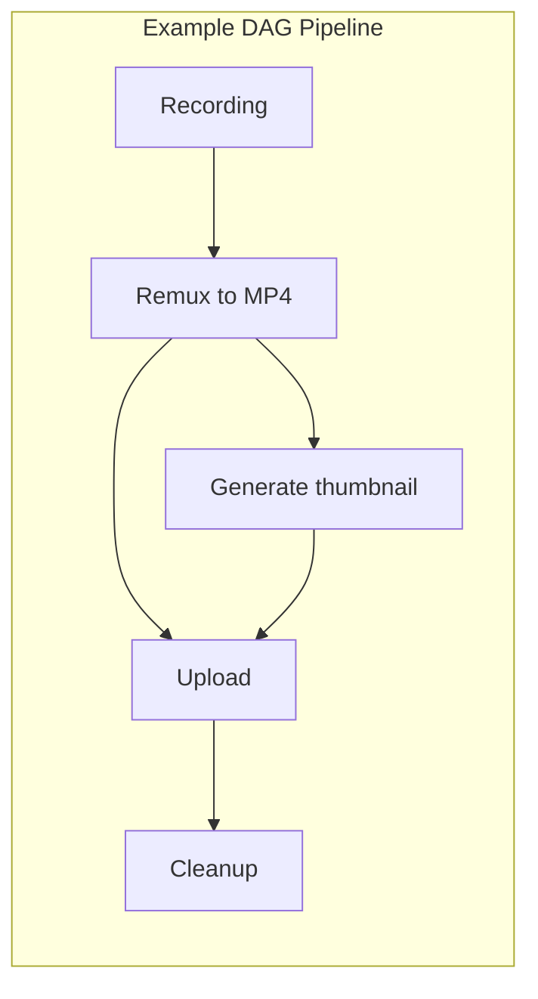
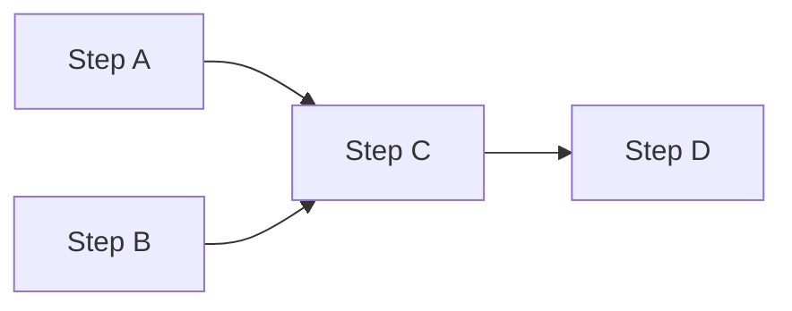
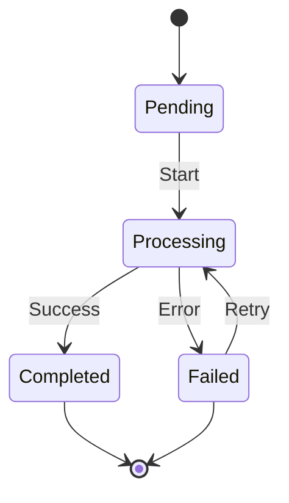

# DAG Pipeline

rust-srec uses a **Directed Acyclic Graph (DAG)** system for post-processing workflows.

## What is a DAG Pipeline?

A DAG pipeline defines a series of processing steps with dependencies. Steps run in parallel when possible, but respect dependency order.


```mermaid
flowchart LR
    subgraph DAG["Example DAG Pipeline"]
        R[Recording] --> REMUX[Remux to MP4]
        REMUX --> THUMB[Generate thumbnail]
        REMUX --> UPLOAD[Upload]
        THUMB --> UPLOAD
        UPLOAD --> CLEANUP[Cleanup]
    end
```

## Pipeline Triggers

The power of rust-srec lies in its automated trigger mechanism. You can trigger pipelines at different stages:

### 1. Segment Pipeline
- **Trigger**: When a single video segment (`.flv`, `.ts`) or danmaku file (`.xml`, `.json`) finishes downloading.
- **Usage**: Remuxing, taking thumbnails, danmaku format conversion.
- **Input**: A single file.

### 2. Paired Segment Pipeline
- **Trigger**: When both the **video segment** and its corresponding **danmaku file** for the same segment are ready, after any segment-level processing has finished.
- **Usage**: Hard-burning danmaku into video (Burn-in), merging segment metadata.
- **Input**: A video file + a matching danmaku file.

### 3. Session Complete Pipeline
- **Trigger**: When the entire streaming session ends, the final recording files are available, and all earlier segment or paired processing for that session has finished.
- **Usage**: Combining all segments, uploading to cloud storage (e.g., via Rclone to Google Drive/OneDrive), sending final completion notifications.
- **Input**: A list of all final products produced during the session.

::: tip Reliability note
If danmaku finishes before the final video file is ready, rust-srec waits before starting the session-complete pipeline. This keeps final jobs such as merge, upload, or cleanup from running with missing video inputs.
:::

## Built-in Processors

Each pipeline step is executed by a specialized processor:

| Processor ID | Function | Core Parameters |
|--------------|----------|-----------------|
| `remux` | Changes container format, optionally re-encoding | `format`, `video_codec`, `audio_codec` |
| `danmaku_factory` | Danmaku conversion | `output_format` (ass) |
| `ass_burnin` | Hard-burn subtitles into video | Processor preset configuration |
| `thumbnail` | Extracts a video frame as an image | `timestamp_secs`, `width`, `quality`, `preserve_resolution` |
| `audio_extract` | Extracts an audio track | `format`, `bitrate`, `sample_rate` |
| `compression` | Transcodes video | Codec and quality settings |
| `rclone` | Cloud synchronization | `destination_root`, `operation`, `time_anchor`, `args` |
| `copy_move` | Copies or moves local files | Destination and operation settings |
| `tdl` | Telegram upload through tdl | `args` |
| `metadata` | Writes metadata (nfo, json) | - |
| `delete` | Automatically cleans up files | - |
| `execute` | Runs a custom Shell command/script | `command`, `scan_output_dir`, `scan_extension` |

## Presets System

To improve efficiency, the system provides two types of presets:

- **Job Preset**: A configuration template for a single step (e.g., "1080p Thumbnail Extraction").
- **Pipeline Preset**: A full DAG workflow definition (e.g., "Bilibili Standard Recording Flow").

## Data Routing

Dependencies control both **when a step can run** and **which file paths it receives**:

1. Every root step (a step with no dependencies) receives the pipeline trigger's original input list.
2. A non-root step waits for all of its direct dependencies to complete.
3. Its input list is the merged, de-duplicated output list from those direct dependencies, in `depends_on` order.
4. Outputs from transitive ancestors are not inherited automatically.

For a chain `A -> B -> C`, step `C` receives only the outputs reported by `B`. It does not also receive the outputs reported by `A`. This prevents replaced, deleted, or unrelated intermediate files from leaking into later steps.

Processor outputs are also significant:

- Transform processors such as `remux` and `compression` output the transformed file.
- Derivative processors such as `thumbnail` and `audio_extract` output only the generated derivative, not their source file.
- `rclone` `copy` and `sync` pass their local input paths through; `rclone` `move` produces no local outputs because it consumes the local files.
- `delete` produces no outputs.

Therefore, a linear `remux -> thumbnail -> rclone` graph sends only the thumbnail to `rclone`. To upload both the remuxed video and its thumbnail, route both producers directly to `rclone`:


```mermaid
flowchart LR
    REMUX[Remux] --> THUMB[Thumbnail]
    REMUX --> RCLONE[Rclone]
    THUMB --> RCLONE
```

In this graph, `rclone` still waits for `thumbnail` because both `remux` and `thumbnail` are direct dependencies. The extra `remux -> rclone` edge routes the video; it does not make the upload start early.

## Advanced Features

### Parallelism & Dependencies (Fan-in / Fan-out)

- **Fan-out**: One step routes its outputs to multiple downstream steps. Those steps may run concurrently if all their other dependencies and worker capacity allow it.
- **Fan-in**: One step has multiple direct dependencies. It waits for all of them and receives their merged outputs.

Fan-out describes graph routing, not a guarantee of simultaneous execution.

### Automatic Cleanup
A `delete` step removes the files produced by the steps it depends on — not the original recording. This is safe after an `upload` step (rclone copy passes the uploaded files through as its output), so a `delete` with `depends_on: upload` implements "delete the local copy after a successful upload".

Do **not** place a `delete` step after a `remux`/transcode step: it would delete the converted result, because that is what the transcode produced. To delete the original source after converting, enable **Remove Input on Success** (`remove_input_on_success`) on the transcode step instead.

::: tip Performance Tip
Re-encoding (like `ass_burnin`) is extremely CPU-intensive. It is recommended to limit the concurrency in the `cpu_pool` to avoid high system load that could impact download stability.
:::

## Key Concepts

### Steps

Each step performs a single processing task:

| Step Type | Description |
|-----------|-------------|
| `remux` | Convert to different container (e.g., FLV → MP4) |
| `thumbnail` | Extract thumbnail image |
| `rclone` | Upload to cloud storage |
| `delete` | Delete files produced by its direct dependencies |
| `preset` | Run one step from a named job preset |
| `workflow` | Expand a named pipeline preset as a sub-DAG |
| `inline` | Run a processor with configuration embedded in the DAG |

### Dependencies

Steps can depend on other steps:


```mermaid
flowchart LR
    A[Step A] --> C[Step C]
    B[Step B] --> C
    C --> D[Step D]
```

- **Fan-out**: One step is a direct dependency of multiple downstream steps
- **Fan-in**: One step waits for multiple direct dependencies and merges their outputs

### Execution States


```mermaid
stateDiagram-v2
    [*] --> Pending
    Pending --> Processing: Start
    Processing --> Completed: Success
    Processing --> Failed: Error
    Failed --> Processing: Retry
    Completed --> [*]
    Failed --> [*]
```

## DAG Definition

```json
{
  "name": "Post-Process",
  "steps": [
    {
      "id": "remux",
      "step": {"type": "preset", "name": "remux"},
      "depends_on": []
    },
    {
      "id": "thumbnail",
      "step": {"type": "preset", "name": "thumbnail"},
      "depends_on": ["remux"]
    },
    {
      "id": "upload",
      "step": {"type": "preset", "name": "upload"},
      "depends_on": ["remux", "thumbnail"]
    },
    {
      "id": "cleanup",
      "step": {"type": "preset", "name": "delete_source"},
      "depends_on": ["upload"]
    }
  ]
}
```

A step can also use an inline processor instead of a job preset:

```json
{
  "id": "thumbnail",
  "step": {
    "type": "inline",
    "processor": "thumbnail",
    "config": {
      "timestamp_secs": 10,
      "width": 640,
      "quality": 2
    }
  },
  "depends_on": ["remux"]
}
```

## Pipeline Presets

Save DAG definitions as reusable presets:

1. Create preset via API or UI
2. Assign preset to streamers or templates
3. Preset runs automatically after recording completes

## Error Handling

- **Fail-fast**: When a step fails, pending downstream steps are cancelled
- **Retry**: Failed steps can be retried manually or automatically
- **Logs**: Each step maintains execution logs for debugging
