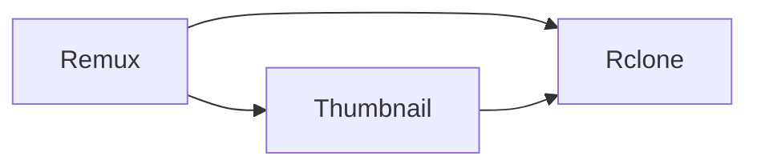

# Create a workflow {#dag-pipeline}

A workflow connects processing steps with dependencies. A job preset stores the settings for one step; a workflow (pipeline preset) stores the steps and their connections.

## Example: MP4 recording and thumbnail

Start with a successful recording and make sure FFmpeg is available to the backend.

1. Open **Workflows** and choose **Create Workflow**. Name it `MP4 and thumbnail`.
2. Add a `remux` step, set the output format to `mp4`, and leave source removal disabled for this first test.
3. Add a `thumbnail` step and make it depend on `remux`. Select a timestamp and image width.
4. Save the workflow, then assign it to a streamer or template's **Segment Pipeline**.
5. Record a video segment. Inspect the workflow in **Pipeline Jobs** and confirm that the converted video and thumbnail exist before enabling uploads or deletion.

```mermaid
flowchart LR
    VIDEO[Completed video segment] --> REMUX[Remux to MP4]
    REMUX --> THUMB[Extract thumbnail]
```

The thumbnail step receives the converted video and outputs only the thumbnail. To add an upload that receives both files, make it depend on both steps, as shown under [Data routing](#data-routing).

Choose the trigger to match your inputs: a segment trigger can also receive chat files when danmu recording is enabled. Use matching processors or a paired/session workflow as needed. See the [processor reference](../reference/processors.md) for each processor's input requirements.

## Pipeline Triggers

Pipelines can run automatically at three stages:

### 1. Segment Pipeline
- **Trigger**: When a single video segment (`.flv`, `.ts`) or danmaku file (`.xml`, `.json`) finishes downloading.
- **Usage**: Remuxing, taking thumbnails, danmaku format conversion.
- **Input**: A single file.

### 2. Paired Segment Pipeline
- **Trigger**: When both the **video segment** and its corresponding **danmaku file** for the same segment are ready, after any segment-level processing has finished.
- **Usage**: Hard-burning danmaku into video (Burn-in), merging segment metadata.
- **Input**: A video file + a matching danmaku file.

### 3. Session Complete Pipeline
- **Trigger**: When the entire streaming session ends, the final recording files are available, and all earlier segment or paired processing for that session has finished.
- **Usage**: Combining all segments, uploading to cloud storage (e.g., via Rclone to Google Drive/OneDrive), sending final completion notifications.
- **Input**: A list of all final products produced during the session.

::: tip Reliability note
If danmaku finishes before the final video file is ready, rust-srec waits before starting the session-complete pipeline. This keeps final jobs such as merge, upload, or cleanup from running with missing video inputs.
:::

## Data Routing

Dependencies control both **when a step can run** and **which file paths it receives**:

1. Every root step (a step with no dependencies) receives the pipeline trigger's original input list.
2. A non-root step waits for all of its direct dependencies to complete.
3. Its input list is the merged, de-duplicated output list from those direct dependencies, in `depends_on` order.
4. Outputs from transitive ancestors are not inherited automatically.

For a chain `A -> B -> C`, step `C` receives only the outputs reported by `B`. It does not also receive the outputs reported by `A`. This prevents replaced, deleted, or unrelated intermediate files from leaking into later steps.

Processor outputs are also significant:

- `remux` outputs the converted file; `compression` outputs the archive it wrote, not the files it archived.
- Derivative processors such as `thumbnail` and `audio_extract` output only the generated derivative, not their source file.
- `rclone` `copy` and `sync` pass their local input paths through; `rclone` `move` produces no local outputs because it consumes the local files.
- `baidupcs` passes its local input paths through, unless **Delete local files after upload** is enabled, in which case the consumed files are dropped from its outputs.
- `ass_burnin` outputs the burned videos. With **Passthrough Inputs** enabled it also passes its inputs through; with it disabled, the videos it left untouched (no matching subtitle, or a second copy of a recording whose subtitle was already burned) stay in its outputs, while subtitles and burned sources are dropped.
- `delete` produces no outputs.

A step whose dependencies produced no outputs, such as a `delete` after an
`rclone` move, completes without running and passes on no outputs, so the
steps after it complete the same way. An `execute` step is the exception: it
still runs its command, with `{input}` empty and `{inputs_json}` equal to `[]`,
so a script after an upload or delete keeps running.

Therefore, a linear `remux -> thumbnail -> rclone` graph sends only the thumbnail to `rclone`. To upload both the remuxed video and its thumbnail, route both producers directly to `rclone`:

```mermaid
flowchart LR
    REMUX[Remux] --> THUMB[Thumbnail]
    REMUX --> RCLONE[Rclone]
    THUMB --> RCLONE
```

In this graph, `rclone` still waits for `thumbnail` because both `remux` and `thumbnail` are direct dependencies. The extra `remux -> rclone` edge routes the video; it does not make the upload start early.

## Parallelism & Dependencies (Fan-in / Fan-out) {#parallelism-dependencies-fan-in-fan-out}

- **Fan-out**: One step routes its outputs to multiple downstream steps. Those steps may run concurrently if all their other dependencies and worker capacity allow it.
- **Fan-in**: One step has multiple direct dependencies. It waits for all of them and receives their merged outputs.

Fan-out describes graph routing, not a guarantee of simultaneous execution.

When a worker becomes free, a step that continues a workflow already in progress is claimed before the first step of a new workflow at the same priority, and within that order the oldest job goes first. A busy queue therefore finishes workflows instead of leaving many half done.

## Automatic Cleanup {#automatic-cleanup}
A `delete` step removes the files produced by the steps it depends on — not the original recording. This is safe after an `upload` step (rclone copy passes the uploaded files through as its output), so a `delete` with `depends_on: upload` implements "delete the local copy after a successful upload".

Do **not** place a `delete` step after a `remux`/transcode step: it would delete the converted result, because that is what the transcode produced. To delete the original source after converting, enable **Remove Input on Success** (`remove_input_on_success`) on the transcode step instead.

A step that removes its inputs (`delete`, an `rclone` or `copy_move` step in `move` mode, or a `baidupcs` step with **Delete local files after upload**) must not share a parent with another step that still reads the same files, because fan-out runs both at once. Such a workflow is rejected when it is saved or validated, with a message naming the steps involved; make the removing step depend on the other reader, directly or through other steps, so it runs after it. Root steps all read the pipeline's inputs and count as sharing one parent. Removal driven by a processor option, such as **Remove Input on Success**, happens only after that step has succeeded, so beside a reader it is reported as a warning when the workflow is validated or saved and logged when it runs: whichever sibling finishes first decides whether the other still finds its file. Saving a workflow also checks that every preset and workflow it names exists and that every processor is available, instead of failing when the next recording finishes.

::: tip Performance Tip
Re-encoding (such as `ass_burnin`) is CPU-intensive. Limit concurrency in `cpu_pool` to avoid system load that could disrupt downloads.
:::

## Error handling {#error-handling}

When a step fails, dependent steps are cancelled; independent branches can finish. The workflow is marked failed after running steps stop. Retry the workflow to restart failed and cancelled steps without repeating completed steps.

Partial file failures fail the step and identify the affected inputs. Already-published files remain on disk and in the job history. Check per-file results before manually repeating uploads or moves.

Automatic per-step retries keep dependent steps waiting until retries are exhausted. Cancelling the workflow cancels pending retries. See [retry counts and timeouts](../reference/workflows.md#per-step-retries-and-timeouts).

If processing is interrupted, restart recovery resumes unfinished work. Stored video/chat paths must still identify the original segments; unmatched chat files are skipped with a warning. See [recovery details](../development/pipeline.md#restart-recovery-of-danmu-segments).

Use [Workflow reference](../reference/workflows.md) for JSON definitions, execution states, and API cancellation. Processor options for Execute, archives, and Baidu Netdisk are in [Processor reference](../reference/processors.md).

This section is now in [Create a workflow](./pipeline.md#dag-pipeline).

This section is now in [Create a workflow](./pipeline.md#dag-pipeline).

This section is now in [Create a workflow](./pipeline.md#dag-pipeline).

This section is now in [Create a workflow](./pipeline.md#dag-pipeline).

This section is now in [Create a workflow](./pipeline.md#dag-pipeline).

This section is now in [Create a workflow](./pipeline.md#dag-pipeline).

This section is now in [Processor reference](../reference/processors.md#built-in-processors).

This section is now in [Processor reference](../reference/processors.md#execute-execute).

This section is now in [Processor reference](../reference/processors.md#archives-compression).

This section is now in [Processor reference](../reference/processors.md#baidu-netdisk-baidupcs).

This section is now in [Pipeline execution contracts](../development/pipeline.md#restart-recovery-of-danmu-segments).

This section is now in [Pipeline execution contracts](../development/pipeline.md#processor-result-contracts).

This section is now in [Workflow reference](../reference/workflows.md#steps).

This section is now in [Workflow reference](../reference/workflows.md#execution-states).

This section is now in [Workflow reference](../reference/workflows.md#dag-definition).

This section is now in [Workflow reference](../reference/workflows.md#per-step-retries-and-timeouts).

This section is now in [Workflow reference](../reference/workflows.md#cancelling-a-running-pipeline).

