# DAG Pipeline

rust-srec uses a **Directed Acyclic Graph (DAG)** system for post-processing workflows.

## What is a DAG Pipeline?

A DAG pipeline defines a series of processing steps with dependencies. Steps run in parallel when possible, but respect dependency order.

```mermaid
flowchart LR
    subgraph DAG["Example DAG Pipeline"]
        R[📁 Recording] --> REMUX[🔄 Remux to MP4]
        R --> THUMB[🖼️ Thumbnail]
        REMUX --> UPLOAD[☁️ Upload]
        THUMB --> UPLOAD
        UPLOAD --> CLEANUP[🗑️ Cleanup]
    end
```



## Pipeline Triggers

The power of rust-srec lies in its automated trigger mechanism. You can trigger pipelines at different stages:

### 1. Segment Pipeline
- **Trigger**: When a single video segment (`.flv`, `.ts`) or danmaku file (`.xml`, `.json`) finished downloading.
- **Usage**: Remuxing, taking thumbnails, danmaku format conversion.
- **Input**: A single file.

### 2. Paired Segment Pipeline
- **Trigger**: When both the **video segment** and its corresponding **danmaku file** for the same index are ready, and their respective segment pipelines đã finished successfully.
- **Usage**: Hard-burning danmaku into video (Burn-in), merging segment metadata.
- **Input**: A video file + a matching danmaku file.

### 3. Session Complete Pipeline
- **Trigger**: When the entire streaming session ends (streamer offline) and all preliminary pipelines (Segment & Paired) for all segments in that session have finished successfully.
- **Usage**: Combining all segments, uploading to cloud storage (e.g., via Rclone to Google Drive/OneDrive), sending final completion notifications.
- **Input**: A list of all final products produced during the session.

## Built-in Processors

Each pipeline step is executed by a specialized processor:

| Processor ID | Function | Core Parameters |
|--------------|----------|-----------------|
| `remux` | Changes container format without re-encoding | `format` (mp4, mkv...) |
| `danmaku_factory` | Danmaku conversion | `output_format` (ass) |
| `burn_in` | Hard burn subtitles into video | `video_path`, `subtitle_path` |
| `thumbnail` | Extracts keyframes as thumbnails | `timestamp`, `width`, `height` |
| `rclone` | Cloud synchronization | `remote`, `path`, `args` |
| `tdl_upload` | Specific upload tool support | `args` |
| `metadata` | Writes metadata (nfo, json) | - |
| `delete` | Automatically cleans up files | - |
| `execute` | Runs a custom Shell command/script | `command`, `args` |

## Presets System

To improve efficiency, the system provides two types of presets:

- **Job Preset**: A configuration template for a single step (e.g., "1080p Thumbnail Extraction").
- **Pipeline Preset**: A full DAG workflow definition (e.g., "Bilibili Standard Recording Flow").

## Advanced Features

### Parallelism & Dependencies (Fan-in / Fan-out)
The DAG system supports complex topologies. For instance, you can run `remux` and `thumbnail` in parallel, while the `upload` step waits for both to succeed before starting (fan-in).

### Automatic Cleanup
By adding a `delete` step at the end of a DAG and setting its `depends_on` to `upload`, you can implement a safe "delete source after successful upload" logic.

::: tip Performance Tip
Re-encoding (like `burn_in`) is extremely CPU-intensive. It is recommended to limit the concurrency in the `cpu_pool` to avoid high system load that could impact download stability.
:::

## Key Concepts

### Steps

Each step performs a single processing task:

| Step Type | Description |
|-----------|-------------|
| `remux` | Convert to different container (e.g., FLV → MP4) |
| `thumbnail` | Extract thumbnail image |
| `upload` | Upload to cloud storage |
| `delete` | Delete source files |
| `preset` | Sub-DAG from preset |

### Dependencies

Steps can depend on other steps:


- **Fan-out**: Multiple steps run in parallel from one source
- **Fan-in**: One step waits for multiple dependencies

### Execution States


## DAG Definition

```json
{
  "name": "Post-Process",
  "steps": [
    {
      "id": "remux",
      "step": {"type": "remux", "format": "mp4"}
    },
    {
      "id": "thumbnail",
      "step": {"type": "thumbnail"}
    },
    {
      "id": "upload",
      "step": {"type": "upload", "target": "s3"},
      "depends_on": ["remux", "thumbnail"]
    },
    {
      "id": "cleanup",
      "step": {"type": "delete"},
      "depends_on": ["upload"]
    }
  ]
}
```

## Pipeline Presets

Save DAG definitions as reusable presets:

1. Create preset via API or UI
2. Assign preset to streamers or templates
3. Preset runs automatically after recording completes

## Error Handling

- **Fail-fast**: When a step fails, pending downstream steps are cancelled
- **Retry**: Failed steps can be retried manually or automatically
- **Logs**: Each step maintains execution logs for debugging
