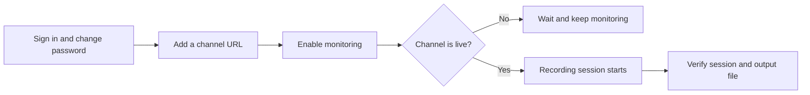

# Make Your First Recording

This walkthrough starts with a running installation and ends with a recorded file on disk. Use a channel that you own or have permission to record.



## 1. Confirm the Service Is Ready

For the recommended Docker setup:

```bash
docker compose ps
curl http://localhost:12555/api/health/live
```

The backend should be healthy and the liveness request should return a successful response. Readiness and detailed health require authentication. If liveness fails, run `docker compose logs --tail=200 rust-srec` before continuing.

## 2. Sign In and Replace the Default Password

Open `http://localhost:15275` and sign in with:

- Username: `admin`
- Password: `admin123!`

The initial account is marked for a mandatory password change. Choose a unique password before any other authenticated action is allowed. Do not expose the service to a network while it still has the default password.

## 3. Add a Streamer

1. Open **Streamers** and select **Add Streamer**.
2. Paste the direct channel URL, for example `https://www.twitch.tv/<channel>` or `https://live.bilibili.com/<room-id>`. Replace the placeholder with a real channel or room.
3. Enter a recognizable name. The sparkle action can retrieve a name from a valid URL.
4. Check that the detected platform is correct, then select **Continue**.
5. Leave **None (Default)** as the template for this first test and keep **Enable monitoring** on.
6. Select **Create streamer**.

The URL must be a channel or room URL, not a video, profile, search, or home page. See [Supported Platforms](../platforms/) for accepted URL forms and platform-specific credentials.

## 4. Observe the First Session

An offline channel remains monitored and does not create a recording until it goes live. For a live channel, the streamer card should move through checking and recording states. Open **Sessions** to inspect the current or completed session.

With the standard Docker configuration, recordings appear under `./output` in the installation directory. The container sees the same location as `/app/output`.

Success means all three are true:

- the streamer is enabled and no persistent error is shown;
- a live broadcast creates a session;
- a media file appears below the configured output directory and continues growing while recording.

## 5. Stop or Disable Monitoring

Open the streamer's action menu and select **Disable** when you no longer want automatic checks. Disabling monitoring only stops the checks; the streamer and its configuration stay. Neither disabling nor deleting a streamer removes its recorded sessions or the files on disk — a deleted streamer's sessions are kept, labelled with the name they were recorded under. To actually clear them, delete the media outputs with the option to remove the file from disk, then delete the sessions.

## When Nothing Is Recorded

| Symptom | Check |
|---|---|
| Link is rejected | Use the direct channel/room format from [Supported Platforms](../platforms/). |
| Streamer stays offline | Confirm the channel is currently live in a browser and check whether the platform requires cookies. |
| Streamer shows an error | Open its edit page and status history, then inspect backend logs. |
| Session starts but no file appears | Check free space, output-directory permissions, and [Storage and Capacity](../operations/storage.md). |
| Platform requests fail | Configure a proxy only if the backend host needs one; see [Configuration](./configuration.md). |

After the first recording works, configure reusable [Templates](../concepts/configuration.md) and a [Pipeline](../concepts/pipeline.md) before adding many channels.
