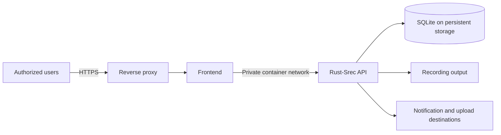

# Production Deployment

Rust-Srec runs as a self-hosted, single-node service. If clustering or failover is a requirement, read [Scope and Limits](./support.md#scope-and-limits) before going further.

## Reference Topology

Keep the backend, database, configuration, and output paths on one trusted host. Publish only the frontend through a TLS reverse proxy unless an API integration specifically requires direct API access.

## Deployment Baseline

1. Use the [Docker deployment](../getting-started/docker.md) and set `VERSION=v0.5.1` for both images. Avoid `latest` where changes must be reviewed before rollout.
2. Generate unique values for `JWT_SECRET` and `SESSION_SECRET`; store the `.env` file with restrictive permissions.
3. Bind host ports to a private address or loopback. In Compose, a loopback-only mapping takes the form `127.0.0.1:15275:80` and `127.0.0.1:12555:8080`.
4. Terminate HTTPS at a maintained reverse proxy and forward `Host`, `X-Forwarded-For`, and `X-Forwarded-Proto`. The session cookie is marked `Secure` automatically once the proxy sends `X-Forwarded-Proto: https` (an RFC 7239 `Forwarded: proto=https` also works). If the proxy cannot send either header, set `COOKIE_SECURE=true` explicitly.
5. Put `DATA_DIR`, `CONFIG_DIR`, `OUTPUT_DIR`, and `LOG_DIR` on persistent storage. Size and monitor the output volume separately from the system disk.
6. Set resource and application concurrency limits for the host. Start conservatively and load-test the expected number and bitrate of simultaneous streams.
7. Configure notifications for recording failures, pipeline failures, credential expiry, and output-root write failures.
8. Complete a backup and restore drill before adding production channels.

## Network Boundary

The frontend reaches the API over `BACKEND_URL=http://rust-srec:8080` on the private Compose network. The host API port is useful for local administration and integrations, but it does not need to be Internet-facing for ordinary browser use.

If direct API access is required, proxy it through HTTPS, restrict source networks, and use individual credentials. Swagger exposes the complete attack surface and should not be public by default.

## Capacity and Reliability

- SQLite, output files, and pipeline work make storage latency material. Do not use an unreliable network filesystem without testing locking, atomic rename, and sustained write behavior.
- Recording and transcode peaks are different workloads. Limit `max_concurrent_downloads`, CPU jobs, IO jobs, and uploads independently.
- Docker restart policies recover a failed process, but do not provide host failover. Monitor the host as well as the container.
- Keep enough free space for an active recording, temporary pipeline files, and rollback snapshots. See [Storage and Capacity](./storage.md).

## Go-Live Checklist

- Default password changed and unused accounts disabled.
- Secrets replaced, protected, and absent from logs and tickets.
- TLS and secure cookies verified from the user-facing URL.
- Backend and Swagger not publicly exposed without a requirement.
- Persistent volume ownership and free-space alerts verified.
- Liveness and authenticated readiness checks monitored.
- Restore drill and rollback procedure completed.
- Platform recording permission, retention, and privacy requirements approved.

Continue with [Security](./security.md), [Backup and Restore](./backup-restore.md), and [Monitoring](./monitoring.md).
