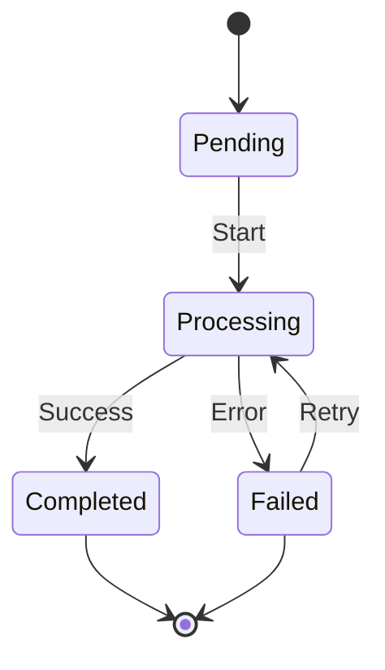

# Workflow reference

JSON definitions, execution states, retries, and API cancellation. For triggers and file routing, see the [workflow guide](../concepts/pipeline.md).

## Steps {#steps}

Each step selects one of these definition forms. Individual processors such as `remux`, `thumbnail`, and `rclone` are listed in the [processor reference](./processors.md).

| Step Type | Description |
|-----------|-------------|
| `preset` | Run one step from a job preset with exactly this name. A name matching no preset is treated as a processor id instead, so `{"type": "preset", "name": "thumbnail"}` still runs the `thumbnail` processor with its defaults. |
| `workflow` | Expand the pipeline preset with exactly this name as a sub-DAG. A name matching no pipeline preset fails the pipeline. |
| `inline` | Run a processor with configuration embedded in the DAG |

## DAG Definition {#dag-definition}

```json
{
  "name": "Post-Process",
  "steps": [
    {
      "id": "remux",
      "step": {"type": "preset", "name": "remux"},
      "depends_on": []
    },
    {
      "id": "thumbnail",
      "step": {"type": "preset", "name": "thumbnail"},
      "depends_on": ["remux"]
    },
    {
      "id": "upload",
      "step": {"type": "preset", "name": "upload"},
      "depends_on": ["remux", "thumbnail"]
    },
    {
      "id": "cleanup",
      "step": {"type": "preset", "name": "delete_source"},
      "depends_on": ["upload"]
    }
  ]
}
```

A step can also use an inline processor instead of a job preset:

```json
{
  "id": "thumbnail",
  "step": {
    "type": "inline",
    "processor": "thumbnail",
    "config": {
      "timestamp_secs": 10,
      "width": 640,
      "quality": 2
    }
  },
  "depends_on": ["remux"]
}
```

## Execution States {#execution-states}



## Per-step retries and timeouts {#per-step-retries-and-timeouts}

A workflow step can carry its own retry budget and timeout in its definition:

```json
{
  "id": "upload",
  "step": {"type": "preset", "name": "upload"},
  "depends_on": ["remux"],
  "retry": {"max_attempts": 3, "backoff_secs": 60},
  "timeout_secs": 7200
}
```

- `retry.max_attempts` counts the first run, so `3` allows two automatic retries; `1`, or no `retry`, means none. `retry.backoff_secs` (default 60) is the wait before the second attempt; it doubles for each further attempt and is capped at six hours.
- `timeout_secs` limits one attempt of that step's job and replaces the worker pool's default timeout for it.

When an attempt fails or times out with attempts left, the job is shown as failed with the time of the next attempt in its error message and in `retry_after`, the step keeps waiting and the workflow stays in progress; nothing downstream is cancelled. The retry starts within about fifteen seconds of its time, also after a restart. A job whose inputs the processor cannot take at all is not retried. Once the budget is spent the failure reaches the workflow as described above, and the manual retry remains available. Cancelling the workflow drops a pending retry. The step dialog of the workflow editor exposes both settings under **Retries and timeout**.

## Cancelling a Running Pipeline {#cancelling-a-running-pipeline}

`DELETE /api/pipeline/{pipeline_id}` cancels a pipeline. When the ID names a DAG execution, it cancels the running step jobs and marks the DAG as cancelled. The session stops waiting for that DAG, and the pipeline remains cancelled after a restart.

A cancelled DAG can be retried afterwards. Retry re-runs the steps that ended failed or cancelled; steps that had already completed are not repeated.

The request is idempotent: an id that matches no pipeline, and a DAG that is already in a terminal state, both answer with `cancelled_count: 0` rather than an error.
