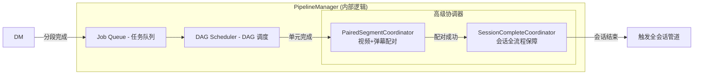
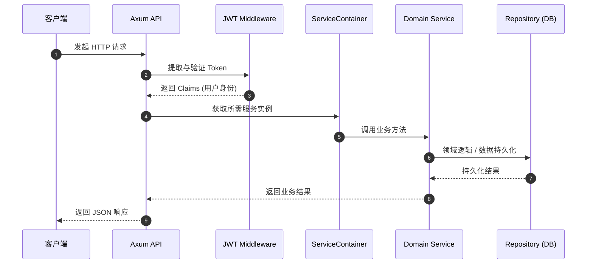

# 系统架构

rust-srec 采用模块化服务架构，基于 Rust 异步运行时（Tokio）构建。

## 整体架构


```mermaid
flowchart TB
    subgraph Client["客户端层 (Frontend)"]
        FE[前端 - TanStack Start + React 19]
        API_CLIENT[API 客户端 / 外部集成]
    end
    
    subgraph API["控制层 (API Layer)"]
        AXUM[Axum Web 服务器]
        SWAGGER[Swagger UI / OpenAPI]
        JWT[JWT 认证中间件]
    end
    
    subgraph Core["组件层 (Core Components)"]
        direction TB
        CS[ConfigService - 配置管理]
        SM[StreamerManager - 主播生命周期]
        DM[DownloadManager - 下载引擎控制]
        PM[PipelineManager - 后处理管道]
        DS[DanmuService - 弹幕采集]
        NS[NotificationService - 消息通知]
        HC[HealthChecker - 健康检查]
    end
    
    subgraph Engine["执行层 (Execution Layer)"]
        MONITOR[直播探测器 (Detector)]
        DWENG[下载引擎 (FFmpeg/Mesio/Streamlink)]
        DAG_SCHED[DAG 调度器]
        WORKER_POOL[工作线程池 (CPU/IO)]
    end
    
    subgraph Storage["存储层 (Persistence)"]
        DB[(SQLite - 核心数据)]
        FS[(文件系统 - 录制文件/日志)]
        CACHE[(内存缓存 - 配置/状态)]
    end
    
    FE --> |REST API| AXUM
    AXUM --> JWT --> Core
    
    CS <--> CACHE
    CS <--> DB
    SM --> MONITOR
    DM --> DWENG
    PM --> DAG_SCHED
    DAG_SCHED --> WORKER_POOL
    WORKER_POOL --> FS
    
    MONITOR -.-> |探测结果| SM
```

## ServiceContainer（服务容器）

`ServiceContainer` 是 rust-srec 的核心，负责所有长期运行服务的初始化、依赖注入和生命周期管理。

### 核心服务及其职责

1.  **ConfigService**: 管理四层配置层级，处理配置合并、持久化，并广播配置变更。
2.  **StreamerManager**: 负责主播状态流转（Idle <-> Monitoring <-> Recording），管理 **Detector** 任务。
3.  **DownloadManager**: 接收探测结果，解析码率/链接，调度具体的下载引擎（FFmpeg, Mesio 等）。
4.  **DanmakuService**: 并行采集直播间弹幕，支持实时保存为 XML/JSON。
5.  **PipelineManager**: 核心后处理中心，管理任务队列、DAG 调度以及 **Paired/Session** 协调器。
6.  **NotificationService**: 将系统事件（开播、失败、管道完成）推送到 Discord、Email 或 Webhook。

### 内部交互与协调器

在 `PipelineManager` 内部，引入了特殊的协调器来处理复杂的触发逻辑：



## 事件驱动通信

服务间通过高性能异步广播通道（Broadcast Channel）进行松耦合通信：

| 事件类型 | 发布者 | 主要订阅者 | 描述 |
|---------|--------|--------|------|
| `ConfigUpdateEvent` | `ConfigService` | `Streamer`, `Download`, `Pipeline` | 触发配置热重载 |
| `MonitorEvent` | `StreamMonitor` | `Download`, `Danmu`, `Notification` | 通知主播开播/下线/错误 |
| `DownloadEvent` | `DownloadManager` | `PipelineManager`, `Notification` | 触发分段后处理（Segment Pipeline） |
| `DagCompletionInfo` | `DagScheduler` | `PipelineManager`, `Notification` | 同步 DAG 执行结果 |
| `ThrottleEvent` | `ThrottleController` | `DownloadManager` | 根据队列深度自动调节下载速率 |

## 请求处理流



::: tip 开发者提示
rust-srec 充分利用了 Rust 的多线程和异步特性。绝大多数阻塞操作（IO、重编码）都在专门的 `WorkerPool` 中执行，确保 API 响应始终敏捷。
:::
::: tip 排查建议
如果遇到问题，`logs` 目录中包含详细的 trace/debug 信息。你可以通过 `RUST_LOG` 环境变量调整日志级别。
:::
