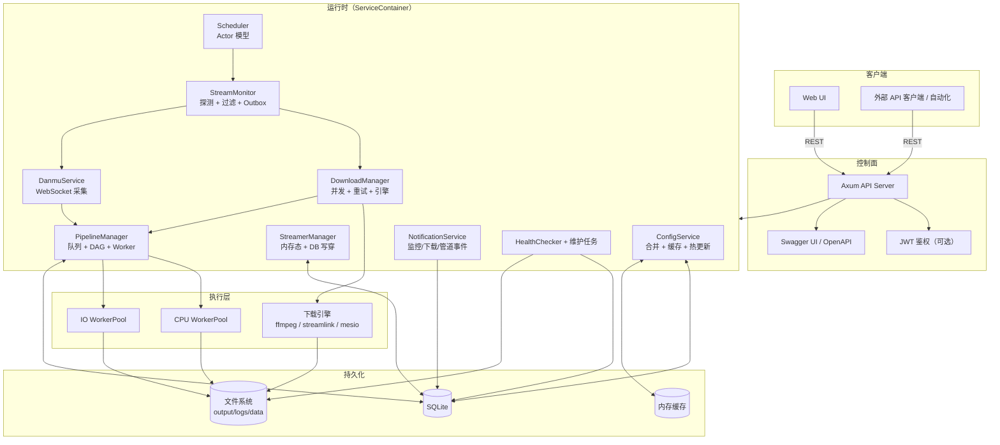
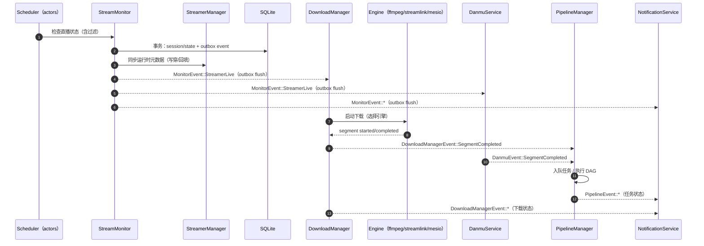
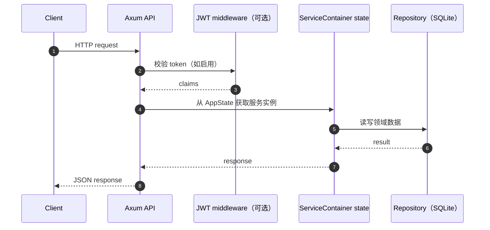

# 系统架构

`rust-srec` 是一套自动录播系统，整体设计强调清晰的关注点分离：

- **控制面**：REST API + 配置管理 + 编排/调度
- **数据面**：直播状态探测 + 下载 + 弹幕 + 后处理
- **持久化层**：SQLite + 文件系统输出

系统以 Tokio 为运行时，由 `ServiceContainer` 统一初始化并管理各类长期运行的服务。

## 高层拓扑

## 运行时根：`ServiceContainer`

`ServiceContainer`（位于 `rust-srec/src/services/container.rs`）负责把所有组件串起来：

- 初始化仓储与服务（数据库、配置缓存、各类 manager/service）
- 启动后台任务（scheduler actors、pipeline workers、outbox flushers）
- 订阅事件流，并在服务之间转发/协调事件
- 持有用于优雅退出的 `CancellationToken`

这让系统的生命周期与依赖关系有一个统一的“入口点”，方便定位与演进。

## 核心组件（按实际实现）

### `ConfigService`（配置合并 + 热更新）

`ConfigService` 是配置控制面，负责加载并合并四层配置：

1. 全局默认（Global）
2. 平台配置（Platform）
3. 模板配置（Template）
4. 主播覆盖（Streamer overrides）

它会缓存合并后的结果，并广播 `ConfigUpdateEvent`，让运行时服务可以无重启响应配置变更。

参见：[配置](./configuration.md)

### `StreamerManager`（运行时状态“事实来源”）

`StreamerManager` 维护运行时所需的主播元数据（内存态），并对关键变更执行
**写穿（write-through）** 持久化到 SQLite。

一个重要的正确性细节：启动时会执行 **重启恢复**，把数据库中遗留的 `Live` 状态重置为
`NotLive`，确保 `NotLive → Live` 这条边能够再次触发下载启动。

### `Scheduler`（Actor 模型编排/调度）

Scheduler 采用 supervisor + actor 的结构：

- `StreamerActor`：单个主播的自调度状态循环（自己管理定时）
- `PlatformActor`：对支持批量探测的平台进行批量协调
- `Supervisor`：负责 actor 生命周期、崩溃恢复、退出汇总

Actor 会调用 `StreamMonitor` 做真实状态探测；Scheduler 同时订阅配置事件，动态创建/移除
actor。

### `StreamMonitor`（探测 + 过滤 + 会话 + Outbox）

`StreamMonitor` 是数据面的探测器，负责：

- 根据 URL/平台解析直播状态（含过滤：时间/关键词/分类等）
- 以事务方式创建/结束 session，并更新 streamer state
- 通过 **DB-backed Outbox** 机制发出 `MonitorEvent`

**Outbox 模式**：将“状态/会话变更”与“事件写入 outbox”放在同一 DB 事务里，然后由后台
任务定期/通知触发，把 outbox flush 到 Tokio `broadcast` 事件流，从而降低
“状态已变更但事件丢失”的风险。

### `DownloadManager`（下载调度 + 引擎抽象）

DownloadManager 负责：

- 并发控制（含高优先级额外并发槽位）
- 重试与熔断（按引擎类型与配置 key 维度隔离）
- 引擎抽象：
  - 外部进程：`ffmpeg`、`streamlink`
  - 内置 Rust 引擎：`mesio`

并通过 `DownloadManagerEvent` 广播下载生命周期与分段事件。

### `DanmuService`（弹幕/聊天采集）

弹幕采集以 session 为单位维持连接，以 segment 为单位落盘：

- session 期间维持 websocket 连接与统计（可选）
- 由下载分段边界驱动，开启/结束对应的弹幕文件（如 XML）
- Danmu 事件会转发到 pipeline，用于“视频+弹幕配对”等协调逻辑

### `PipelineManager`（队列 + DAG + WorkerPool）

PipelineManager 是后处理引擎：

- DB-backed job queue（支持重启恢复）
- DAG 执行（fan-in / fan-out、fail-fast）
- CPU/IO 分离的 worker pool
- 多阶段触发协调：
  - Segment pipeline（单个文件）
  - Paired-segment pipeline（同一分段的 视频 + 弹幕）
  - Session-complete pipeline（会话结束后、所有分段完成后触发）

参见：[DAG 管道](./pipeline.md)

### `NotificationService`（事件分发）

NotificationService 订阅监控/下载/管道事件，并分发到 Discord / Email / Webhook 等通道，
包含重试、熔断与 dead-letter 持久化。

参见：[通知](./notifications.md)

## 关键流程

### 录制生命周期（端到端）

### API 请求流（控制面）

## 事件驱动通信

跨服务协调主要依赖 Tokio `broadcast`：

| 事件流 | 发布者 | 典型消费者 | 备注 |
|---|---|---|---|
| `ConfigUpdateEvent` | `ConfigService` | `Scheduler`、`DownloadManager`、`PipelineManager`、`ServiceContainer` | 配置热更新与资源清理 |
| `MonitorEvent` | `StreamMonitor` | `ServiceContainer`、`NotificationService` | 通过 DB outbox 发出，提高一致性 |
| `DownloadManagerEvent` | `DownloadManager` | `PipelineManager`、`Scheduler`、`NotificationService` | 分段边界是管道触发核心 |
| `DanmuEvent` | `DanmuService` | `PipelineManager` | 用于 paired/session 协调 |
| `PipelineEvent` | `PipelineManager` | `NotificationService` | 作业生命周期与可观测性 |

::: tip 关于限流/节流
`PipelineManager` 内置可选的节流系统（`ThrottleController`）。若注入
`DownloadLimitAdjuster`，可以根据队列压力动态调节下载并发。
:::

## 可观测性、健康检查与优雅退出

- 日志：使用 `tracing`，支持动态调整过滤器并带日志保留清理
- 健康检查：
  - `GET /api/health/live`（无鉴权，适合作为容器 liveness）
  - `GET /api/health` 与 `GET /api/health/ready`（启用 JWT 时需要鉴权）
- 退出：
  - `ServiceContainer` 持有 `CancellationToken` 并向后台任务传播
  - 收到 `SIGINT`/`SIGTERM` 后执行优雅退出流程
