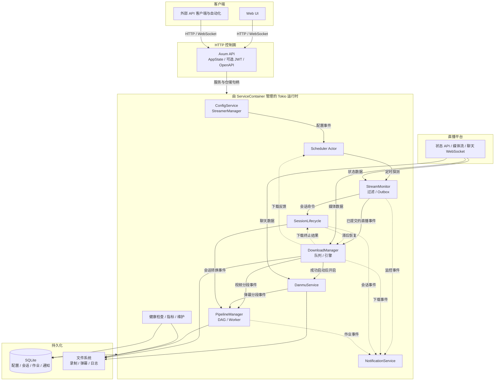
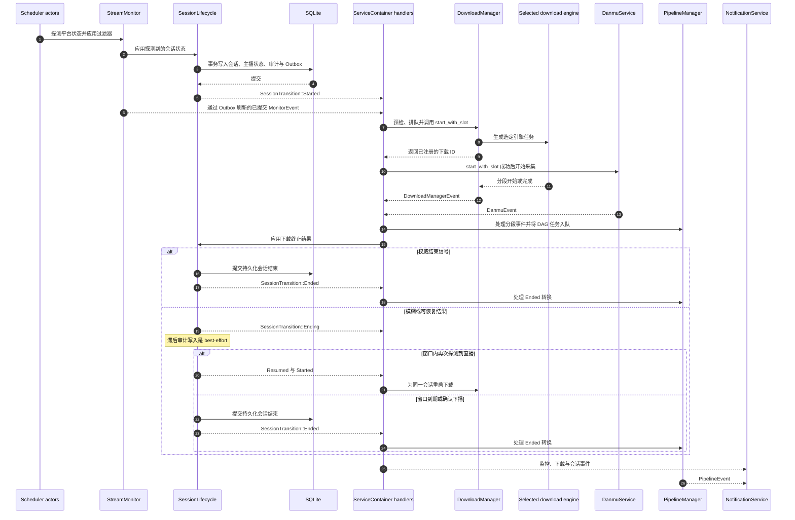
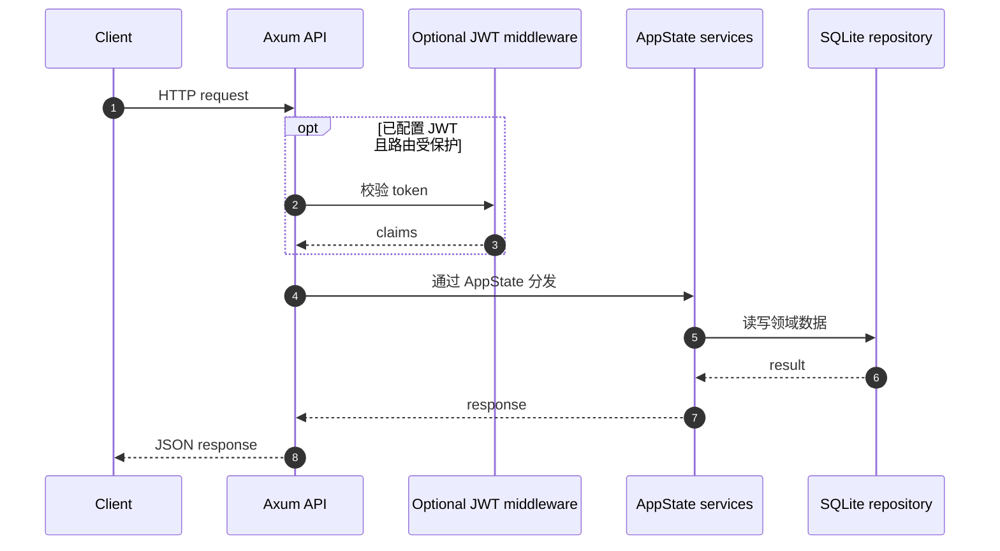

# 系统架构

`rust-srec` 是一套自动录播系统，整体设计强调清晰的关注点分离：

- **控制面**：REST API + 配置管理 + 编排/调度
- **数据面**：直播状态探测 + 下载 + 弹幕 + 后处理
- **持久化层**：SQLite + 文件系统输出

系统以 Tokio 为运行时，由 `ServiceContainer` 统一初始化并管理各类长期运行的服务。

## 高层拓扑


```mermaid
flowchart TB
  subgraph Clients["客户端"]
    FE["Web UI"]
    EXT["外部 API 客户端与自动化"]
  end

  subgraph Control["HTTP 控制面"]
    API["Axum API<br/>AppState / 可选 JWT / OpenAPI"]
  end

  subgraph Runtime["由 ServiceContainer 管理的 Tokio 运行时"]
    CFG["ConfigService<br/>StreamerManager"]
    SCH["Scheduler Actor"]
    MON["StreamMonitor<br/>过滤 / Outbox"]
    SESS["SessionLifecycle"]
    DL["DownloadManager<br/>队列 / 引擎"]
    DM["DanmuService"]
    PL["PipelineManager<br/>DAG / Worker"]
    NOTI["NotificationService"]
    OPS["健康检查 / 指标 / 维护"]
  end

  subgraph Sources["直播平台"]
    SRC["状态 API / 媒体流 / 聊天 WebSocket"]
  end

  subgraph Storage["持久化"]
    DB[("SQLite<br/>配置 / 会话 / 作业 / 通知")]
    FS["文件系统<br/>录制 / 弹幕 / 日志"]
  end

  FE -->|"HTTP / WebSocket"| API
  EXT -->|"HTTP / WebSocket"| API
  API -->|"服务与仓储句柄"| Runtime

  CFG -->|"配置事件"| SCH
  SCH -->|"定时探测"| MON
  MON -->|"会话命令"| SESS
  MON -->|"已提交的直播事件"| DL
  DL -->|"成功启动后开启"| DM
  DL -->|"视频分段事件"| PL
  DM -->|"弹幕分段事件"| PL
  SESS -->|"会话转换事件"| PL
  SESS -.->|"滞后恢复"| DL
  DL -.->|"下载终止结果"| SESS
  DL -.->|"下载反馈"| SCH

  MON -.->|"监控事件"| NOTI
  DL -.->|"下载事件"| NOTI
  SESS -.->|"会话事件"| NOTI
  PL -.->|"作业事件"| NOTI

  SRC -->|"状态数据"| MON
  SRC -->|"媒体数据"| DL
  SRC -->|"聊天数据"| DM

  DM --> FS
  DL --> FS
  PL --> FS
  Runtime <--> DB
  OPS --> DB
  OPS --> FS
```

运行时服务之间的箭头表示逻辑事件路径。`ServiceContainer` 通过广播订阅、有界队列和处理
任务完成这些接线，而不是让服务彼此直接耦合。

该拓扑中有三个重要的职责边界：

- `ServiceContainer` 是组合根与事件接线层，并不持有领域状态的所有权。
- `StreamMonitor` 负责探测与过滤平台状态；`SessionLifecycle` 独占内存中的会话状态机以及
  持久化启动/结束决策。
- 直播事件会先进入下载启动流程；只有下载管理器的 `start_with_slot` 返回真实下载 ID 后，
  才会开始弹幕采集。

## 运行时根：`ServiceContainer`

`ServiceContainer`（位于 `rust-srec/src/services/container.rs`）负责把所有组件串起来：

- 初始化仓储与服务（数据库、配置缓存、各类 manager/service）
- 启动后台任务（scheduler actors、pipeline workers、outbox flushers）
- 订阅事件流，并在服务之间转发/协调事件
- 持有用于优雅退出的 `CancellationToken`

这让系统的生命周期与依赖关系有一个统一的“入口点”，方便定位与演进。

## 核心组件（按实际实现）

### `ConfigService`（配置合并 + 热更新）

`ConfigService` 是配置控制面，负责加载并合并四层配置：

1. 全局默认（Global）
2. 平台配置（Platform）
3. 模板配置（Template）
4. 主播覆盖（Streamer overrides）

它会缓存合并后的结果，并广播 `ConfigUpdateEvent`，让运行时服务可以无重启响应配置变更。

参见：[配置](./configuration.md)

### `StreamerManager`（运行时状态“事实来源”）

`StreamerManager` 维护运行时所需的主播元数据（内存态），并对关键变更执行
**写穿（write-through）** 持久化到 SQLite。

一个重要的正确性细节：启动时会执行 **重启恢复**，把数据库中遗留的 `Live` 状态重置为
`NotLive`，确保 `NotLive → Live` 这条边能够再次触发下载启动。

### `Scheduler`（Actor 模型编排/调度）

Scheduler 采用 supervisor + actor 的结构：

- `StreamerActor`：单个主播的自调度状态循环（自己管理定时）
- `PlatformActor`：对支持批量探测的平台进行批量协调
- `Supervisor`：负责 actor 生命周期、崩溃恢复、退出汇总

Actor 会调用 `StreamMonitor` 做真实状态探测；Scheduler 同时订阅配置事件，动态创建/移除
actor。

### `StreamMonitor`（探测 + 过滤 + Outbox）

`StreamMonitor` 是数据面的探测器，负责：

- 根据 URL/平台解析直播状态（含过滤：时间/关键词/分类等）
- 将会话变更委托给 `SessionLifecycle`
- 通过 **DB-backed Outbox** 机制发出 `MonitorEvent`

**Outbox 模式**：将“状态/会话变更”与“事件写入 outbox”放在同一 DB 事务里，然后由后台
任务定期/通知触发，把 outbox flush 到 Tokio `broadcast` 事件流，从而降低
“状态已变更但事件丢失”的风险。

### `SessionLifecycle`（会话状态的唯一所有者）

`SessionLifecycle` 负责录制状态机，包括滞后窗口（hysteresis）和终止原因分类。新的会话
启动和持久化结束会先提交各自所需的数据库变更，再广播 `Started` 或 `Ended`。滞后阶段的
`Ending` 与 `Resumed` 属于内存状态转换，其审计写入是 best-effort；在生命周期真正进入
`Ended` 前，session 的 `end_time` 保持为空。下载终止事件会回流至此服务。`Ended` 会驱动
会话完成管道、弹幕清理与下载状态清理；恢复后的 `Started` 会重启同一会话。

### `DownloadManager`（下载调度 + 引擎抽象）

DownloadManager 负责：

- 并发控制（含高优先级额外并发槽位）
- 失败分类与熔断器（按引擎类型、配置以及可选的主播范围隔离）
- 失败/拒绝事件与 retry-after 提示；由 Scheduler Actor 决定何时重新探测并再次进入下载
  启动流程
- 引擎抽象：
  - 外部进程：`ffmpeg`、`streamlink`
  - 内置 Rust 引擎：`mesio`

并通过 `DownloadManagerEvent` 广播下载生命周期与分段事件。

对于落库后的 session 分段，后端会保留三种不同含义的时间戳：

- `created_at`：该分段开始录制的时间
- `completed_at`：该分段结束录制的时间
- `persisted_at`：该分段元数据写入 SQLite 的时间

### `DanmuService`（弹幕/聊天采集）

弹幕采集以 session 为单位维持连接，以 segment 为单位落盘：

- session 期间维持 websocket 连接与统计（可选）
- 由下载分段边界驱动，开启/结束对应的弹幕文件（如 XML）
- Danmu 事件会转发到 pipeline，用于“视频+弹幕配对”等协调逻辑

### `PipelineManager`（队列 + DAG + WorkerPool）

PipelineManager 是后处理引擎：

- DB-backed job queue（支持重启恢复）
- DAG 执行（fan-in / fan-out、fail-fast）
- CPU/IO 分离的 worker pool
- 多阶段触发协调：
  - Segment pipeline（单个文件）
  - Paired-segment pipeline（同一分段的 视频 + 弹幕）
  - Session-complete pipeline（会话结束后、所有分段完成后触发）

参见：[DAG 管道](./pipeline.md)

### `NotificationService`（事件分发）

NotificationService 订阅监控/下载/会话/管道事件，并分发到 Discord / Email / Gotify /
Telegram / Webhook 通道，包含重试、熔断与 dead-letter 持久化。可选的浏览器 Web Push
由 `WebPushService` 处理。

参见：[通知](./notifications.md)

## 关键流程

### 录制生命周期（端到端）


```mermaid
sequenceDiagram
  autonumber
  participant SCH as Scheduler actors
  participant MON as StreamMonitor
  participant SESS as SessionLifecycle
  participant DB as SQLite
  participant SC as ServiceContainer handlers
  participant DL as DownloadManager
  participant ENG as Selected download engine
  participant DM as DanmuService
  participant PL as PipelineManager
  participant NOTI as NotificationService

  SCH->>MON: 探测平台状态并应用过滤器
  MON->>SESS: 应用探测到的会话状态
  SESS->>DB: 事务写入会话、主播状态、审计与 Outbox
  DB-->>SESS: 提交
  SESS-->>SC: SessionTransition::Started
  MON-->>SC: 通过 Outbox 刷新的已提交 MonitorEvent

  SC->>DL: 预检、排队并调用 start_with_slot
  DL->>ENG: 生成选定引擎任务
  DL-->>SC: 返回已注册的下载 ID
  SC->>DM: start_with_slot 成功后开始采集
  ENG-->>DL: 分段开始或完成
  DL-->>SC: DownloadManagerEvent
  DM-->>SC: DanmuEvent
  SC->>PL: 处理分段事件并将 DAG 任务入队

  SC->>SESS: 应用下载终止结果
  alt 权威结束信号
    SESS->>DB: 提交持久化会话结束
    SESS-->>SC: SessionTransition::Ended
    SC->>PL: 处理 Ended 转换
  else 模糊或可恢复结果
    SESS-->>SC: SessionTransition::Ending
    Note over SESS: 滞后审计写入是 best-effort
    alt 窗口内再次探测到直播
      SESS-->>SC: Resumed 与 Started
      SC->>DL: 为同一会话重启下载
    else 窗口到期或确认下播
      SESS->>DB: 提交持久化会话结束
      SESS-->>SC: SessionTransition::Ended
      SC->>PL: 处理 Ended 转换
    end
  end
  SC-->>NOTI: 监控、下载与会话事件
  PL-->>NOTI: PipelineEvent
```

### API 请求流（控制面）


```mermaid
sequenceDiagram
  autonumber
  participant C as Client
  participant A as Axum API
  participant J as Optional JWT middleware
  participant S as AppState services
  participant R as SQLite repository

  C->>A: HTTP request
  opt 已配置 JWT 且路由受保护
    A->>J: 校验 token
    J-->>A: claims
  end
  A->>S: 通过 AppState 分发
  S->>R: 读写领域数据
  R-->>S: result
  S-->>A: response
  A-->>C: JSON response
```

配置 JWT 后，大多数受保护路由使用 JWT 中间件。完整健康检查与就绪检查会在处理器内部
校验 bearer token；未配置 JWT 鉴权时也会返回 `401`。liveness 路由保持公开。WebSocket、
媒体与流代理路由使用各自文档中说明的查询参数鉴权路径。

## 事件驱动通信

跨服务协调主要依赖 Tokio `broadcast`：

| 事件流 | 发布者 | 典型消费者 | 备注 |
|---|---|---|---|
| `ConfigUpdateEvent` | `ConfigService`、`StreamerManager` | `Scheduler`、`ServiceContainer` | 驱动 Actor 变更、运行时重配置与资源清理 |
| `MonitorEvent` | `StreamMonitor` | `ServiceContainer`、`NotificationService` | 通过 DB outbox 发出，提高一致性 |
| `DownloadManagerEvent` | `DownloadManager` | `Scheduler`、`NotificationService`、`ServiceContainer` 处理器 | 处理器将分段交给 `PipelineManager`，将终止结果交给 `SessionLifecycle` |
| `SessionTransition` | `SessionLifecycle` | `ServiceContainer` 处理器、`NotificationService` | `Ended` 驱动清理与会话管道；恢复后的 `Started` 重启同一会话 |
| `DanmuEvent` | `DanmuService` | `ServiceContainer` 处理器 | 处理器将分段配对交给 `PipelineManager`，将终止信号交给下载/会话处理 |
| `PipelineEvent` | `PipelineManager` | `NotificationService` | 作业生命周期与可观测性 |

::: tip 关于限流/节流
`PipelineManager` 内置可选的节流系统（`ThrottleController`）。若注入
`DownloadLimitAdjuster`，可以根据队列压力动态调节下载并发。
:::

### 输出根写入门

下载管理器内置了一个**输出根写入门**（`downloader::output_root_gate`），它工作在文件系统边界上，作为运行在网络/进程边界上的引擎熔断器（circuit breaker）的互补机制。设计目标是：当文件系统出现单点故障（磁盘写满、绑定挂载失效、权限丢失）时，不让这次故障级联成数十次每主播的重试，淹没日志和数据库 outbox。

```
Healthy ──(record_failure：启动前 ENOENT / 运行时 ENOSPC / 启动探测)──► Degraded
                                                                         │
                            (mark_healthy：下一次真实 ensure_output_dir 成功)│
Healthy ◄────────────────────────────────────────────────────────────────┘
```

关键特性：

- **无锁热路径**。在 Healthy 状态下，`check()` 只做一次原子加载加一次 `DashMap::get`，没有互斥锁，也没有空跑成本。
- **基于 CAS 的单飞冷却**。当根处于 `Degraded` 时，每个冷却窗口（默认 30 秒）只允许一个调用方通过，去尝试真实的 `create_dir_all`；其他并发调用方以缓存的错误快速拒绝。这借鉴了 `CircuitBreaker` 的 half-open 模式。
- **没有后台探测任务**。真实的 `ensure_output_dir` 调用本身就是探测——写入门复用实际的下载尝试作为探测信号。容器启动时会运行一次有界的一次性探测，以便在第一秒就发现已经坏掉的挂载点。
- **恢复钩子**。在 `Degraded → Healthy` 的切换时，写入门会清除所有因它而退避的主播的 `consecutive_error_count`、`disabled_until` 和 `last_error`（通过 `"output-root blocked:"` 前缀过滤）。受影响的主播整队会在同一次监视周期内恢复。
- **每次状态切换只发出一条通知**。`Healthy → Degraded` 的 CAS 同时也是决定"哪个调用方负责发出 critical 级 `output_path_inaccessible` 通知"的位置——无论有多少并发主播受影响，用户只会看到一条告警。

写入门在 `/health` 中以一个聚合的 `output-root` 组件暴露，列出所有 Degraded 根及其分类后的 `io::ErrorKind`、被拒绝次数和上次尝试的时间。参见[通知系统文档](./notifications.md#基础设施关键事件)了解事件形态，以及 [Docker 故障排查](../getting-started/docker.md#使用绑定挂载时如何释放磁盘空间)了解挂载失效的失败模式。

## 可观测性、健康检查与优雅退出

- 日志：使用 `tracing`，支持动态调整过滤器并带日志保留清理
- 健康检查：
  - `GET /api/health/live`（无鉴权，适合作为容器 liveness）
  - `GET /api/health` 与 `GET /api/health/ready` 需要有效 bearer token；未配置 JWT 鉴权时
    返回 `401`
- 退出：
  - `ServiceContainer` 持有 `CancellationToken` 并向后台任务传播
  - 所有支持的平台都通过 `SIGINT` 触发优雅退出；Unix 还会处理 `SIGTERM`
