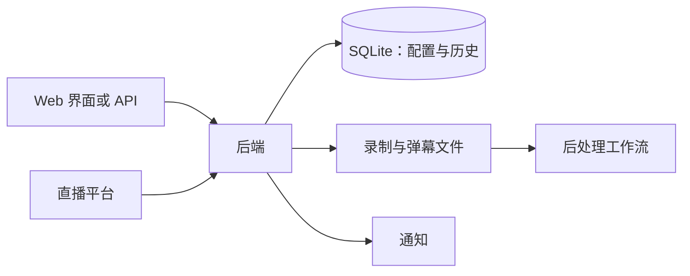

# 系统概览 {#系统架构}

Rust-Srec 监控已配置的频道，录制直播视频和弹幕，并运行后处理工作流。Web 界面和 API 控制同一个后端。

```mermaid
flowchart LR
    UI[Web 界面或 API] --> B[后端]
    P[直播平台] --> B
    B --> DB[(SQLite：配置与历史)]
    B --> FILES[录制与弹幕文件]
    FILES --> W[后处理工作流]
    B --> N[通知]
```

## 录制生命周期

1. 后端根据主播的有效设置和时间安排检查直播状态。
2. 允许录制且容量充足时，下载引擎写入视频文件。启用弹幕采集后，同时写入匹配的聊天文件。
3. 大小或时长上限可将录制拆为分段。分段工作流处理已完成的文件，配对工作流等待同一分段的视频和弹幕。
4. 会话结束且前序处理完成后，执行会话完成工作流。
5. 通知报告已订阅事件，界面中保留会话和产物记录。

## 部署与存储

标准安装使用一个后端和一个 SQLite 数据库。Docker 分别运行后端和前端，桌面端在本机运行录制服务。录制文件保存在文件系统，数据库保存配置、会话、任务和文件记录。

备份时需同时保存数据库和文件。配置导出不是录制备份，删除数据库记录也不一定删除文件。详见[备份与恢复](../operations/backup-restore.md)和[删除行为](../operations/data-governance.md#删除语义)。

## 配置与日常操作

- [配置层级](./configuration.md)：默认值、模板和覆盖。
- [录制引擎](./engines.md)：兼容性和引擎选项。
- [工作流](./pipeline.md)：处理触发时机和文件传递。
- [监控](../operations/monitoring.md)：健康、日志和恢复操作。

服务边界、事件投递、数据库事务及 Rust 接口见[运行时架构](../development/architecture.md)。

此节内容已移至[运行时架构](../development/architecture.md#高层拓扑).

此节内容已移至[运行时架构](../development/architecture.md#运行时根-servicecontainer).

此节内容已移至[运行时架构](../development/architecture.md#服务容器职责).

此节内容已移至[运行时架构](../development/architecture.md#核心组件-按实际实现).

此节内容已移至[运行时架构](../development/architecture.md#runtimecoordinator-录制启动与取消).

此节内容已移至[运行时架构](../development/architecture.md#configservice-配置合并-热更新).

此节内容已移至[运行时架构](../development/architecture.md#streamermanager-已提交的元数据快照).

此节内容已移至[运行时架构](../development/architecture.md#scheduler-actor-模型编排-调度).

此节内容已移至[运行时架构](../development/architecture.md#streammonitor-探测-过滤-outbox).

此节内容已移至[运行时架构](../development/architecture.md#sessionlifecycle-会话状态的唯一所有者).

此节内容已移至[运行时架构](../development/architecture.md#downloadmanager-下载调度-引擎抽象).

此节内容已移至[运行时架构](../development/architecture.md#danmuservice-弹幕-聊天采集).

此节内容已移至[运行时架构](../development/architecture.md#pipelinemanager-队列-dag-workerpool).

此节内容已移至[运行时架构](../development/architecture.md#notificationservice-事件分发).

此节内容已移至[运行时架构](../development/architecture.md#仓库行写入).

此节内容已移至[运行时架构](../development/architecture.md#下载器-rust-接口).

此节内容已移至[运行时架构](../development/architecture.md#ffmpeg-录制事件).

此节内容已移至[运行时架构](../development/architecture.md#关键流程).

此节内容已移至[运行时架构](../development/architecture.md#录制生命周期-端到端).

此节内容已移至[运行时架构](../development/architecture.md#api-请求流-控制面).

此节内容已移至[运行时架构](../development/architecture.md#调度器状态与退避).

此节内容已移至[运行时架构](../development/architecture.md#可靠的生命周期反馈).

此节内容已移至[运行时架构](../development/architecture.md#事件驱动通信).

此节内容已移至[运行时架构](../development/architecture.md#输出根写入门).

此节内容已移至[运行时架构](../development/architecture.md#服务所有权).

此节内容已移至[运行时架构](../development/architecture.md#可观测性、健康检查与优雅退出).

此节内容已移至[运行时架构](../development/architecture.md#后端-rust-接口).

此节内容已移至[运行时架构](../development/architecture.md#actor-终止与唤醒策略).

