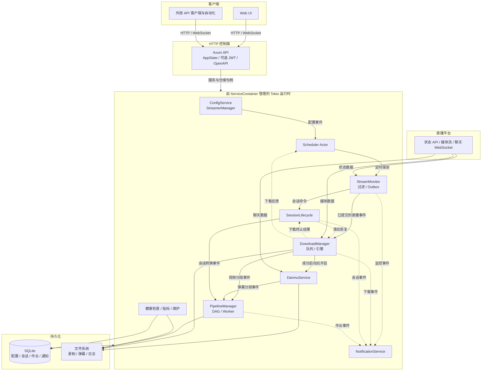
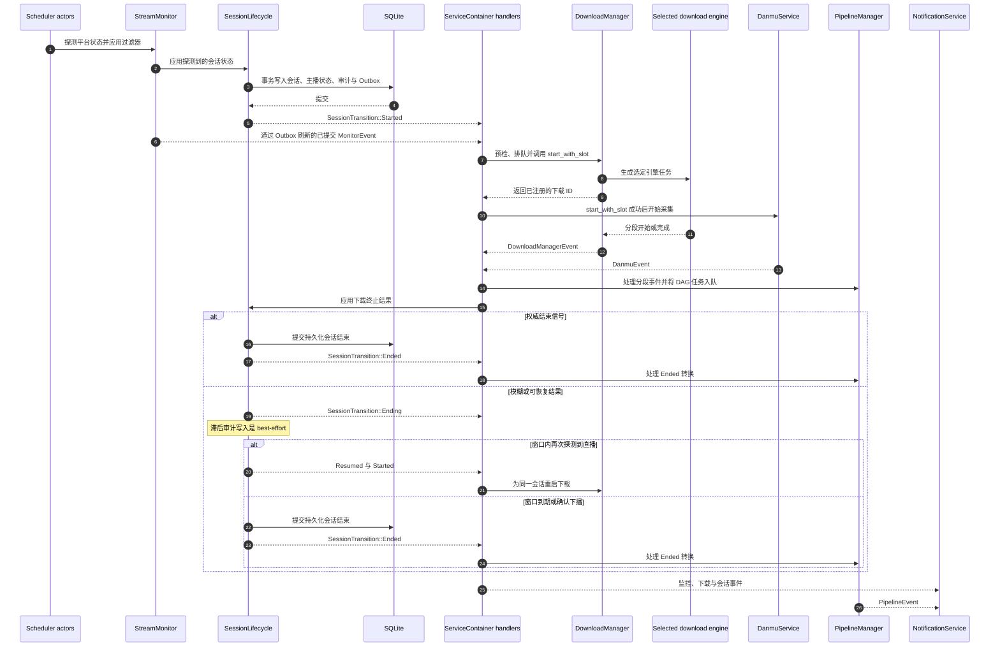
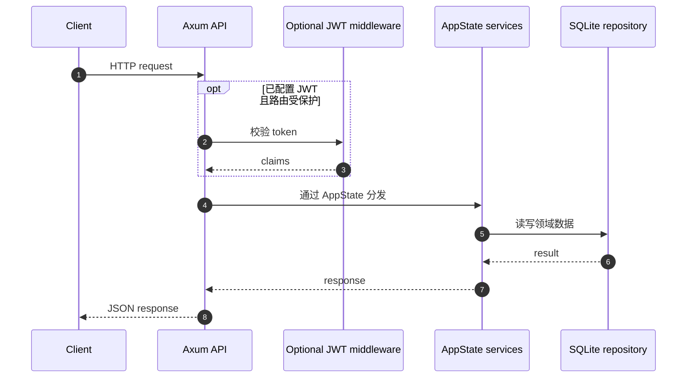

# 系统架构

`rust-srec` 是一套自动录播系统，整体设计强调清晰的关注点分离：

- **控制面**：REST API + 配置管理 + 编排/调度
- **数据面**：直播状态探测 + 下载 + 弹幕 + 后处理
- **持久化层**：SQLite + 文件系统输出

系统以 Tokio 为运行时，由 `ServiceContainer` 统一初始化并管理各类长期运行的服务。

## 高层拓扑


```mermaid
flowchart TB
  subgraph Clients["客户端"]
    FE["Web UI"]
    EXT["外部 API 客户端与自动化"]
  end

  subgraph Control["HTTP 控制面"]
    API["Axum API<br/>AppState / 可选 JWT / OpenAPI"]
  end

  subgraph Runtime["由 ServiceContainer 管理的 Tokio 运行时"]
    CFG["ConfigService<br/>StreamerManager"]
    SCH["Scheduler Actor"]
    MON["StreamMonitor<br/>过滤 / Outbox"]
    SESS["SessionLifecycle"]
    DL["DownloadManager<br/>队列 / 引擎"]
    DM["DanmuService"]
    PL["PipelineManager<br/>DAG / Worker"]
    NOTI["NotificationService"]
    OPS["健康检查 / 指标 / 维护"]
  end

  subgraph Sources["直播平台"]
    SRC["状态 API / 媒体流 / 聊天 WebSocket"]
  end

  subgraph Storage["持久化"]
    DB[("SQLite<br/>配置 / 会话 / 作业 / 通知")]
    FS["文件系统<br/>录制 / 弹幕 / 日志"]
  end

  FE -->|"HTTP / WebSocket"| API
  EXT -->|"HTTP / WebSocket"| API
  API -->|"服务与仓储句柄"| Runtime

  CFG -->|"配置事件"| SCH
  SCH -->|"定时探测"| MON
  MON -->|"会话命令"| SESS
  MON -->|"已提交的直播事件"| DL
  DL -->|"成功启动后开启"| DM
  DL -->|"视频分段事件"| PL
  DM -->|"弹幕分段事件"| PL
  SESS -->|"会话转换事件"| PL
  SESS -.->|"滞后恢复"| DL
  DL -.->|"下载终止结果"| SESS
  DL -.->|"下载反馈"| SCH

  MON -.->|"监控事件"| NOTI
  DL -.->|"下载事件"| NOTI
  SESS -.->|"会话事件"| NOTI
  PL -.->|"作业事件"| NOTI

  SRC -->|"状态数据"| MON
  SRC -->|"媒体数据"| DL
  SRC -->|"聊天数据"| DM

  DM --> FS
  DL --> FS
  PL --> FS
  Runtime <--> DB
  OPS --> DB
  OPS --> FS
```

运行时服务之间的箭头表示逻辑事件路径。`ServiceContainer` 通过广播订阅、有界队列和处理
任务完成这些接线，而不是让服务彼此直接耦合。

该拓扑中有三个重要的职责边界：

- `ServiceContainer` 是组合根与事件接线层，并不持有领域状态的所有权。
- `StreamMonitor` 负责探测与过滤平台状态；`SessionLifecycle` 独占内存中的会话状态机以及
  持久化启动/结束决策。
- 直播事件会先进入下载启动流程；只有下载管理器的 `start_with_slot` 返回真实下载 ID 后，
  才会开始弹幕采集。

## 运行时根：`ServiceContainer`

`ServiceContainer`（位于 `rust-srec/src/services/container.rs`）负责把所有组件串起来：

- 初始化仓储与服务（数据库、配置缓存、各类 manager/service）
- 启动后台任务（scheduler actors、pipeline workers、outbox flushers）
- 订阅事件流，并在服务之间转发/协调事件
- 持有用于优雅退出的 `CancellationToken`

这让系统的生命周期与依赖关系有一个统一的“入口点”，方便定位与演进。

## 服务容器职责

容器组装、有序关闭、输出根目录辅助逻辑和事件决策位于独立的私有模块中。初始化仍只发现一次输出根目录，并将同一份快照用于健康检查注册和启动写入探测。容器公开 API 和关闭期限保持不变。

启动日志保留数据库与配置 I/O、引擎发现、需要等待的初始化阶段及整体耗时。不再单独记录同步包装对象构造和后台任务启动的耗时；这些记录并不代表任务随后执行工作的耗时。

## 核心组件（按实际实现）

### `RuntimeCoordinator`（录制启动与取消）

协调器将下载启动和弹幕采集绑定到触发它们的会话。指定旧会话的 Offline 事件只停止该
会话的工作，不会按主播 ID 误选后续会话。禁用和离开录制时间窗口的事件，也会取消已
注册会话取消令牌、但尚未进入下载队列的启动任务。

启动流程在配置、预检、排队、时效检查和最终接纳期间响应取消。取消后释放预留资源，
并且不启动弹幕采集。弹幕初始化和前序采集任务交接也响应会话取消；采集任务注册后，
取消会等待其受管理的清理完成，不会丢弃就绪等待并遗留任务。
从滞后窗口恢复的 Started 转换必须同时携带下载参数且会话仍活跃。
只有排队等待时间严格超过时效阈值时，才一起刷新 URL、请求头和附加信息。等于阈值时
保留缓存媒体并执行短等待状态校验；主播缺失或已离线时出队，检查器错误则回退到缓存媒体。

### `ConfigService`（配置合并 + 热更新）

`ConfigService` 是配置控制面，负责加载并合并四层配置：

1. 全局默认（Global）
2. 平台配置（Platform）
3. 模板配置（Template）
4. 主播覆盖（Streamer overrides）

它会缓存合并后的结果，并广播 `ConfigUpdateEvent`，让运行时服务可以无重启响应配置变更。

参见：[配置](./configuration.md)

### `StreamerManager`（运行时状态“事实来源”）

`StreamerManager` 维护运行时所需的主播元数据（内存态），并对关键变更执行
**写穿（write-through）** 持久化到 SQLite。

一个重要的正确性细节：启动时会执行 **重启恢复**，把数据库中遗留的 `Live` 状态重置为
`NotLive`，确保 `NotLive → Live` 这条边能够再次触发下载启动。
即使前后状态均为 `NotLive`，actor 也会处理首次确认的下播结果，结束数据库中遗留的未完成
会话并发布最终完成事件。处理失败或被抑制时会等待后续检查重试。开播结果会复用未完成
会话，保留重启前后的录制连续性。

### `Scheduler`（Actor 模型编排/调度）

Scheduler 采用 supervisor + actor 的结构：

- `StreamerActor`：单个主播的自调度状态循环（自己管理定时）
- `PlatformActor`：对支持批量探测的平台进行批量协调
- `Supervisor`：负责 actor 生命周期、崩溃恢复、退出汇总

Actor 会调用 `StreamMonitor` 做真实状态探测；Scheduler 同时订阅配置事件，动态创建/移除
actor。

调度器在创建 actor 或发送时序更新前，通过共享配置服务解析全局 → 平台 → 模板 →
主播四层配置。它直接读取当前配置层，不依赖容器另一个订阅者刷新元数据的先后顺序，
因此离线确认次数和延迟不会因事件竞争停留在默认值。发送给 actor 与用于重启恢复的
配置来自同一次解析。解析失败时，现有 actor 保留上一次有效时序；新 actor 不会使用
未解析的默认值启动。更新解析最多并发八个查询，并响应关闭取消信号。
排队等待的崩溃重启在到期时重新解析配置，包括退避期间发生的变更。查询失败时
会将该次重启延后五秒，而不会使用此前保存的旧配置启动。

周期检查在配置间隔的 ±10% 范围内随机分散。有效间隔未变时保留原定检查时间；
实际间隔变化可以提前检查，但不会推迟已经安排的检查。智能唤醒、准入/冷却期限、
明确的立即检查以及暂停/直播状态保留各自原有的时序约束。Rust 调用方现在需要等待
`Scheduler::add_streamer` 完成配置解析后再创建 actor。

不可恢复的 actor 错误表示终止决定，例如主播已被移除。定时器与消息路径都会
正常停止，并执行已配置的状态持久化；supervisor 不会为它们安排重启。可恢复的
任务失败与 panic 仍可重启。连续十次崩溃后停止自动重启，即使较早的崩溃已离开
六十秒退避窗口。该窗口仍决定重启延迟；显式清除失败记录或移除 actor 会重置
崩溃额度。

下载终止反馈保留会话生命周期的权责边界。应用关闭和主播禁用导致的停止，只会
暂停 actor 本地轮询，不会上报下播：关闭时保留会话供恢复，禁用清理流程负责
关闭相应会话。未知的内部停止原因会恢复状态检查，以验证平台实际状态。
权威的主播下播反馈仍会通过 monitor 上报 Offline。

### `StreamMonitor`（探测 + 过滤 + Outbox）

`StreamMonitor` 是数据面的探测器，负责：

- 根据 URL/平台解析直播状态（含过滤：时间/关键词/分类等）
- 将会话变更委托给 `SessionLifecycle`
- 通过 **DB-backed Outbox** 机制发出 `MonitorEvent`

**Outbox 模式**：将“状态/会话变更”与“事件写入 outbox”放在同一 DB 事务里，然后由后台
任务定期/通知触发，把 outbox flush 到 Tokio `broadcast` 事件流，从而降低
“状态已变更但事件丢失”的风险。

### `SessionLifecycle`（会话状态的唯一所有者）

`SessionLifecycle` 负责录制状态机，包括滞后窗口（hysteresis）和终止原因分类。新的会话
启动和持久化结束会先提交各自所需的数据库变更，再广播 `Started` 或 `Ended`。滞后阶段的
`Ending` 与 `Resumed` 属于内存状态转换，其审计写入是 best-effort；在生命周期真正进入
`Ended` 前，session 的 `end_time` 保持为空。下载终止事件会回流至此服务。`Ended` 会驱动
会话完成管道、弹幕清理与下载状态清理；恢复后的 `Started` 会重启同一会话。
同一主播的操作通过异步锁串行执行数据库提交、内存更新和事件发布；定时器到期遵循相同
顺序，并在取得句柄前重新检查取消状态。数据库结束操作只更新活跃行，因此延迟事件不会
改写结束时间或重复发布完成事件。明确指向旧会话的下播信号不会改变较新活跃会话的状态。

### `DownloadManager`（下载调度 + 引擎抽象）

DownloadManager 负责：

- 并发控制（含高优先级额外并发槽位）
- 失败分类与熔断器（按引擎类型、配置以及可选的主播范围隔离）
- 失败/拒绝事件与 retry-after 提示；由 Scheduler Actor 决定何时重新探测并再次进入下载
  启动流程
- 引擎抽象：
  - 外部进程：`ffmpeg`、`streamlink`
  - 内置 Rust 引擎：`mesio`

并通过 `DownloadManagerEvent` 广播下载生命周期与分段事件。

对于落库后的 session 分段，后端会保留三种不同含义的时间戳：

- `created_at`：该分段开始录制的时间
- `completed_at`：该分段结束录制的时间
- `persisted_at`：该分段元数据写入 SQLite 的时间

### `DanmuService`（弹幕/聊天采集）

弹幕采集以 session 为单位维持连接，以 segment 为单位落盘：

- session 期间维持 websocket 连接与统计（可选）
- 由下载分段边界驱动，开启/结束对应的弹幕文件（如 XML）
- Danmu 事件会转发到 pipeline，用于“视频+弹幕配对”等协调逻辑

### `PipelineManager`（队列 + DAG + WorkerPool）

PipelineManager 是后处理引擎：

- DB-backed job queue（支持重启恢复）
- DAG 执行（fan-in / fan-out、fail-fast）
- CPU/IO 分离的 worker pool
- 多阶段触发协调：
  - Segment pipeline（单个文件）
  - Paired-segment pipeline（同一分段的 视频 + 弹幕）
  - Session-complete pipeline（会话结束后、所有分段完成后触发）

参见：[DAG 管道](./pipeline.md)

### `NotificationService`（事件分发）

NotificationService 订阅监控/下载/会话/管道事件，并分发到 Discord / Email / Gotify /
Telegram / Webhook 通道，包含重试、熔断与 dead-letter 持久化。可选的浏览器 Web Push
由 `WebPushService` 处理。

参见：[通知](./notifications.md)

### 仓库行写入

完整作业、DAG、步骤、会话、媒体输出和分段写入，在已有 SQLite 连接上复用仓库负责的
列绑定。重试、时钟和事务仍由调用方拥有。DAG 发布先插入未关联作业的步骤，再在同一
事务中关联根作业；后续物化仍使用独立的活跃父 DAG 和 PENDING/BLOCKED 条件。

原始会话创建保留传入模型，生命周期创建则构建带初始标题的活跃会话。原始结束操作仍
无条件更新，生命周期结束只修改活跃行。媒体插入与会话大小记账共同提交，组合分段创建
也加入该事务；单独插入分段不增加会话总大小。保留存储的毫秒值、可空生命周期时间戳和
未显式指定的数据库默认值。

## 下载器 Rust 接口

下载管理器将事件契约放在 `downloader::manager::events`，确认式事件传递放在 `coordination`，引擎配置放在 `configuration`，下载任务生命周期放在 `attempt`。这些实现模块保持私有；通过 `downloader` 导入现有事件的公开路径以及通过 `downloader::manager` 导入的内部路径保持不变。运行时关闭使用 `DownloadManager::shutdown_until`，活动下载条目持有队列槽位，直到条目被移除。

已移除未使用的下载中配置更新 API、只写不读的重试覆盖字段，以及 `stop_all`、`get_downloads_by_status`、`set_high_priority_extra_slots` 和旧进程等待辅助函数。Rust 集成应使用受支持的管理器关闭与快照方法、`DownloadConfig::build_pipeline_config` / `build_hls_pipeline_config` / `build_flv_pipeline_config`，以及公开的 `CircuitBreaker` 方法。内部熔断器管理通过 `CircuitBreakerManager::get` 获取实例。Mesio 引擎诊断现在报告所链接库的 `mesio::VERSION`。

### FFmpeg 录制事件

直接 FFmpeg 录制与 Streamlink 重封装共享分片标识、时长与字节累计、进度采样、
输出错误分类及最终事件发布。文件系统字节缓存只属于当前分片：切换分片后，
在新分片的元数据采样成功前使用解析出的进度字节数。每个活动分片的文件系统
采样仍以 500 毫秒为间隔节流。

标准错误 EOF 不代表最终文件已经关闭。跟踪器等待进程所有者报告退出结果后，
才检查并发布最终分片；无法确认清理完成时不发布该分片完成事件。输出 I/O 错误
仍先于终止失败事件发布；仅当标准错误尚未识别输出错误时，退出码 228 才提供
磁盘已满的回退分类。

辅助任务收尾会跨超时保留已完成的等待结果，在无法确认清理时中止并等待未完成
任务，确认清理成功后则允许最终事件正常发布。FFmpeg 的标准输入停止命令与
Streamlink 的生产者、管道和受控子进程关闭策略仍分别保留。这不扩大 Streamlink
内部缓冲区排空或隐藏 Windows 进程协作停止的保证。

## 关键流程

### 录制生命周期（端到端）


```mermaid
sequenceDiagram
  autonumber
  participant SCH as Scheduler actors
  participant MON as StreamMonitor
  participant SESS as SessionLifecycle
  participant DB as SQLite
  participant SC as ServiceContainer handlers
  participant DL as DownloadManager
  participant ENG as Selected download engine
  participant DM as DanmuService
  participant PL as PipelineManager
  participant NOTI as NotificationService

  SCH->>MON: 探测平台状态并应用过滤器
  MON->>SESS: 应用探测到的会话状态
  SESS->>DB: 事务写入会话、主播状态、审计与 Outbox
  DB-->>SESS: 提交
  SESS-->>SC: SessionTransition::Started
  MON-->>SC: 通过 Outbox 刷新的已提交 MonitorEvent

  SC->>DL: 预检、排队并调用 start_with_slot
  DL->>ENG: 生成选定引擎任务
  DL-->>SC: 返回已注册的下载 ID
  SC->>DM: start_with_slot 成功后开始采集
  ENG-->>DL: 分段开始或完成
  DL-->>SC: DownloadManagerEvent
  DM-->>SC: DanmuEvent
  SC->>PL: 处理分段事件并将 DAG 任务入队

  SC->>SESS: 应用下载终止结果
  alt 权威结束信号
    SESS->>DB: 提交持久化会话结束
    SESS-->>SC: SessionTransition::Ended
    SC->>PL: 处理 Ended 转换
  else 模糊或可恢复结果
    SESS-->>SC: SessionTransition::Ending
    Note over SESS: 滞后审计写入是 best-effort
    alt 窗口内再次探测到直播
      SESS-->>SC: Resumed 与 Started
      SC->>DL: 为同一会话重启下载
    else 窗口到期或确认下播
      SESS->>DB: 提交持久化会话结束
      SESS-->>SC: SessionTransition::Ended
      SC->>PL: 处理 Ended 转换
    end
  end
  SC-->>NOTI: 监控、下载与会话事件
  PL-->>NOTI: PipelineEvent
```

### API 请求流（控制面）


```mermaid
sequenceDiagram
  autonumber
  participant C as Client
  participant A as Axum API
  participant J as Optional JWT middleware
  participant S as AppState services
  participant R as SQLite repository

  C->>A: HTTP request
  opt 已配置 JWT 且路由受保护
    A->>J: 校验 token
    J-->>A: claims
  end
  A->>S: 通过 AppState 分发
  S->>R: 读写领域数据
  R-->>S: result
  S-->>A: response
  A-->>C: JSON response
```

配置 JWT 后，大多数受保护路由使用 JWT 中间件。完整健康检查与就绪检查会在处理器内部
校验 bearer token；未配置 JWT 鉴权时也会返回 `401`。liveness 路由保持公开。WebSocket、
媒体与流代理路由使用各自文档中说明的查询参数鉴权路径。

## 调度器状态与退避

主播 Actor 使用内存中的调度状态以及基于数据库的元数据缓存。已移除未使用的 JSON 状态文件接口（`with_state_path`、`restore_state`、恢复状态构造函数、`PersistedActorState`、`PersistedConfig` 和 `SupervisorConfig.state_dir`）。运行时恢复仍使用数据库与会话生命周期，无需 Actor 状态文件。

同时移除了未使用的 `StreamerManager::record_error` 和 `StreamerRepository::record_streamer_error`。监控保留事务式错误写入与 `disabled_until_for_error_count` 计算。退避保留配置的阈值，从 60 秒开始翻倍，最多一小时；即使存储的错误计数很大，也会安全达到上限，不会溢出。数据库与缓存的协调仍由现有服务共同完成。

### 可靠的生命周期反馈

录制启动与结束后的调度反馈使用独立且受管理的通道，与进度广播及持久化确认分离。容器在构造时接入该通道；Rust 嵌入方应在启动服务前调用 `Scheduler::connect_download_manager`。每个被接纳的录制任务在启动前为 Started 和 Terminal 预留容量；接纳不会等待 Actor 应用消息，结束反馈在录制槽位释放后发布。Actor 世代与录制标识隔离延迟消息，新建的替代 Actor 会从录制所有者获取当前标识。

每个主播最多保留 32 个生命周期消息。全局预算为 1,024 个积压消息，加上运行期间最高录制总并发数的两倍（包括高优先级额外槽位）。提高并发时扩容，降低时保留已持有的预留容量。容量不足会返回可重试的 `SchedulerFeedbackBusy` 错误，并保留本地重新检查请求，不会将主播标记为离线或禁用。受管理的恢复任务在等待两个容量池时合并请求，不阻塞生命周期应用及预留容量释放；只有容量恢复后才重试。Actor 退出和关闭流程会取消此等待。旧 Actor 世代仍持有应用消息时，共享消息内容和预留容量继续保留。

配置解析最多使用八个受管理的工作任务。配置修订号和 Actor 世代会拒绝过期结果；邮箱压力下仍保留最新的目标配置，配置广播发生丢失时会重新对齐当前状态。进度仍为节流且允许丢失的广播。关闭流程先停止监控，再排空录制；剩余反馈明确归类为已停止、已退出或不可用，录制排空流程也会等待反馈任务结束。

## 事件驱动通信

跨服务协调主要依赖 Tokio `broadcast`：

| 事件流 | 发布者 | 典型消费者 | 备注 |
|---|---|---|---|
| `ConfigUpdateEvent` | `ConfigService`、`StreamerManager` | `Scheduler`、`ServiceContainer` | 驱动 Actor 变更、运行时重配置与资源清理 |
| `MonitorEvent` | `StreamMonitor` | `ServiceContainer`、`NotificationService` | 通过 DB outbox 发出，提高一致性 |
| `DownloadManagerEvent` | `DownloadManager` | `Scheduler`、`NotificationService`、`ServiceContainer` 处理器 | 处理器将分段交给 `PipelineManager`，将终止结果交给 `SessionLifecycle` |
| `SessionTransition` | `SessionLifecycle` | `ServiceContainer` 处理器、`NotificationService` | `Ended` 驱动清理与会话管道；恢复后的 `Started` 重启同一会话 |
| `DanmuEvent` | `DanmuService` | `ServiceContainer` 处理器 | 处理器将分段配对交给 `PipelineManager`，将终止信号交给下载/会话处理 |
| `PipelineEvent` | `PipelineManager` | `NotificationService` | 作业生命周期与可观测性 |

::: tip 关于限流/节流
`PipelineManager` 内置可选的节流系统（`ThrottleController`）。若注入
`DownloadLimitAdjuster`，可以根据队列压力动态调节下载并发。
:::

### 输出根写入门

下载管理器内置了一个**输出根写入门**（`downloader::output_root_gate`），它工作在文件系统边界上，作为运行在网络/进程边界上的引擎熔断器（circuit breaker）的互补机制。设计目标是：当文件系统出现单点故障（磁盘写满、绑定挂载失效、权限丢失）时，不让这次故障级联成数十次每主播的重试，淹没日志和数据库 outbox。

```
Healthy ──(record_failure：启动前 ENOENT / 运行时 ENOSPC / 启动探测)──► Degraded
                                                                         │
                            (mark_healthy：下一次真实 ensure_output_dir 成功)│
Healthy ◄────────────────────────────────────────────────────────────────┘
```

关键特性：

- **无锁热路径**。在 Healthy 状态下，`check()` 只做一次原子加载加一次 `DashMap::get`，没有互斥锁，也没有空跑成本。
- **基于 CAS 的单飞冷却**。当根处于 `Degraded` 时，每个冷却窗口（默认 30 秒）只允许一个调用方通过，去尝试真实的 `create_dir_all`；其他并发调用方以缓存的错误快速拒绝。这借鉴了 `CircuitBreaker` 的 half-open 模式。
- **没有后台探测任务**。真实的 `ensure_output_dir` 调用本身就是探测——写入门复用实际的下载尝试作为探测信号。容器启动时会运行一次有界的一次性探测，以便在第一秒就发现已经坏掉的挂载点。
- **恢复钩子**。在 `Degraded → Healthy` 的切换时，写入门会清除所有因它而退避的主播的 `consecutive_error_count`、`disabled_until` 和 `last_error`（通过 `"output-root blocked:"` 前缀过滤）。受影响的主播整队会在同一次监视周期内恢复。
- **每次状态切换只发出一条通知**。`Healthy → Degraded` 的 CAS 同时也是决定"哪个调用方负责发出 critical 级 `output_path_inaccessible` 通知"的位置——无论有多少并发主播受影响，用户只会看到一条告警。
- **只有 `ENOSPC` 会在录制途中进入写入门**。写入器写满磁盘时，会在录制仍在进行的过程中把故障上报给写入门，使该根降级，从而对下一次启动进行限流。其他写入失败——文件系统只读、权限丢失、路径消失——会被归类为文件级故障，仍由引擎的 `CircuitBreaker` 处理；它们通过启动探测抵达写入门，只有在同时导致启动前钩子的 `create_dir_all` 失败时才会经由该钩子抵达。目录已存在但不可写时 `ensure_output_dir` 返回 `Ok`，因此启动前钩子发现不了这种情况。之所以这样划分，是因为 `OutputRootUnavailable` 不计入熔断器，对这一类故障来说写入门是唯一的限流手段。

写入门在 `/api/health` 中以一个聚合的 `output-root` 组件暴露，列出所有 Degraded 根及其分类后的 `io::ErrorKind`、被拒绝次数和上次尝试的时间。参见[通知系统文档](./notifications.md#存储严重事件)了解事件形态，以及 [Docker 故障排查](../getting-started/docker.md#清理存储)了解挂载失效的失败模式。

## 服务所有权

已结束会话的延迟清理由会话生命周期服务持有。关闭时会取消并等待这些任务结束，
不必等待保留时间到期；清理不会移除后续新会话的当前会话索引。API 状态复用容器中的
仓库实例与配置导入服务。导入服务在运行时协调器创建后构造，而日志归档授权及归档
容量控制仍属于各自的 API 状态。

## 可观测性、健康检查与优雅退出

- 日志：使用 `tracing`，支持动态调整过滤器并带日志保留清理
- 健康检查：
  - `GET /api/health/live`（无鉴权，适合作为容器 liveness）
  - `GET /api/health` 与 `GET /api/health/ready` 需要有效 bearer token；未配置 JWT 鉴权时
    返回 `401`
- 退出：
  - 独立后端把 SQLite、套接字和录制文件都限制在操作系统隔离的工作进程中。父进程的专用
    线程会观测终止信号，即使启动或异步运行时工作阻塞，也会立即启用绝对关闭期限。看门狗会
    持续运行，直到持久化标记更新、终止诊断和父进程退出全部完成。
  - `ServiceContainer` 在工作进程内执行分阶段优雅关闭；在最终分段事实持久化之前，
    必需的事件消费者会保持运行。
  - 所有支持的平台都通过 `SIGINT` 触发优雅退出；Unix 还会处理 `SIGTERM`。父进程和工作
    进程都注册了信号处理，因此像 `KillMode=control-group` 或 `pkill` 那样直接打到工作进程
    的信号，与经由控制管道转发的信号走同一条优雅收尾流程。工作进程内部的致命故障仍会让它
    立即失败退出；父进程随后终止其后代并保留恢复状态。
  - 被强制终止或崩溃的工作进程会在 SQLite 旁保留未清理运行世代标记，提醒下次启动可能
    需要恢复。更早的恢复事项不会被之后正常退出的运行世代清除；该标记只负责检测，
    并不负责重放文件。
  - 标记只保留最早和最新的未清理世代，中间的世代记为数量，因此反复重启也不会让它无限
    变大。启动和退出时的提示会写明还有多少个世代等待恢复。

## 后端 Rust 接口

主播状态的统一类型为 `rust_srec::domain::StreamerState`，包含 `ERROR` 和 `DISABLED`。数据库模型构造函数与 API 状态转换检查均使用此类型。`StreamerState::can_transition_to` 保留为状态转换校验入口；录制状态和错误退避由运行时服务持久化，不通过修改配置层的 `domain::Streamer` 实体来驱动。

已移除未使用的 `database::batching`、`config::UpdateCoalescer`、`domain::session` 实体、主播状态修改辅助方法，以及仓库的 `list_active_streamers` / `resume_session` 方法。会话和媒体数据使用 `database::models` 中的持久化模型；磁盘状态分类使用 `HealthChecker::check_disk_space_with_thresholds`。主播仓库保留 `list_streamers`（排除已标记删除的记录）和 `list_all_streamers`（包含这些记录，以便启动时完成退出与清理）。
