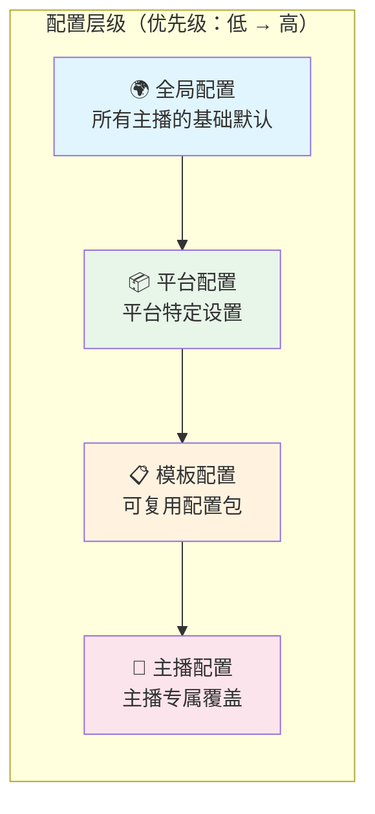
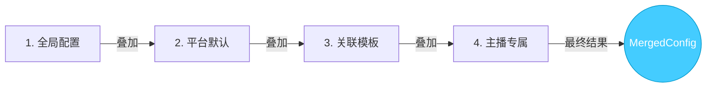

# 配置层级

rust-srec 使用 **4 层配置层级**，实现从全局默认到主播专属的灵活继承式配置。

## 层级结构

## 合并机制 (Merging Logic)

解析主播配置时，系统会从最低优先级到最高优先级执行递归合并。合并逻辑由 `MergedConfigBuilder` 实现。

### 合并路径

### 合并原则
1. **标量值覆盖**：如 `output_format`，高优先级层的值将完全取代替低优先级层。
2. **列表/集合追加或覆盖**：根据具体字段设计。
3. **认证信息 (Cookies)**：通常遵循“有则覆盖”原则。如果主播配置了专属 Cookie，则忽略平台或全局 Cookie。

## 动态配置与热重载 (Hot-Reloading)

rust-srec 支持配置热重载。当您通过 Web UI 或 API 修改全局设置或主播配置时：

1. **数据库更新**：新配置首先持久化到 SQLite 手册。
2. **缓存失效**：`ConfigService` 标记相关缓存失效。
3. **事件通知**：`ConfigService` 发布 `ConfigUpdateEvent`。
4. **服务响应**：
    - `StreamerManager` 可能会更新正在监控的主播频率。
    - `DownloadManager` 会在 **下一次分段开始时** 应用新的文件名模板或输出格式。
    - 正在进行的下载和处理任务通常不受影响，以确保稳定性。

## 技术实现细节

### ConfigService
作为中枢，`ConfigService` 维护着一份活跃配置的内存快照，减少数据库查询压力。

### ConfigResolver
负责根据主播 ID 解析并合并出 `MergedConfig`。它会检查：
- 该主播是否关联了模板？
- 该主播所属平台的默认配置是什么？
- 全局兜底配置是什么？

### MergedConfig
这是一个只读的结构体，包含了下载引擎和后处理管道所需的所有参数。

::: tip 配置建议
尽可能使用 **模板 (Templates)**。例如，您可以创建一个名为 "高质量 4K" 的模板，将 `force_origin_quality` 设为 true，并分配给所有需要高画质录制的主播。这样当您需要全局修改重试策略时，只需修改一个模板即可应用到所有关联主播。
:::
