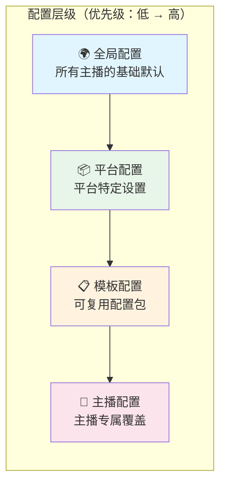
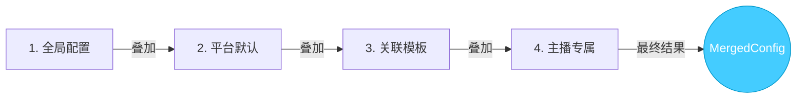

# 配置层级

rust-srec 使用 **4 层配置层级**，实现从全局默认到主播专属的灵活继承式配置。

## 层级结构

```mermaid
flowchart TB
    subgraph Hierarchy["配置层级（优先级：低 → 高）"]
        direction TB
        G[🌍 全局配置<br/>所有主播的基础默认]
        P[📦 平台配置<br/>平台特定设置]
        T[📋 模板配置<br/>可复用配置包]
        S[🎯 主播配置<br/>主播专属覆盖]
    end
    
    G --> P
    P --> T
    T --> S
    
    style G fill:#e1f5fe
    style P fill:#e8f5e9
    style T fill:#fff3e0
    style S fill:#fce4ec
```

## 合并机制 (Merging Logic)

解析主播配置时，系统会从最低优先级到最高优先级执行递归合并。合并逻辑由 `MergedConfigBuilder` 实现。

### 合并路径

```mermaid
graph LR
    G[1. 全局配置] -->|叠加| P[2. 平台默认]
    P -->|叠加| T[3. 关联模板]
    T -->|叠加| S[4. 主播专属]
    S -->|最终结果| Result((MergedConfig))
    
    style Result fill:#4cf,stroke:#09c,color:#fff
```

### 合并原则
1. **标量值覆盖**：如 `output_format`，高优先级层的值将完全取代替低优先级层。
2. **列表/集合追加或覆盖**：根据具体字段设计。
3. **认证信息 (Cookies)**：通常遵循“有则覆盖”原则。如果主播配置了专属 Cookie，则忽略平台或全局 Cookie。

### 离线判定和下载失败恢复共用同一个次数

`offline_check_count` 是连续离线信号的统一容忍次数。运行时会根据全局、平台、
模板和主播配置合并出每个主播的最终值，并将其同时用于：

- 确认主播离线前所需的连续离线状态检查次数
- 连续下载失败后让主播进入临时冷却的失败次数

默认值为 `3`。即使将 `offline_check_count` 设置为 `1`，下载失败阈值也最低为
`2`，以避免一次临时 CDN 或网络错误立即触发冷却。达到阈值后，冷却从 60 秒开始，
后续连续失败会让时间依次翻倍，最长为一小时。成功的状态检查或持续的下载进度会
清除累计失败状态。

`offline_check_delay_ms` 控制离线确认检查间隔及相关的会话迟滞窗口，不控制冷却时长。

::: warning 已弃用的兼容格式
序列化 `StreamerMetadata` 中的别名 `effective_offline_check_count` 和
`effective_offline_check_delay_ms` 已弃用。未包含 `backoff_threshold` 的持久化
`TransientError` 事件也已弃用。这些兼容格式将在未来版本中移除。新的集成必须使用
`offline_check_count` 和 `offline_check_delay_ms`，并在每个序列化的瞬时错误事件中包含
`backoff_threshold`。
:::

## 动态配置与热重载 (Hot-Reloading)

rust-srec 支持配置热重载。当您通过 Web UI 或 API 修改全局设置或主播配置时：

1. **数据库更新**：新配置首先持久化到 SQLite 手册。
2. **缓存失效**：`ConfigService` 标记相关缓存失效。
3. **事件通知**：`ConfigService` 发布 `ConfigUpdateEvent`。
4. **服务响应**：
    - `StreamerManager` 可能会更新正在监控的主播频率。
    - `DownloadManager` 会在 **下一次分段开始时** 应用新的文件名模板或输出格式。
    - 正在进行的下载和处理任务通常不受影响，以确保稳定性。

## 技术实现细节

### ConfigService
作为中枢，`ConfigService` 维护着一份活跃配置的内存快照，减少数据库查询压力。

### ConfigResolver
负责根据主播 ID 解析并合并出 `MergedConfig`。它会检查：
- 该主播是否关联了模板？
- 该主播所属平台的默认配置是什么？
- 全局兜底配置是什么？

### MergedConfig
这是一个只读的结构体，包含了下载引擎和后处理管道所需的所有参数。

::: tip 配置建议
尽可能使用 **模板 (Templates)**。例如，您可以创建一个名为 "高质量 4K" 的模板，将 `force_origin_quality` 设为 true，并分配给所有需要高画质录制的主播。这样当您需要全局修改重试策略时，只需修改一个模板即可应用到所有关联主播。
:::
