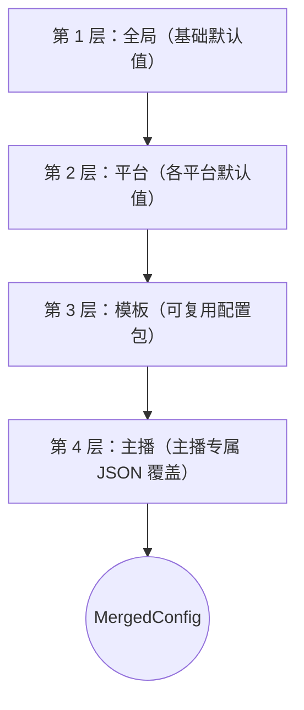

# 配置层级

rust-srec 通过合并存储在 SQLite 数据库中的 **4 层配置层级**，解析出每个主播实际生效的配置。

本页以代码实现为准，说明合并过程的具体规则。部署和逐步配置请改看快速上手：

- `../getting-started/configuration.md`

## 4 层配置层级

最终配置按以下顺序合并（优先级由低到高）：

1. 全局配置（`global_config` 表）
2. 平台配置（`platform_config` 表）
3. 模板配置（`template_config` 表，主播可选关联）
4. 主播覆盖（`streamers.streamer_specific_config` JSON）

```mermaid
flowchart TB
  G["第 1 层：全局（基础默认值）"]
  P["第 2 层：平台（各平台默认值）"]
  T["第 3 层：模板（可复用配置包）"]
  S["第 4 层：主播（主播专属 JSON 覆盖）"]
  M(("MergedConfig"))

  G --> P
  P --> T
  T --> S
  S --> M
```

合并由以下部分完成：

- `MergedConfigBuilder`（逐层应用）
- `ConfigResolver`（读取数据库记录并构建 `MergedConfig`）
- `ConfigService`（缓存解析结果并广播更新）

## 合并结果：`MergedConfig`

`MergedConfig` 是运行时用于监控、下载、弹幕和管道的最终配置。

主要字段（按用途分组）：

- 输出：`output_folder`、`output_filename_template`、`output_file_format`
- 限制：`min_segment_size_bytes`、`max_download_duration_secs`、`max_part_size_bytes`
- 弹幕：`record_danmu`、`danmu_statistics`
- 网络：`proxy_config`、`cookies`
- 引擎：`download_engine`、`extractor`、`download_retry_policy`、`engines_override`
- 流选择：`stream_selection`
- 管道：`pipeline`、`session_complete_pipeline`、`paired_segment_pipeline`
- 平台提取器选项：`platform_extras`
- 时序：`fetch_delay_ms`、`download_delay_ms`、`offline_check_count`、
  `offline_check_delay_ms`
- 会话体验：`auto_thumbnail`

部分设置属于全局运行时参数，不在 `MergedConfig` 之内，例如并发上限和日志过滤指令。

## 各项设置分别在哪一层配置

并非每个字段在每一层都可以设置。下面的列表对应解析器和构建器实际读取的内容。

- 仅全局层（基础默认值 + 运行时参数）：`auto_thumbnail`、并发/任务上限、调度延迟、日志过滤指令
- 仅平台层：`fetch_delay_ms`、`download_delay_ms`、`platform_specific_config`
- 仅模板层：`platform_overrides`、`engines_override`
- 仅主播层：`streamer_specific_config`（JSON 对象，见下文）

::: tip 各层的字段名并不相同
平台层和模板层存储的是 `stream_selection_config`（JSON），它会成为
`MergedConfig.stream_selection`；主播覆盖同样使用 `stream_selection_config` 这个键。
全局层的引擎和提取器默认值名为 `default_download_engine` 和 `default_extractor`，
而平台、模板和主播层使用 `download_engine` 和 `extractor`。
:::

## 合并规则（重要细节）

构建器的策略刻意保守：绝大多数字段都是“有值则覆盖”。

### 标量：高优先级层覆盖

对于大部分字符串/数字/布尔字段，只要高优先级层提供了值，就会替换低优先级层的值。

### 离线判定和下载失败恢复共用同一个次数

`offline_check_count` 是连续离线信号的统一容忍次数。运行时会根据全局、平台、
模板和主播配置合并出每个主播的最终值，并将其同时用于：

- 确认主播离线前所需的连续离线状态检查次数
- 连续下载失败后让主播进入临时冷却的失败次数

默认值为 `3`。即使将 `offline_check_count` 设置为 `1`，下载失败阈值也最低为
`2`，以避免一次临时 CDN 或网络错误立即触发冷却。达到阈值后，冷却从 60 秒开始，
后续连续失败会让时间依次翻倍，最长为一小时。成功的状态检查或持续的下载进度会
清除累计失败状态。

`offline_check_delay_ms` 控制离线确认检查间隔及相关的会话迟滞窗口，不控制冷却时长。

这两个值在每一层都会被收敛到下限：`offline_check_count` 最小为 `1`，
`offline_check_delay_ms` 最小为 `1000`。

::: warning 已弃用的兼容格式
序列化 `StreamerMetadata` 中的别名 `effective_offline_check_count` 和
`effective_offline_check_delay_ms` 已弃用。未包含 `backoff_threshold` 的持久化
`TransientError` 事件也已弃用。这些兼容格式将在未来版本中移除。新的集成必须使用
`offline_check_count` 和 `offline_check_delay_ms`，并在每个序列化的瞬时错误事件中包含
`backoff_threshold`。
:::

### Cookies：“有值即覆盖”（空字符串同样算有值）

Cookies 被当作单个可选字符串处理。只要高优先级层提供了 `cookies`，就会覆盖低优先级层。

::: tip Cookies 使用建议
不要把 cookies 设置成空字符串。空字符串同样算“有值”，会覆盖低优先级层，
实际效果是让兜底 cookies 失效。
:::

### 流选择：由 `StreamSelectionConfig::merge` 合并

流选择的合并有特殊语义：

- `preferred_formats`：仅当为 `Some(非空数组)` 时覆盖
- `preferred_media_formats`、`preferred_qualities`、`preferred_cdns`：仅当非空时覆盖
- `min_bitrate`、`max_bitrate`：仅当非零时覆盖
- `blacklisted_cdns`：取并集而不是替换，因此高优先级层只能新增排除项

这样模板只需声明自己关心的部分，不会丢掉平台层的默认值。

### 管道：高优先级层整体替换管道

管道由 JSON 解析为 `DagPipelineDefinition`。当某一层提供了管道时，它会整体替换
之前的管道定义（不存在逐步骤合并）。

模板还可以把管道写在 `platform_overrides[platform_name]` 里。它比模板自身顶层的
`pipeline`、`session_complete_pipeline` 和 `paired_segment_pipeline` 更具体，
因此解析器会在模板层之后再应用它们，结果是它们优先生效。

参见：

- `./pipeline.md`

### 平台附加项：JSON 浅合并，`null` 不覆盖

平台提取器选项通过 `platform_extras`（一个 JSON 数据块）传递，采用浅层对象合并：

- 如果两侧都是 JSON 对象，高优先级层的键会覆盖低优先级层的同名键。
- 高优先级层中值为 `null` 的键会被忽略（不产生覆盖）。
- 如果任意一侧不是对象，则高优先级层胜出。

具体实现位于 `platforms_parser::extractor::platform_configs::merge_platform_extras`。

::: tip 如何清除 platform_extras 中的键
`platform_extras` 使用浅合并，且忽略上层的 `null`。这意味着高优先级层无法通过 `null`
“取消”低优先级层的键，只能用一个非 null 的值覆盖它。
:::

## 平台提取器选项（`platform_extras`）

`platform_extras` 的来源和合并位置如下：

- 平台层：`platform_config.platform_specific_config`
- 模板层：`template_config.platform_overrides[platform_name]`
- 主播层：`streamers.streamer_specific_config.platform_extras`

每一层都会按层级顺序调用同一个合并函数。

::: tip 关于平台附加项中的凭据
平台、模板和主播记录都可能包含与凭据相关的键。每一层在并入 `platform_extras` 之前，
都会剥离 `refresh_token`、`access_token`、`session_cookies`、`last_cookie_check_date`
和 `last_cookie_check_result`，因此提取器配置绝不会携带凭据。
:::

## 凭据（`cookies` + `refresh_token`）单独解析

运行时会另外解析出 `credential_source`（挂在 `ResolvedStreamerContext` 上的附属数据），
用于认证和 refresh token 处理。它刻意不属于 `MergedConfig`，也不得通过序列化的配置
接口对外暴露。

优先级（由高到低）：

1. 主播覆盖：`streamer_specific_config.cookies`
   （可选附带 `streamer_specific_config.refresh_token`）
2. 模板：`template_config.cookies`
   （可选附带 `template_config.platform_overrides[platform].refresh_token`）
3. 平台：`platform_config.cookies`
   （可选附带 `platform_config.platform_specific_config.refresh_token`）

与 `MergedConfig.cookies` 不同，空字符串或只有空白字符的 `cookies` **不会**成为凭据来源：
该层会被跳过，继续考察下一层。`refresh_token` 只会从 cookies 胜出的那一层读取，
因此主播没有配置自己的 cookies 时，主播层的 `refresh_token` 会被忽略。

平台层也可以在没有 cookies 的情况下产生凭据来源：对于 SOOP，
`platform_specific_config` 中配置了 `username` 和 `password` 时会得到一个凭据来源，
其 cookies 在首次使用时签发。

## 主播覆盖：`streamer_specific_config`

`streamer_specific_config` 是一个无类型 JSON 对象，未知的键会被忽略。

会影响 `MergedConfig` 的键：

- `output_folder`、`output_filename_template`、`output_file_format`
- `min_segment_size_bytes`、`max_download_duration_secs`、`max_part_size_bytes`
- `record_danmu`、`danmu_statistics`、`cookies`、`download_engine`、`extractor`、
  `offline_check_count`、`offline_check_delay_ms`
- `proxy_config`（JSON 对象）
- `stream_selection_config`（JSON 对象）
- `download_retry_policy`（JSON 对象）
- `pipeline`、`session_complete_pipeline`、`paired_segment_pipeline`（JSON 对象）
- `platform_extras`（JSON 对象）

由凭据子系统使用、不属于 `MergedConfig` 的键：

- `refresh_token`

::: tip 无效 JSON 会被忽略
平台/模板/全局记录中的多数 JSON 字段都采用尽力而为的解析方式。解析失败时，解析器会
记录一条警告，并回退到默认值或上一层的值。`streamer_specific_config` 内部同理：
某个键的值结构不对时会被跳过并继承低优先级层，而不会让整次解析失败。
:::

## 引擎与提取器选择

### `download_engine`

`download_engine` 是一个字符串，用于选择使用哪份下载引擎配置。它可以是：

- 内置引擎类型字符串（`ffmpeg`、`streamlink`、`mesio`）
- 存放在 `engine_configuration` 表中的自定义引擎配置 ID

两者都匹配不上时，会回退到下载管理器的默认引擎。

### `extractor`

`extractor` 用于选择由哪个提取器解析直播流地址。它独立于 `download_engine`，后者只决定
解析出的地址如何被拉取。可用取值：

- `auto`（默认）：按 URL 正则注册表分派
- `streamlink`：通过 Streamlink 解析

某一层存储 `NULL` 或空字符串表示不表达偏好，继承下一层的值。无法识别的名称同样只记录日志
并忽略，因此写错名字只会退化为继承，而不会导致解析失败。

### `engines_override`（仅模板层）

模板可以提供 `engines_override`，它是一个 JSON 对象：

- `engine_id` -> `override_value`

下载开始时，下载管理器会检查所选引擎 ID 是否有对应的覆盖项。如果有，它会：

1. 载入基础引擎配置（内置类型用默认配置，自定义 ID 用数据库中的配置）
2. 以 JSON Merge Patch 语义应用覆盖：嵌套对象按键逐层合并，覆盖中值为 `null` 的键会被删除
3. 为该覆盖创建一个专用的引擎实例，其键包含覆盖内容的哈希，因此它的熔断器状态与未覆盖的
   引擎相互独立

::: tip 这里的 `null` 含义不同
`engines_override` 中把某个键设为 `null` 表示删除该键，而 `platform_extras` 会忽略上层的
`null`。
:::

## 热重载、缓存与更新事件

`ConfigService` 在内存中缓存解析出的主播配置：

- TTL：1 小时（默认）
- 并发请求去重：同一主播同时只有一次解析在进行
- 解析硬超时：30 秒（避免进行中的条目卡死）

通过 API/界面修改配置时，该服务会让相关缓存条目失效，并广播 `ConfigUpdateEvent`，
以便调度器和各管理器作出响应。

典型的失效范围：

- `GlobalUpdated`：所有主播失效
- `PlatformUpdated`：该平台下的主播失效
- `TemplateUpdated`：使用该模板的主播失效
- `StreamerMetadataUpdated`：该主播失效
- `EngineUpdated`：所有主播失效（引擎的使用情况未被追踪）

::: tip 优先使用模板
把共用设置放进模板，而不是在每个主播上重复配置。之后修改一次模板即可让所有关联主播
重新解析配置，无需逐个主播修改。
:::

关于运行时行为以及这些更新在系统中的传递路径，参见：

- `./architecture.md`
