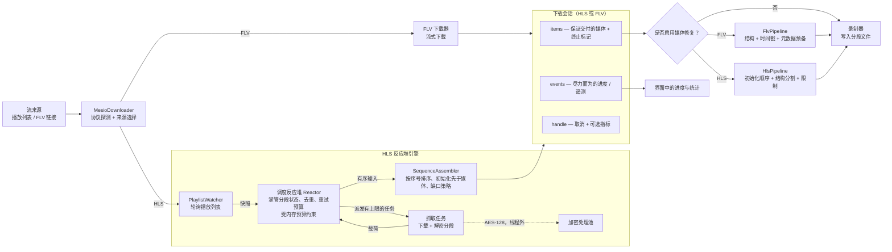
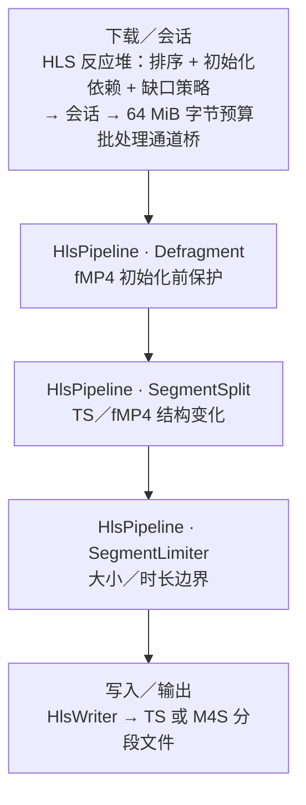

# Mesio 引擎

Mesio 是 rust-srec 的**进程内 Rust 下载引擎**。与 `FFMPEG` 和 `Streamlink` 不同，它并非外部程序，而是运行在录制器内部——这也是它在三种引擎中 CPU 与内存占用最低、并支持 HLS 多线程下载的原因。本页介绍 Mesio 的内部工作原理；若需三种引擎的功能横向对比，请参阅[引擎](./engines.md)。

## 架构

单一的 `MesioDownloader` 负责选择协议（HLS 或 FLV）与来源，随后无论何种协议都产出一个统一的**下载会话（download session）**。该会话暴露两条流——保证交付的 **items**（媒体数据与终止标记）流，以及尽力而为的 **events**（进度／遥测）流——外加一个用于取消和可选指标的控制句柄。

## HLS 反应堆引擎

对于 HLS，全部下载状态都集中在一处——**调度反应堆（Scheduler Reactor）**。它掌管：

- **分段身份与去重**：播放列表刷新轮换鉴权令牌时分段不会被重复抓取（例如 Twitch 签名链接，可剥离轮换的查询参数，使同一分段在多次刷新间被识别）。
- **重试预算**：包括将下载途中过期的签名链接透明切换到较新的链接重试。
- **有上限的并发抓取任务**：其进行中的下载、解密处理与输出缓冲各自受明确的内存预算约束——因此高速流或加密流不会再让内存无限增长。

解密在独立的**加密处理池**中运行，位于调度循环之外，因此即便加密分段突发涌入也能保持响应，而不会堆积。随后 **SequenceAssembler** 保证输出有序、fMP4 初始化分段先于依赖它的媒体写入（避免编解码不匹配导致的损坏），并在分段掉出直播窗口时以明确的缺口取代无声卡死。

## 下载会话

Mesio 的 HLS 与 FLV 下载器共用这同一套会话模型，因此进度上报、重试处理与取消行为在两种协议间表现一致。**items** 流是权威的——它承载录制器所依赖的媒体与终止标记——而 **events** 流则是尽力而为的遥测，用于在界面中呈现进度与统计；**handle** 则负责取消与可选的性能指标。

## 媒体修复流水线

下载会话与媒体修复流水线是两个独立层次。启用流处理和对应的 Mesio 修复开关时，会话数据会先在阻塞工作线程上通过一条同步操作符链，再交给写入器；否则会直接进入写入器。

下图展示启用修复时的路径。操作符顺序固定；标记为可选的节点取决于 FLV 配置。

### FLV 修复路径

### HLS 修复路径

- **FLV 流水线**会校验流结构，在配置指定的序列头变化时分割，在有界窗口内重排 GOP，按配置过滤重复标签，修复时间戳连续性，并应用文件大小或时长限制。启用关键帧索引时，它还会为 AMF `onMetaData` 预留空间。FLV 写入器会记录最终统计，并在文件关闭前就地回填元数据与关键帧索引，不再平移已完成文件的后续内容。
- **HLS 流水线**会保护 fMP4 初始化数据的顺序，分析 TS 流结构，在编解码器、分辨率、节目布局或 fMP4 初始化数据变化时轮换输出，在轮换后重新发出适用的 fMP4 初始化分段，并应用文件大小或时长限制。HLS 通道桥按字节预算限流，FLV 通道桥则仍按项目数量限流。

HLS 下载反应堆会按配置的缺口策略报告或跳过无法获取的媒体。修复流水线只会接收已交付的媒体以及明确的分割或终止标记；它无法重建源站从未交付的字节，也不会对媒体载荷进行转码。

## Mesio 独占功能

Mesio 专属的处理选项记录在[引擎](./engines.md)页面：

- [FLV 一致性修复](./engines.md#_2-flv-一致性修复) —— 修复 FLV 结构与时间戳，并在不移动文件后续内容的前提下完成 AMF 元数据。
- [原始数据模式](./engines.md#_3-原始数据模式-raw-data-mode) —— 不做包解析，直接把流字节写入磁盘，以获得绝对最低的 CPU／内存开销。
- [HLS 一致性修复](./engines.md#_4-hls-一致性修复-mesio-独占) —— 在写入前保护分段结构，并在不连续或有意义的流变化处轮换输出。

> [!NOTE]
> 完整的引擎设计与源码放在一起，见 [`crates/mesio/docs/HLS_ENGINE_ARCHITECTURE.md`](https://github.com/hua0512/rust-srec/blob/main/crates/mesio/docs/HLS_ENGINE_ARCHITECTURE.md) 与 [`crates/mesio/docs/DOWNLOADER_ENGINE_ARCHITECTURE_PLAN.md`](https://github.com/hua0512/rust-srec/blob/main/crates/mesio/docs/DOWNLOADER_ENGINE_ARCHITECTURE_PLAN.md)。
