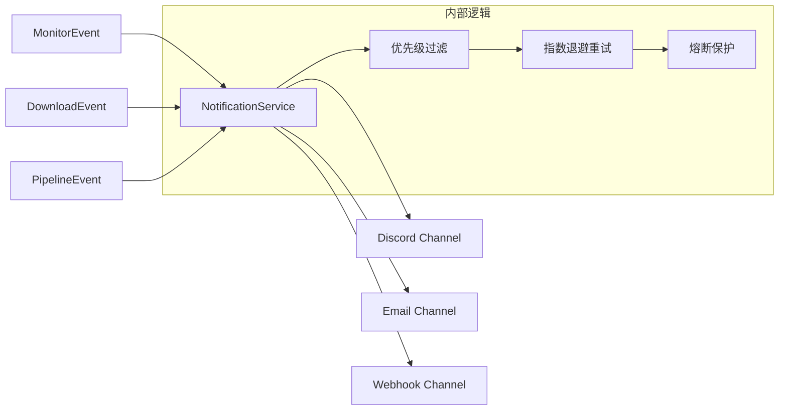

# 通知系统

rust-srec 内置了灵活且强大的通知系统，用于实时通报直播状态、系统错误和任务进度。

## 系统架构

通知系统基于事件驱动模式构建。当系统内发生重要变更时，相应的组件会发布一个事件，`NotificationService` 订阅这些事件并根据配置转发至不同的渠道（Channels）。



## 通知渠道 (Channels)

目前支持以下通知渠道：

| 渠道 | 描述 | 典型配置 |
|------|------|---------|
| **Discord** | 通过 Discord Webhook 发送格式化消息。 | Webhook URL, 用户名, 头像 |
| **Email** | 通过 SMTP 发送电子邮件通知。 | SMTP 服务器, 端口, 账号/密码 |
| **Webhook** | 发送自定义 JSON POST 请求到指定 URL。 | 目标 URL, 自定义 Headers |

## 优先级与过滤

并非所有事件都需要立即通知。系统引入了 `NotificationPriority` 对事件进行分级：

- **High (高)**: 严重故障（如存储空间不足）、监视致命错误。
- **Info (中)**: 开播提醒、管道处理完成。
- **Debug/Low (低)**: 主播状态微调、重试尝试（默认不发送）。

您可以在配置中设置 `min_priority`，仅接收高于该级别的通知。

## 可靠性保证

为了确保通知在网络波动下仍能送达，系统具备以下机制：

1. **重试机制**：失败的通知会进入重试队列，采用指数退避算法（Exponential Backoff）。
2. **熔断机制 (Circuit Breaker)**：如果某个渠道持续失败（如 Webhook 链接失效），系统会自动熔断该渠道，防止无效重试消耗系统资源。
3. **死信队列 (Dead Letter Queue)**：多次重试仍失败的通知将被存入死信队列，您可以通过 API 查看失败原因。

## 配置示例

在全局配置或平台配置中启用通知：

```json
{
  "notifications": {
    "enabled": true,
    "min_priority": "info",
    "channels": [
      {
        "type": "discord",
        "webhook_url": "https://discord.com/api/webhooks/..."
      }
    ]
  }
}
```

::: tip 提示
您可以为主播设置不同的通知策略。例如，给特别重要的主播设置高优先级的通知，甚至使用不同的 Webhook 渠道。
:::
