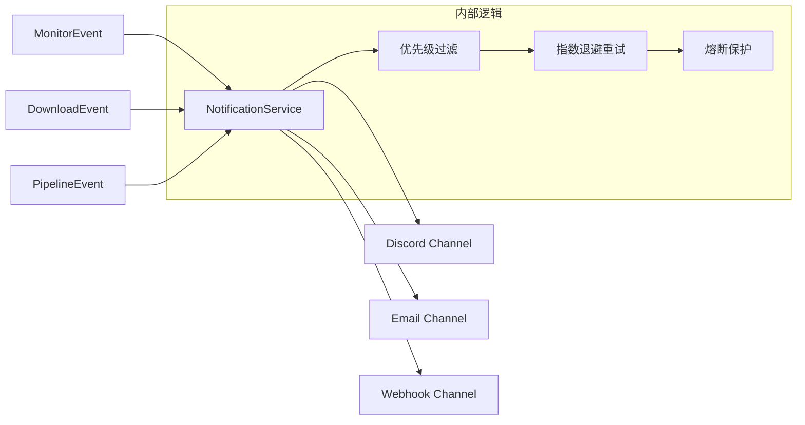

# 通知系统

rust-srec 内置了灵活且强大的通知系统，用于实时通报直播状态、系统错误和任务进度。

## 系统架构

通知系统基于事件驱动模式构建。当系统内发生重要变更时，相应的组件会发布一个事件，`NotificationService` 订阅这些事件并根据配置转发至不同的渠道（Channels）。


```mermaid
flowchart LR
    E1[MonitorEvent] --> NS[NotificationService]
    E2[DownloadEvent] --> NS
    E3[PipelineEvent] --> NS
    
    NS --> C1[Discord Channel]
    NS --> C2[Email Channel]
    NS --> C3[Webhook Channel]
    
    subgraph NS_Inner["内部逻辑"]
        NS --> Filter[优先级过滤]
        Filter --> Retry[指数退避重试]
        Retry --> CB[熔断保护]
    end
```

## 通知渠道 (Channels)

目前支持以下通知渠道：

| 渠道 | 描述 | 典型配置 |
|------|------|---------|
| **Discord** | 通过 Discord Webhook 发送格式化消息。 | Webhook URL, 用户名, 头像 |
| **Email** | 通过 SMTP 发送电子邮件通知。 | SMTP 服务器, 端口, 账号/密码 |
| **Webhook** | 发送自定义 JSON POST 请求到指定 URL。 | 目标 URL, 自定义 Headers |

## 基础设施关键事件

以下两个事件会在录制文件系统本身出现问题时触发：

| 事件 | 触发时机 | 能否自动恢复？ |
|------|---------|---------------|
| `out_of_space` | 预警：磁盘使用率超过配置阈值，但录制仍在运行。 | 不适用（仅预警） |
| `output_path_inaccessible` | **[输出根写入门](./architecture.md#输出根写入门)已实际阻止录制**，原因是 `create_dir_all` 或中途写入时遇到 ENOENT / ENOSPC / EACCES / EROFS / 超时等错误。每次 `Healthy → Degraded` 状态切换**只发出一次**（不是每次失败都发）。 | 真正的 ENOSPC：是，磁盘释放后约 30 秒内自动恢复。失效的 Docker 绑定挂载：**否**，必须重启容器。详见 [Docker 故障排查](../getting-started/docker.md#使用绑定挂载时如何释放磁盘空间)。 |

设置环境变量 `RUST_SREC_LOCALE` 后，`output_path_inaccessible` 的描述文本会按语言本地化。目前支持：`en`、`zh-CN`。描述会根据底层 `io::ErrorKind` 分支——`NotFound`（挂载失效）会显示与 `StorageFull`（磁盘真正写满）不同的恢复建议。

## 优先级与过滤

并非所有事件都需要立即通知。系统引入了 `NotificationPriority` 对事件进行分级：

- **Critical (严重)**: 会阻塞录制的系统级故障（`output_path_inaccessible`、`fatal_error`、`pipeline_queue_critical`）。
- **High (高)**: 重要警告，录制可能仍能继续（`out_of_space`、`download_rejected`）。
- **Normal (中)**: 上下线事件、管道生命周期、系统启停。
- **Low (低)**: 细粒度状态变化、分段级进度（通常会被过滤）。

您可以在配置中设置 `min_priority`，仅接收高于该级别的通知。

## 可靠性保证

为了确保通知在网络波动下仍能送达，系统具备以下机制：

1. **重试机制**：失败的通知会进入重试队列，采用指数退避算法（Exponential Backoff）。
2. **熔断机制 (Circuit Breaker)**：如果某个渠道持续失败（如 Webhook 链接失效），系统会自动熔断该渠道，防止无效重试消耗系统资源。
3. **死信队列 (Dead Letter Queue)**：多次重试仍失败的通知将被存入死信队列，您可以通过 API 查看失败原因。

## 配置示例

在全局配置或平台配置中启用通知：

```json
{
  "notifications": {
    "enabled": true,
    "min_priority": "info",
    "channels": [
      {
        "type": "discord",
        "webhook_url": "https://discord.com/api/webhooks/..."
      }
    ]
  }
}
```

::: tip 提示
您可以为主播设置不同的通知策略。例如，给特别重要的主播设置高优先级的通知，甚至使用不同的 Webhook 渠道。
:::
