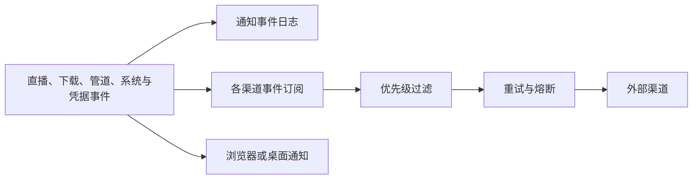

# 通知系统

Rust-Srec 会记录通知事件，并可把选定事件发送到外部渠道。渠道送达语言、界面语言和仅浏览器通知彼此独立配置。


```mermaid
flowchart LR
  E[直播、下载、管道、系统与凭据事件] --> L[通知事件日志]
  E --> S[各渠道事件订阅]
  S --> P[优先级过滤]
  P --> R[重试与熔断]
  R --> C[外部渠道]
  E --> B[浏览器或桌面通知]
```

## 可用目标

| 目标 | v0.5 Web 界面 | 要求 |
|---|---|---|
| Webhook | 可创建、编辑、测试 | HTTPS 端点；可选请求头或认证 |
| Telegram | 可创建、编辑、测试 | 机器人令牌和 Chat ID |
| Gotify | 可创建、编辑、测试 | 服务器 URL 和应用令牌 |
| Email | 可创建、编辑、测试 | SMTP 主机、发件人与收件人；仅在中继允许时可不填凭据 |
| Discord | 可表示已有渠道；v0.5 表单禁用新建选择 | 后端/API 支持 Discord Webhook 设置 |
| Web Push | 按浏览器配置 | VAPID 密钥，以及 HTTPS 或 localhost |
| 实时轮询 | 按浏览器配置 | 应用标签页必须保持打开 |
| 桌面通知 | 仅桌面版 | 操作系统通知权限 |

因此 Discord 是受后端支持、但 v0.5 Web 界面新建受限的渠道，并非该版本界面中普遍可选的渠道。

## 配置外部渠道

邮件渠道会为连续消息复用 SMTP 连接。替换配置后会使用独立连接池；此前已接收的投递任务仍使用原渠道。禁用渠道或被优先级过滤的消息不会初始化 SMTP 传输。邮件仍立即发送：存储 JSON 中的旧 `batch_window_secs` 设置会被忽略，Rust `EmailConfig` 接口已移除此字段。

1. 打开**通知**，选择**添加渠道**。
2. 选择 Webhook、Telegram、Gotify 或 Email，并输入易识别的渠道名称。
3. 设置**最低优先级**、消息语言和**启用**状态。
4. 保存后执行测试操作；接收端收到测试消息才算验证成功。
5. 打开订阅管理器，选择应发送到该渠道的事件类型。

渠道设置与事件订阅相互独立。仅创建目标并不代表它会自动接收全部事件。

## 优先级

API 与界面设置采用 0-10 数值优先级：

| 级别 | 值 | 示例 |
|---|---:|---|
| Low | 2 | 下播、分片进度、管道开始/完成 |
| Normal | 5 | 开播、下载完成、系统启动/关闭 |
| High | 8 | 下载错误/拒绝、管道失败、凭据刷新失败、百度网盘重新登录失败 |
| Critical | 10 | 致命错误、输出路径不可访问、空间不足、凭据无效 |

五种外部渠道共用启用状态和最低优先级规则。渠道测试通过同一路径发送 Normal
优先级的启动事件，因此禁用渠道或将最低优先级设为 High/Critical 时，测试也会被
过滤。使用 Rust 默认配置构造的邮件渠道最低优先级为 High，测试时请设置合适的阈值。

渠道会过滤低于其最低值的事件。在注明兼容的位置，API 也接受旧字符串 `low`、`normal`、`high`、`critical`；`info` 不是有效优先级。

## 语言

每个外部渠道可跟随服务器语言，也可覆盖为 `en` 或 `zh-CN`。`RUST_SREC_LOCALE` 设置后端生成消息的默认语言，与用户在 Web 界面选择的语言无关。

每次投递尝试只读取一次服务端语言，并在使用相同有效语言的渠道间共享已渲染的
标题和正文。重试会重新获取语言快照。各渠道随后分别处理转义、邮件 MIME 内容和
Telegram 实体格式。

## Telegram 格式

Telegram 渠道支持 `HTML`、`Markdown`、`MarkdownV2`（不区分大小写），或使用空 `parse_mode` 发送纯文本。格式化消息使用 Telegram 显式实体：动态内容始终按原文显示，标题加粗，页脚使用斜体。长消息会在完整字符边界处截断，并采用保守的 4,096 UTF-16 单位上限。其他模式值会返回配置错误。参见 [Telegram Bot API](https://core.telegram.org/bots/api#sendmessage)。

## Web Push

生成 VAPID 密钥对，并在后端启动前设置三个变量：

```bash
docker run --rm ghcr.io/hua0512/rust-srec-vapid:v0.5.1
```

```dotenv
WEB_PUSH_VAPID_PUBLIC_KEY=...
WEB_PUSH_VAPID_PRIVATE_KEY=...
WEB_PUSH_VAPID_SUBJECT=mailto:operations@example.com
```

然后在**通知**页面为当前浏览器启用 Web Push、授予浏览器权限、选择优先级并发送测试。浏览器要求安全上下文；localhost 以外必须使用 HTTPS。

## 送达行为

外部渠道会对临时失败进行退避重试，并对反复失败的渠道使用熔断器。重试耗尽的送达会进入死信，通知事件则按配置保留周期留在事件历史中。

数据库渠道重载会一起发布渠道与订阅。只要数据库 ID 仍处于已加载状态，修改名称、目标、凭据或订阅都会保留该渠道的熔断历史。移除或禁用会结束这一代渠道，重新添加后使用新的熔断器。已接收的通知及其重试继续使用重载前选定的渠道实例。仓库读取失败会保留已加载的注册表。

这些机制只能减少临时丢失，不能构成端到端送达保证。应监控接收服务，在配置变更后重新测试渠道，并为严重事件设置第二目标。

Web Push 使用容量为 2,048 个事件的 FIFO 队列，正常运行时工作线程每批最多处理 64 个事件。队列满时丢弃最新到达的事件，对所有优先级（包括严重事件）采用相同策略。工作线程未启动、队列已关闭或服务关闭时也拒绝新的推送事件。`notification_stats.web_push_dropped` 计数器记录这些入队失败，并以限频警告日志提示。事件历史持久化与外部渠道送达独立继续，丢弃的推送不会自动重放。关闭时会在现有后台任务关闭预算内尝试发送已接收的事件，但成功入队不代表已送达。

## 存储严重事件

- `out_of_space` 表示磁盘用量越过阈值。
- `output_path_inaccessible` 表示[输出根写入门](./architecture.md#输出根写入门)因跟踪目录不可写而阻止了新录制任务。

真实磁盘满在释放空间后可于后续探测自动恢复；失效 Docker 绑定挂载可能需要重启容器，参见[存储与容量](../operations/storage.md)。

## 队列与 Web Push 投递

普通渠道投递会串行处理队列准入；容量已满时移除最早的待投递通知，并取消其计划重试。
队列上限为零时不接受普通渠道投递，事件日志与 Web Push 仍独立运行。已开始的发送可在
通知被移除后完成。熔断期间不增加投递尝试次数；刚触发熔断的失败也会遵守重试冷却时间。

Web Push 发送成功后会清除持久化限流状态，包括首次 HTTP 请求即成功的情况。只有 SQLite
确认删除后才报告失效订阅已删除。正常及精简 JSON 负载均必须满足字节上限；元数据过大时
会在发送 HTTP 请求前返回错误。

## 后端通知接口

渠道注册与重载、源事件映射、投递与重试、Web Push 队列与工作任务分别由独立模块
负责。公开事件目录和本地化方法仍可通过 `notification::events` 访问。自定义 Rust
渠道可以继续实现 `NotificationChannel::send`；新增的可选 `send_rendered` 方法提供
`RenderedEvent`，便于复用共享的标题和正文。直接调用内置渠道与队列投递使用相同的
过滤和消息构建路径。默认 `test` 方法同样遵守正常投递的过滤规则。
