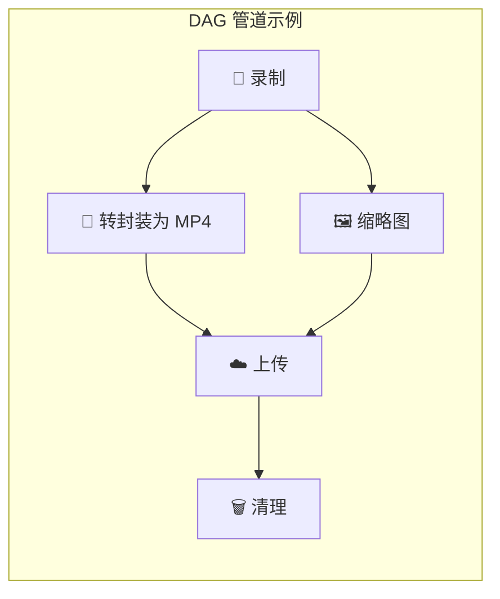

# DAG 管道

rust-srec 使用 **有向无环图（DAG）** 系统进行后处理工作流。

## 什么是 DAG 管道？

DAG 管道定义一系列带依赖关系的处理步骤。步骤在可能时并行执行，但遵循依赖顺序。

## 管道触发器 (Pipeline Triggers)

rust-srec 的强大之处在于其自动化的触发机制。您可以根据需求在不同阶段触发管道：

### 1. 分段管道 (Segment Pipeline)
- **触发时机**：单个视频分段（`.flv`, `.ts`）或弹幕文件（`.xml`, `.json`）下载完成后。
- **典型用途**：转封装（Remux）、视频截图、弹幕格式转换。
- **输入**：单个文件。

### 2. 配对分段管道 (Paired Segment Pipeline)
- **触发时机**：当同一索引（Index）的 **视频分段** 和 **弹幕文件** 都下载完成，且各自的分段管道执行成功后。
- **典型用途**：将弹幕烧录进视频（Burn-in）、合并分段信息。
- **输入**：对应的视频文件 + 弹幕文件。

### 3. 会话完成管道 (Session Complete Pipeline)
- **触发时机**：整个直播会话结束（主播离线），且该会话所有分段的所有前期管道（Segment & Paired）都已成功执行。
- **典型用途**：全会话合并、上传到云盘（如 Rclone 到 Google Drive/OneDrive）、发送最终完成通知。
- **输入**：该会话产生的所有最终产物列表。

## 内置处理器 (Processors)

每个管道步骤由一个专门的处理器执行：

| 处理器 ID | 功能 | 核心参数 |
|----------|------|---------|
| `remux` | 转封装，不改变编码 | `format` (mp4, mkv...) |
| `danmaku_factory` | 弹幕转换 | `output_format` (ass) |
| `burn_in` | 视频+弹幕硬烧录 | `video_path`, `subtitle_path` |
| `thumbnail` | 提取视频关键帧作为封面 | `timestamp`, `width`, `height` |
| `rclone` | 云端同步 | `remote`, `path`, `args` |
| `tdl_upload` | 具体的上传工具支持 | `args` |
| `metadata` | 写入元数据（nfo, json） | - |
| `delete` | 自动清理中间文件 | - |
| `execute` | 执行自定义 Shell 脚本 | `command`, `args` |

## 预设系统 (Presets)

为了提高效率，系统提供了两种预设：

- **Job Preset (任务预设)**：针对单个步骤的配置模板（如“1080p 封面提取”）。
- **Pipeline Preset (管道预设)**：完整的 DAG 工作流定义（如“B站标准录制流程”）。

## 高级特性

### 任务并行与依赖 (Fan-in / Fan-out)
DAG 系统支持复杂的拓扑结构。例如，您可以让 `remux` 和 `thumbnail` 并行运行，而 `upload` 步骤则等待这两者全部成功后才开始（扇入）。

### 自动清理
通过在 DAG 末尾添加 `delete` 步骤，并将其 `depends_on` 设置为 `upload`，您可以实现“上传成功后自动删除源文件”的安全清理逻辑。

::: tip 性能建议
重编码（如 `burn_in`）是极其消耗 CPU 的。建议在 `cpu_pool` 中限制较小的并发数，以防止系统负载过高影响下载稳定性。
:::
