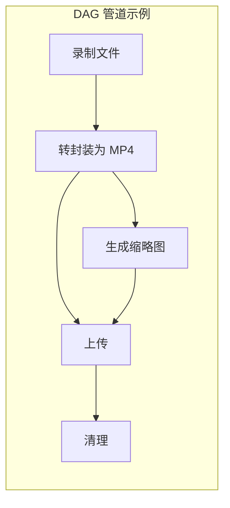
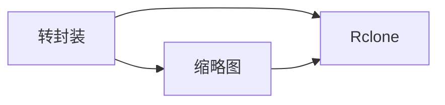
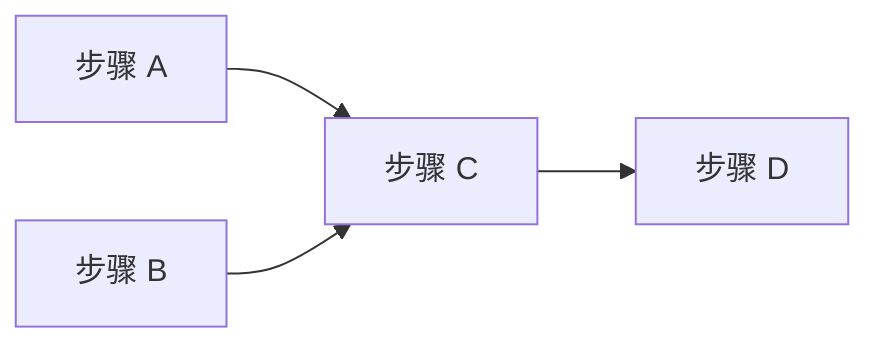
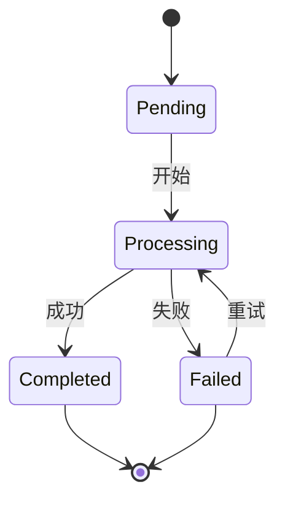

# DAG 管道

rust-srec 使用 **有向无环图（DAG）** 系统进行后处理工作流。

## 什么是 DAG 管道？

DAG 管道定义一系列带依赖关系的处理步骤。步骤在可能时并行执行，但遵循依赖顺序。


```mermaid
flowchart LR
    subgraph DAG["DAG 管道示例"]
        R[录制文件] --> REMUX[转封装为 MP4]
        REMUX --> THUMB[生成缩略图]
        REMUX --> UPLOAD[上传]
        THUMB --> UPLOAD
        UPLOAD --> CLEANUP[清理]
    end
```

## 管道触发器 (Pipeline Triggers)

rust-srec 的强大之处在于其自动化的触发机制。您可以根据需求在不同阶段触发管道：

### 1. 分段管道 (Segment Pipeline)
- **触发时机**：单个视频分段（`.flv`, `.ts`）或弹幕文件（`.xml`, `.json`）下载完成后。
- **典型用途**：转封装（Remux）、视频截图、弹幕格式转换。
- **输入**：单个文件。

### 2. 配对分段管道 (Paired Segment Pipeline)
- **触发时机**：当同一分段的 **视频文件** 和 **弹幕文件** 都准备好，并且相关分段处理结束后。
- **典型用途**：将弹幕烧录进视频（Burn-in）、合并分段信息。
- **输入**：对应的视频文件 + 弹幕文件。

### 3. 会话完成管道 (Session Complete Pipeline)
- **触发时机**：整个直播会话结束，最终录制文件已可用，并且该会话所有前期的分段或配对处理都已结束。
- **典型用途**：全会话合并、上传到云盘（如 Rclone 到 Google Drive/OneDrive）、发送最终完成通知。
- **输入**：该会话产生的所有最终产物列表。

::: tip 稳定性说明
如果弹幕先于最终视频文件完成，rust-srec 会等待视频文件准备好后再启动会话完成管道。这样可以避免合并、上传或清理等最终任务在缺少视频输入时过早运行。
:::

## 内置处理器 (Processors)

每个管道步骤由一个专门的处理器执行：

| 处理器 ID | 功能 | 核心参数 |
|----------|------|---------|
| `remux` | 更改容器格式，也可选择重新编码 | `format`, `video_codec`, `audio_codec` |
| `danmaku_factory` | 弹幕转换 | `output_format` (ass) |
| `ass_burnin` | 将字幕硬烧录进视频 | 处理器预设配置 |
| `thumbnail` | 从视频中提取画面作为图片 | `timestamp_secs`, `width`, `quality`, `preserve_resolution` |
| `audio_extract` | 提取音轨 | `format`, `bitrate`, `sample_rate` |
| `compression` | 视频转码 | 编解码器与质量设置 |
| `rclone` | 云端同步 | `destination_root`, `operation`, `time_anchor`, `args` |
| `copy_move` | 复制或移动本地文件 | 目标路径与操作设置 |
| `tdl` | 通过 tdl 上传到 Telegram | `args` |
| `metadata` | 写入元数据（nfo, json） | - |
| `delete` | 自动清理中间文件 | - |
| `execute` | 执行自定义 Shell 脚本 | `command`, `scan_output_dir`, `scan_extension` |

## 预设系统 (Presets)

为了提高效率，系统提供了两种预设：

- **Job Preset (任务预设)**：针对单个步骤的配置模板（如“1080p 封面提取”）。
- **Pipeline Preset (管道预设)**：完整的 DAG 工作流定义（如“B站标准录制流程”）。

## 数据路由

依赖关系同时决定一个步骤**何时可以运行**以及**会收到哪些文件路径**：

1. 每个根步骤（没有依赖的步骤）都会收到管道触发器提供的原始输入列表。
2. 非根步骤会等待其所有直接依赖完成。
3. 该步骤的输入是所有直接依赖的输出列表，按 `depends_on` 顺序合并并去重。
4. 系统不会自动继承间接祖先步骤的输出。

对于 `A -> B -> C` 这样的链，步骤 `C` 只会收到 `B` 报告的输出，不会同时收到 `A` 的输出。这样可以防止已被替换、已被删除或无关的中间文件流入后续步骤。

处理器的输出语义同样重要：

- `remux`、`compression` 等转换处理器输出转换后的文件。
- `thumbnail`、`audio_extract` 等衍生文件处理器只输出新生成的衍生文件，不会透传源文件。
- `rclone` 的 `copy` 和 `sync` 会透传本地输入路径；`rclone` 的 `move` 会消耗本地文件，因此没有本地输出。
- `delete` 没有输出。

因此，线性的 `remux -> thumbnail -> rclone` 图只会把缩略图发送给 `rclone`。若要同时上传转封装后的视频及其缩略图，需要把两个产出步骤都直接连接到 `rclone`：


```mermaid
flowchart LR
    REMUX[转封装] --> THUMB[缩略图]
    REMUX --> RCLONE[Rclone]
    THUMB --> RCLONE
```

在这个图中，`rclone` 仍然会等待 `thumbnail`，因为 `remux` 和 `thumbnail` 都是它的直接依赖。额外的 `remux -> rclone` 边只负责传递视频，不会让上传提前开始。

## 高级特性

### 任务并行与依赖 (Fan-in / Fan-out)

- **扇出（Fan-out）**：一个步骤将输出路由给多个下游步骤。只有在其他依赖和 Worker 容量也允许时，这些下游步骤才可能并发运行。
- **扇入（Fan-in）**：一个步骤具有多个直接依赖。它会等待所有依赖完成，并接收这些依赖合并后的输出。

扇出描述的是图中的数据路由，不保证步骤一定同时执行。

### 自动清理
`delete` 步骤删除的是其所依赖步骤**产出的文件**，而不是原始录制文件。在 `upload` 步骤之后使用是安全的（rclone 复制会把已上传的文件作为输出透传），因此添加一个 `depends_on: upload` 的 `delete` 步骤即可实现“上传成功后删除本地副本”。

请**不要**在 `remux`/转码步骤之后放置 `delete` 步骤：它会删除转码后的结果文件，因为那正是转码步骤的产出。若要在转码后删除原始源文件，请改为在转码步骤上启用 **Remove Input on Success**（`remove_input_on_success`）。

::: tip 性能建议
重编码（如 `ass_burnin`）是极其消耗 CPU 的。建议在 `cpu_pool` 中限制较小的并发数，以防止系统负载过高影响下载稳定性。
:::

## 核心概念

### 步骤

每个步骤执行一项处理任务：

| 步骤类型 | 说明 |
|---------|------|
| `remux` | 转换容器格式（例如 FLV -> MP4） |
| `thumbnail` | 提取缩略图 |
| `rclone` | 上传到云存储 |
| `delete` | 删除其直接依赖步骤产出的文件 |
| `preset` | 使用命名的任务预设运行一个步骤 |
| `workflow` | 将命名的管道预设展开为子 DAG |
| `inline` | 使用 DAG 中内嵌的配置运行处理器 |

### 依赖关系

步骤可以依赖其他步骤：


```mermaid
flowchart LR
    A[步骤 A] --> C[步骤 C]
    B[步骤 B] --> C
    C --> D[步骤 D]
```

- **扇出**：一个步骤是多个下游步骤的直接依赖。
- **扇入**：一个步骤等待多个直接依赖，并合并它们的输出。

### 执行状态


```mermaid
stateDiagram-v2
    [*] --> Pending
    Pending --> Processing: 开始
    Processing --> Completed: 成功
    Processing --> Failed: 失败
    Failed --> Processing: 重试
    Completed --> [*]
    Failed --> [*]
```

## DAG 定义

```json
{
  "name": "Post-Process",
  "steps": [
    {
      "id": "remux",
      "step": {"type": "preset", "name": "remux"},
      "depends_on": []
    },
    {
      "id": "thumbnail",
      "step": {"type": "preset", "name": "thumbnail"},
      "depends_on": ["remux"]
    },
    {
      "id": "upload",
      "step": {"type": "preset", "name": "upload"},
      "depends_on": ["remux", "thumbnail"]
    },
    {
      "id": "cleanup",
      "step": {"type": "preset", "name": "delete_source"},
      "depends_on": ["upload"]
    }
  ]
}
```

步骤也可以直接使用内联处理器，而不是引用任务预设：

```json
{
  "id": "thumbnail",
  "step": {
    "type": "inline",
    "processor": "thumbnail",
    "config": {
      "timestamp_secs": 10,
      "width": 640,
      "quality": 2
    }
  },
  "depends_on": ["remux"]
}
```

## 管道预设

可以将 DAG 定义保存为可复用的预设：

1. 通过 API 或 UI 创建预设。
2. 将预设分配给主播或模板。
3. 录制完成后自动运行预设。

## 错误处理

- **快速失败（Fail-fast）**：某个步骤失败时，取消尚未执行的下游步骤。
- **重试**：可以手动或自动重试失败步骤。
- **日志**：每个步骤都会保存执行日志，便于排查问题。
