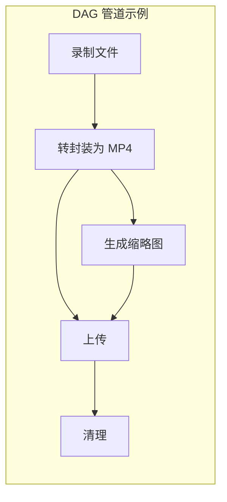
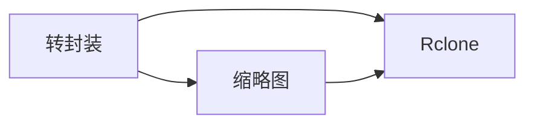
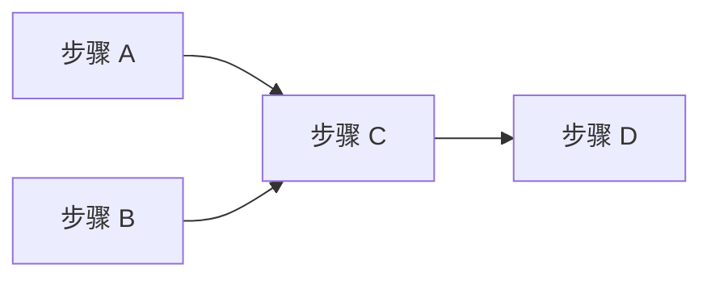
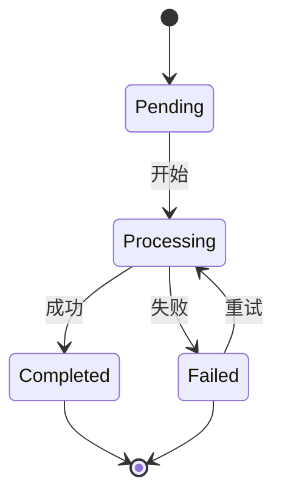

# DAG 管道

rust-srec 使用 **有向无环图（DAG）** 系统进行后处理工作流。

## 什么是 DAG 管道？

DAG 管道定义一系列带依赖关系的处理步骤。步骤在可能时并行执行，但遵循依赖顺序。


```mermaid
flowchart LR
    subgraph DAG["DAG 管道示例"]
        R[录制文件] --> REMUX[转封装为 MP4]
        REMUX --> THUMB[生成缩略图]
        REMUX --> UPLOAD[上传]
        THUMB --> UPLOAD
        UPLOAD --> CLEANUP[清理]
    end
```

## 管道触发器 (Pipeline Triggers)

rust-srec 的强大之处在于其自动化的触发机制。您可以根据需求在不同阶段触发管道：

### 1. 分段管道 (Segment Pipeline)
- **触发时机**：单个视频分段（`.flv`, `.ts`）或弹幕文件（`.xml`, `.json`）下载完成后。
- **典型用途**：转封装（Remux）、视频截图、弹幕格式转换。
- **输入**：单个文件。

### 2. 配对分段管道 (Paired Segment Pipeline)
- **触发时机**：当同一分段的 **视频文件** 和 **弹幕文件** 都准备好，并且相关分段处理结束后。
- **典型用途**：将弹幕烧录进视频（Burn-in）、合并分段信息。
- **输入**：对应的视频文件 + 弹幕文件。

### 3. 会话完成管道 (Session Complete Pipeline)
- **触发时机**：整个直播会话结束，最终录制文件已可用，并且该会话所有前期的分段或配对处理都已结束。
- **典型用途**：全会话合并、上传到云盘（如 Rclone 到 Google Drive/OneDrive）、发送最终完成通知。
- **输入**：该会话产生的所有最终产物列表。

::: tip 稳定性说明
如果弹幕先于最终视频文件完成，rust-srec 会等待视频文件准备好后再启动会话完成管道。这样可以避免合并、上传或清理等最终任务在缺少视频输入时过早运行。
:::

## 内置处理器 (Processors)

每个管道步骤由一个专门的处理器执行：

| 处理器 ID | 功能 | 核心参数 |
|----------|------|---------|
| `remux` | 更改容器格式，也可选择重新编码 | `format`, `video_codec`, `audio_codec` |
| `danmaku_factory` | 弹幕转换 | `output_format` (ass) |
| `ass_burnin` | 将字幕硬烧录进视频 | 处理器预设配置 |
| `thumbnail` | 从视频中提取画面作为图片 | `timestamp_secs`, `width`, `quality`, `preserve_resolution` |
| `audio_extract` | 提取音轨 | `format`, `bitrate`, `sample_rate` |
| `compression` | 将文件打包为 ZIP 或 tar.gz 归档 | `format`, `compression_level`, `output_path`, `overwrite`, `preserve_paths` |
| `rclone` | 云端同步 | `destination_root`, `operation`, `time_anchor`, `args` |
| `baidupcs` | 通过 BaiduPCS-Go 上传到百度网盘 | `destination_root`, `policy`, `norapid`, `time_anchor`, `args` |
| `copy_move` | 复制或移动本地文件 | 目标路径与操作设置 |
| `metadata` | 写入元数据（nfo, json） | - |
| `delete` | 自动清理中间文件 | - |
| `execute` | 运行程序或自定义 Shell 命令 | `program`, `args` 或 `command`, `scan_output_dir`, `scan_extension` |

### 执行程序（`execute`） {#execute-execute}

在预设编辑器或工作流步骤的配置对话框中，通过**执行模式**选择 **Shell 命令**或**程序和参数**。已有 Shell 命令会保持原样，以 Shell 模式打开。切换模式会清空原有命令或程序及参数；输出扫描设置由两种模式共用并保留。

在程序模式下，在**程序**中填写可执行文件，按顺序使用**添加参数**逐项输入。每个文本框代表一个完整参数，可包含空格、引号、换行或空字符串。删除文本框才会省略该参数；留空会传入空参数。保存时只包含所选模式的字段。

使用 `program` 和 `args` 可以直接运行可执行程序，无需经过 Shell：

```json
{
  "program": "ffmpeg",
  "args": ["-nostdin", "-n", "-i", "{input}", "-c", "copy", "{output}"]
}
```

`program` 是 `PATH` 中的固定可执行程序名或可执行文件路径，不展开占位符。`args` 中每一项都是一个参数，空字符串也会保留。参数支持与 `command` 相同的文件、元数据、JSON 数组和时间占位符。插入的取值保持原样：引号、空格、Shell 运算符、环境变量引用及取值内的其他占位符都不会被解释。不要在参数外额外添加 Shell 引号。被调用的程序仍会按自身规则解释选项。

省略 `args` 表示不传入参数。`program`（可带 `args`）与 `command` 只能选择一种，混用会使步骤失败。在 Windows 上，`program` 拒绝 `.bat` 和 `.cmd` 文件，因为 Windows 会隐式通过 Shell 运行它们；批处理脚本请使用 `command`。两种模式均保留输出目录扫描、管道输出处理、超时和进程清理行为。

Shell 语法取决于服务器的操作系统，与浏览器的操作系统无关。例如，`ffmpeg -nostdin -n -i {input} -c copy {output}` 使用固定原生可执行程序及占位符参数；服务器已安装 FFmpeg 时，该示例符合两个平台所支持的模板语法。

不含已识别占位符的命令模板保留原有 Shell 行为。含占位符时，编译器只接受明确限定的语法，通过进程局部绑定传递替换数据。占位符可用于普通参数单词或文件重定向目标，命令名必须固定。未知和越界占位符保持字面文本。未加引号的空值不产生参数，已有引号会保留空参数；空重定向路径在启动前报错。

| 含占位符的模板 | 支持的结构 |
| --- | --- |
| POSIX | 未引用、单引号和双引号中的参数片段；`;`、LF 换行、`&&`、`||`、管道、`<`、`>`、`>>`，以及 `2>&1` 等固定文件描述符复制 |
| Windows | 固定的原生可执行程序名或路径；带引号或不带引号的参数片段；`&`、`&&`、`||`、文件重定向及固定文件描述符复制。原生命令前后可附加不含占位符的 `echo`、`ver` 阶段。 |

含占位符的模板会在启动前拒绝命令替换、算术、参数展开、here-document、命令分组、前置变量赋值、命令名展开（包括 POSIX 花括号形式）和嵌套 Shell 包装命令。

Windows 还拒绝管道、多行模板、批处理脚本、含占位符的内置命令阶段、模板中的字面 `%`/`!`/`^` 字符、替换单词中的控制字符，以及含义不明确的字面引号和反斜杠组合。这些模板字符限制也适用于引号内；请把这类数据放入 `args` 或占位符取值。

Windows 先组装完整参数，再按常见 C 风格及 Shell32 解析器的反斜杠引号规则编码。使用自定义参数解析器的程序必须接受这种编码；请遵循被调用程序的参数或数据接口要求。重定向文件名使用独立规则，不能含双引号。

固定 Windows 原生路径允许 `RUNNER~1` 等 8.3 别名和字面方括号，但仍不支持通配符程序名及扩展 `\\?\` 命名空间路径。含取值的 Windows 命令会在启动前按 cmd 的 8,191 个 UTF-16 单元限制检查：每个继承绑定、生成命令及保守估算的展开命令都必须符合限制，并为启动器保留 32 个单元。因此，大型 JSON 数组可能需要改用 `program`/`args` 或文件数据接口。

不支持的形式请改用 `program` 与 `args`，或使用具有明确参数/数据接口的固定脚本。不要把不可信取值放进被调用程序的代码或表达式参数中；程序仍会按自身规则解释选项。

### 归档（`compression`）

`compression` 处理器把输入文件打包成一个归档文件。它不会重新编码媒体，文件按原样放入归档。

| 配置项 | 说明 | 默认值 |
|--------|------|--------|
| `format` | `zip` 或 `targz`（gzip 压缩的 tar） | `zip` |
| `compression_level` | `0`–`9`。`0` 表示不压缩——`zip` 为仅存储条目，`targz` 为不压缩的 gzip 流——对已经压缩过的视频来说通常是更合适的选择。大于 `9` 的取值不会被收敛，而是让步骤直接失败。 | `6` |
| `output_path` | 要写入的归档路径。省略时根据第一个输入推导：同一目录、同一文件名，把输入的扩展名换成对应格式的扩展名，因此 `/rec/video.flv` 得到 `/rec/video.zip`。 | 自动推导 |
| `overwrite` | 覆盖该路径上已存在的归档。设为 `false` 时步骤会直接失败。 | `true` |
| `preserve_paths` | 在归档内按输入文件的完整路径存放（去掉开头的分隔符）：`/srv/recordings/x/a.mp4` 对应的条目是 `srv/recordings/x/a.mp4`。路径不会相对某个公共前缀截断。设为 `false` 时，所有条目都以文件名平铺在归档根目录。 | `false` |

该处理器支持批量输入，因此一个从依赖步骤收到多个文件的步骤会生成一个包含全部文件的归档。它的输出只有归档路径——输入文件不会被删除，而依赖它的 `delete` 步骤删除的是归档本身，而不是源文件。

ZIP 条目始终按 ZIP64 尺寸写入，因此单个超过 4 GiB 的录制文件也能正确打包。代价是每个条目多 40 字节，生成的归档仍可用常规 ZIP 工具打开。

### 百度网盘（`baidupcs`）

`baidupcs` 处理器通过外部 [BaiduPCS-Go](https://github.com/qjfoidnh/BaiduPCS-Go) 命令行工具将录像上传到百度网盘（Docker 镜像已内置；裸机部署需自行安装，若不在 `PATH` 中可通过 `BAIDUPCS_PATH` 指定路径）。

- **登录**：在网页端打开任意 `baidupcs` 预设，通过账号卡片粘贴 Cookie 字符串（推荐）或 BDUSS + STOKEN 登录。凭据交给 BaiduPCS-Go 处理，登录会话保存在它的配置目录（`BAIDUPCS_GO_CONFIG_DIR`）中；卡片同时显示当前账号和网盘容量。勾选**记住凭据以便自动重新登录**后，凭据也会保存在服务器上（明文，与平台 Cookie 相同）：登录会话过期时，上传任务会在首次尝试前检查登录状态、并在重试前再补一次登录，无需人工干预。如果重放的登录被拒绝（通常是修改密码导致会话令牌失效），会发出高优先级的 `baidupcs_relogin_failed` 通知，并在一小时内暂停后续尝试——失效凭据只产生一条提醒，而不是每个任务都白白请求一次百度。退出登录会一并清除保存的凭据。
- **目标路径**：`destination_root` 支持 `{streamer}`、`{title}` 及时间占位符，始终解析为网盘的绝对路径。不存在的文件夹会在上传时自动创建。
- **重试**：BaiduPCS-Go 的退出码无法反映上传结果，rust-srec 会解析其逐文件输出来判定成败。无论是运行内重试还是手动重试任务，都只会重新上传尚未确认结果的文件；配合默认的 `skip` 策略和秒传检测，部分失败后的重试开销很小。
- **限制**：单文件超过 128 GB 会被百度拒绝；传输中断后只能从头重传（BaiduPCS-Go v4 已不支持断点续传）。由于该工具的本地状态存储不支持并发写入，上传任务同一时间只运行一个 BaiduPCS-Go 进程；任务运行期间也请勿手动对同一配置目录执行 BaiduPCS-Go 命令。

登录使用 [BaiduPCS-Go v4.0.1 的标准输入命令接口](https://github.com/qjfoidnh/BaiduPCS-Go/blob/v4.0.1/main.go)，
并在私有目录中操作标准 `pcs_config.json` 的副本，避免 Cookie、BDUSS 和 STOKEN
出现在进程参数中。私有目录内会阻止 CLI 打开命令历史路径，因此登录命令不会
保存到历史记录。成功后只更新原配置中的当前账号及所选 UID；登录被拒绝时，
原配置保持不变。提交前检查原始字节时，如果发现外部改动，则拒绝覆盖。
外部 CLI 或配置写入程序不受后端锁保护，因此不能同时运行。

自定义程序必须支持相同的无参数命令接口、`env` 配置目录输出及标准账号配置格式。
不兼容的程序会返回错误，绝不会退回通过命令行参数传递凭据。登录子进程保持
六十秒截止时间（包含标准输入写入），强制清理最多额外等待五秒。请求取消后，
仍会保留账号锁直到清理完成。粘贴的凭据不能包含换行或 NUL 字符。

## 重启时恢复弹幕分段

恢复流程将已存储的 XML 输出与视频分段关联：把视频路径的扩展名替换为
`.xml` 后，必须与已存储的 XML 路径匹配。不会根据标题数字或媒体输出 ID
推断分段索引。如果没有匹配分段，或不同分段索引对应同一个 XML 路径，
该 XML 输出会被跳过并记录警告。恢复数据库时应保持原始视频与 XML 路径
记录一致；无法匹配的历史文件不会被自动分配分段或重新执行配对处理。

## 预设系统 (Presets)

为了提高效率，系统提供了两种预设：

- **Job Preset (任务预设)**：针对单个步骤的配置模板（如“1080p 封面提取”）。
- **Pipeline Preset (管道预设)**：完整的 DAG 工作流定义（如“B站标准录制流程”）。

## 数据路由

依赖关系同时决定一个步骤**何时可以运行**以及**会收到哪些文件路径**：

1. 每个根步骤（没有依赖的步骤）都会收到管道触发器提供的原始输入列表。
2. 非根步骤会等待其所有直接依赖完成。
3. 该步骤的输入是所有直接依赖的输出列表，按 `depends_on` 顺序合并并去重。
4. 系统不会自动继承间接祖先步骤的输出。

对于 `A -> B -> C` 这样的链，步骤 `C` 只会收到 `B` 报告的输出，不会同时收到 `A` 的输出。这样可以防止已被替换、已被删除或无关的中间文件流入后续步骤。

处理器的输出语义同样重要：

- `remux` 输出转换后的文件；`compression` 输出它写出的归档文件，而不是被打包的那些文件。
- `thumbnail`、`audio_extract` 等衍生文件处理器只输出新生成的衍生文件，不会透传源文件。
- `rclone` 的 `copy` 和 `sync` 会透传本地输入路径；`rclone` 的 `move` 会消耗本地文件，因此没有本地输出。
- `baidupcs` 会透传本地输入路径；若开启了“上传后删除本地文件”，被删除的文件不会出现在输出中。
- `delete` 没有输出。

因此，线性的 `remux -> thumbnail -> rclone` 图只会把缩略图发送给 `rclone`。若要同时上传转封装后的视频及其缩略图，需要把两个产出步骤都直接连接到 `rclone`：


```mermaid
flowchart LR
    REMUX[转封装] --> THUMB[缩略图]
    REMUX --> RCLONE[Rclone]
    THUMB --> RCLONE
```

在这个图中，`rclone` 仍然会等待 `thumbnail`，因为 `remux` 和 `thumbnail` 都是它的直接依赖。额外的 `remux -> rclone` 边只负责传递视频，不会让上传提前开始。

## 高级特性

### 任务并行与依赖 (Fan-in / Fan-out)

- **扇出（Fan-out）**：一个步骤将输出路由给多个下游步骤。只有在其他依赖和 Worker 容量也允许时，这些下游步骤才可能并发运行。
- **扇入（Fan-in）**：一个步骤具有多个直接依赖。它会等待所有依赖完成，并接收这些依赖合并后的输出。

扇出描述的是图中的数据路由，不保证步骤一定同时执行。

### 自动清理
`delete` 步骤删除的是其所依赖步骤**产出的文件**，而不是原始录制文件。在 `upload` 步骤之后使用是安全的（rclone 复制会把已上传的文件作为输出透传），因此添加一个 `depends_on: upload` 的 `delete` 步骤即可实现“上传成功后删除本地副本”。

请**不要**在 `remux`/转码步骤之后放置 `delete` 步骤：它会删除转码后的结果文件，因为那正是转码步骤的产出。若要在转码后删除原始源文件，请改为在转码步骤上启用 **Remove Input on Success**（`remove_input_on_success`）。

::: tip 性能建议
重编码（如 `ass_burnin`）是极其消耗 CPU 的。建议在 `cpu_pool` 中限制较小的并发数，以防止系统负载过高影响下载稳定性。
:::

## 核心概念

### 步骤

每个步骤执行一项处理任务：

| 步骤类型 | 说明 |
|---------|------|
| `remux` | 转换容器格式（例如 FLV -> MP4） |
| `thumbnail` | 提取缩略图 |
| `rclone` | 上传到云存储 |
| `delete` | 删除其直接依赖步骤产出的文件 |
| `preset` | 运行名称与之完全一致的任务预设中的一个步骤。若没有任何预设与之同名，该名称会被当作处理器 ID 处理，因此 `{"type": "preset", "name": "thumbnail"}` 仍会以默认配置运行 `thumbnail` 处理器。 |
| `workflow` | 将名称与之完全一致的管道预设展开为子 DAG。若没有任何管道预设与之同名，整个管道会失败。 |
| `inline` | 使用 DAG 中内嵌的配置运行处理器 |

### 依赖关系

步骤可以依赖其他步骤：


```mermaid
flowchart LR
    A[步骤 A] --> C[步骤 C]
    B[步骤 B] --> C
    C --> D[步骤 D]
```

- **扇出**：一个步骤是多个下游步骤的直接依赖。
- **扇入**：一个步骤等待多个直接依赖，并合并它们的输出。

### 执行状态


```mermaid
stateDiagram-v2
    [*] --> Pending
    Pending --> Processing: 开始
    Processing --> Completed: 成功
    Processing --> Failed: 失败
    Failed --> Processing: 重试
    Completed --> [*]
    Failed --> [*]
```

## DAG 定义

```json
{
  "name": "Post-Process",
  "steps": [
    {
      "id": "remux",
      "step": {"type": "preset", "name": "remux"},
      "depends_on": []
    },
    {
      "id": "thumbnail",
      "step": {"type": "preset", "name": "thumbnail"},
      "depends_on": ["remux"]
    },
    {
      "id": "upload",
      "step": {"type": "preset", "name": "upload"},
      "depends_on": ["remux", "thumbnail"]
    },
    {
      "id": "cleanup",
      "step": {"type": "preset", "name": "delete_source"},
      "depends_on": ["upload"]
    }
  ]
}
```

步骤也可以直接使用内联处理器，而不是引用任务预设：

```json
{
  "id": "thumbnail",
  "step": {
    "type": "inline",
    "processor": "thumbnail",
    "config": {
      "timestamp_secs": 10,
      "width": 640,
      "quality": 2
    }
  },
  "depends_on": ["remux"]
}
```

## 管道预设

可以将 DAG 定义保存为可复用的预设：

1. 通过 API 或 UI 创建预设。
2. 将预设分配给主播或模板。
3. 录制完成后自动运行预设。

## 错误处理

配对分段和会话完成管道会先接收成功写入的输入清单，随后依次接收视频和弹幕输入。
清单文件名仍为 `segment_<session>_<index>_inputs.json` 和
`session_<session>_inputs.json`。会话完成输入按分段序号排序，配对输入保留收集顺序。
清单写入失败时，原始产物输入仍可使用，但该操作会被报告为未完整完成。

正常完成与重启恢复都会按 DAG 定义顺序收集叶子步骤输出，保留每个路径的首次出现，
在 Windows 上进行大小写折叠比较。缺少叶子记录或输出数组无效时，恢复会保留有效输出，
同时报告未完整完成。重复完成同一步骤不会再创建下游任务，也不会再次增加 DAG 的已完成步骤数。

Delete、rclone 和 BaiduPCS 的重试等待时间按指数增长，但每次最多等待 30 秒，
极端配置值也遵循此上限；重试次数仍按配置执行。FFmpeg 两种上游时间戳字段
对外都转换为毫秒单位的 `out_time_ms`。

禁用覆盖时，暂存输出在 Windows、Linux 和 macOS 上使用原生的禁止替换发布，
因此不支持硬链接的文件系统仍可发布文件，且不会覆盖竞争写入的目标。
既不支持禁止替换发布、也不支持硬链接的平台会返回错误。处理器被放弃后，临时文件
会在异步工作线程之外尽力清理；正常发布会等待提交或回滚完成。字幕和字体路径中的
单引号与滤镜图分隔符无需用户额外转义。

- **快速失败（Fail-fast）**：某个步骤失败时，取消尚未执行的下游步骤。
- **重试**：可以手动或自动重试失败步骤。
- **日志**：每个步骤都会保存执行日志，便于排查问题。

重试和重启恢复会保留任务已有的步骤耗时、日志计数、文件大小信息及产物历史。
开始新的尝试不会重复写入以前的日志。处理器运行前会先保存当前处理器信息；
如果保存失败或已有执行信息无效，任务会停止处理并报告失败，不会替换原始信息。
完成和失败更新也会保留额外的已存储执行信息字段。

产物历史可能包含先前尝试已经发布的文件，后续失败不会删除这些文件。
处理器负责管理自己暂存的临时输出，清理限制见上文。

### 处理器结果约定

媒体处理器共享输出规划、顺序执行和单文件跳过结果的构造。音频提取、元数据、缩略图
及 remux 的单输入任务使用第一个输出覆盖；批量任务要求每个输入对应一个输出，或
完全省略输出。ASS 与 DanmakuFactory 则严格按选中的视频/XML 输入匹配输出。
命名及空字符串的含义仍由各处理器决定。

音频提取、元数据和缩略图通过共享驱动器暂存后统一发布。ASS 保留自己的产物匹配循环，
使用相同的暂存发布机制。Remux 的适配器逐项立即发布：后续明确失败时尽力删除此前
输出，而取消保留已发布的输出。源文件仍在发布成功后删除，跳过的源文件会保留。
输出、成功/跳过输入和日志保持输入顺序，现有元数据格式不变。

路径机制共享文件系统解析，同时保留不同策略：ASS 命令路径保持词法形式；remux
解析已存在的相对命令路径，并进行尽力解析及 Windows/macOS 大小写折叠比较。
暂存输出验证检查原生文件身份（包括硬链接），通过父目录解析尚不存在的输出文件，
并传播 I/O 错误。传输处理器仍在源文件可能被消耗前记录大小，仅将确认不存在的输入
视为先前已完成的传输。

### 取消运行中的管道

`DELETE /api/pipeline/{pipeline_id}` 用于取消管道。当该 ID 指向一次 DAG 执行时，整个 DAG 都会被停下：进行中的步骤任务被取消，DAG 本身也会进入已取消的终态，而不是停留在处理中——因此等待它的会话不会一直等下去，管道也不会在重启后又变回进行中。

已取消的 DAG 之后可以重试。重试会重新运行处于失败或已取消状态的步骤，已完成的步骤不会重复执行。

该请求是幂等的：无论 ID 未匹配到任何管道，还是对应的 DAG 已处于终态，都会返回 `cancelled_count: 0` 而不是报错。
