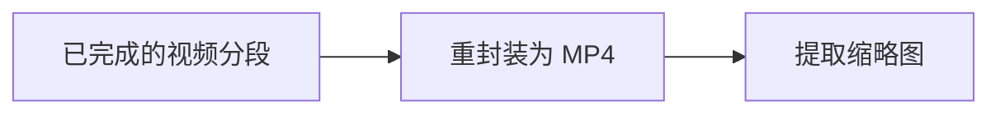
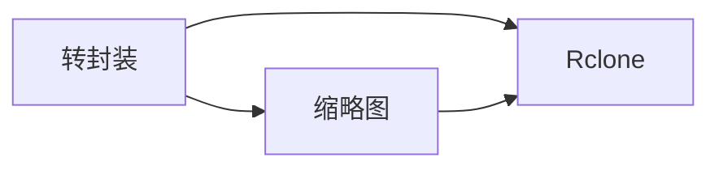

# 创建工作流 {#dag-管道}

工作流通过依赖关系连接处理步骤。任务预设保存一个步骤的设置；工作流（管道预设）保存步骤及其连接。

## 示例：MP4 录制与缩略图

先成功录制一次，并确认后端能够调用 FFmpeg。

1. 打开**工作流**，选择**创建工作流**，命名为 `MP4 and thumbnail`。
2. 添加 `remux` 步骤，输出格式设为 `mp4`；首次测试保留源文件删除选项为关闭。
3. 添加 `thumbnail` 步骤，让它依赖 `remux`，并选择时间点和图像宽度。
4. 保存工作流，将它分配给主播或模板的**分段管道**。
5. 录制一个视频分段，在**管道任务**中检查工作流，确认转换视频和缩略图存在后，再启用上传或删除。

```mermaid
flowchart LR
    VIDEO[已完成的视频分段] --> REMUX[重封装为 MP4]
    REMUX --> THUMB[提取缩略图]
```

缩略图步骤接收转换后的视频，只输出缩略图。若上传步骤需要两个文件，让它同时依赖上述两个步骤，见[数据路由](#数据路由)。

应根据输入选择触发方式：启用弹幕录制时，分段触发器也会收到聊天文件。请使用匹配的处理器，或按需选择配对、会话工作流。各处理器的输入要求见[处理器参考](../reference/processors.md)。

## 管道触发器 (Pipeline Triggers)

管道可以在以下三个阶段自动运行：

### 1. 分段管道 (Segment Pipeline)
- **触发时机**：单个视频分段（`.flv`, `.ts`）或弹幕文件（`.xml`, `.json`）下载完成后。
- **典型用途**：转封装（Remux）、视频截图、弹幕格式转换。
- **输入**：单个文件。

### 2. 配对分段管道 (Paired Segment Pipeline)
- **触发时机**：当同一分段的 **视频文件** 和 **弹幕文件** 都准备好，并且相关分段处理结束后。
- **典型用途**：将弹幕烧录进视频（Burn-in）、合并分段信息。
- **输入**：对应的视频文件 + 弹幕文件。

### 3. 会话完成管道 (Session Complete Pipeline)
- **触发时机**：整个直播会话结束，最终录制文件已可用，并且该会话所有前期的分段或配对处理都已结束。
- **典型用途**：全会话合并、上传到云盘（如 Rclone 到 Google Drive/OneDrive）、发送最终完成通知。
- **输入**：该会话产生的所有最终产物列表。

::: tip 稳定性说明
如果弹幕先于最终视频文件完成，rust-srec 会等待视频文件准备好后再启动会话完成管道。这样可以避免合并、上传或清理等最终任务在缺少视频输入时过早运行。
:::

## 数据路由

依赖关系同时决定一个步骤**何时可以运行**以及**会收到哪些文件路径**：

1. 每个根步骤（没有依赖的步骤）都会收到管道触发器提供的原始输入列表。
2. 非根步骤会等待其所有直接依赖完成。
3. 该步骤的输入是所有直接依赖的输出列表，按 `depends_on` 顺序合并并去重。
4. 系统不会自动继承间接祖先步骤的输出。

对于 `A -> B -> C` 这样的链，步骤 `C` 只会收到 `B` 报告的输出，不会同时收到 `A` 的输出。这样可以防止已被替换、已被删除或无关的中间文件流入后续步骤。

处理器的输出语义同样重要：

- `remux` 输出转换后的文件；`compression` 输出它写出的归档文件，而不是被打包的那些文件。
- `thumbnail`、`audio_extract` 等衍生文件处理器只输出新生成的衍生文件，不会透传源文件。
- `rclone` 的 `copy` 和 `sync` 会透传本地输入路径；`rclone` 的 `move` 会消耗本地文件，因此没有本地输出。
- `baidupcs` 会透传本地输入路径；若开启了“上传后删除本地文件”，被删除的文件不会出现在输出中。
- `ass_burnin` 输出烧录后的视频。开启**透传输入**时还会透传全部输入；关闭时，它未处理的视频（没有匹配的字幕，或同一录制文件的第二个副本）仍保留在输出中，字幕文件和已烧录的源文件则不会输出。
- `delete` 没有输出。

依赖步骤没有产生任何输出时（例如 `rclone` 移动之后的 `delete`），该步骤不会运行，直接完成且不传递输出，后续步骤也以同样方式完成。`execute` 步骤是例外：它仍会运行命令，此时 `{input}` 为空、`{inputs_json}` 为 `[]`，因此上传或删除之后的脚本照常执行。

因此，线性的 `remux -> thumbnail -> rclone` 图只会把缩略图发送给 `rclone`。若要同时上传转封装后的视频及其缩略图，需要把两个产出步骤都直接连接到 `rclone`：

```mermaid
flowchart LR
    REMUX[转封装] --> THUMB[缩略图]
    REMUX --> RCLONE[Rclone]
    THUMB --> RCLONE
```

在这个图中，`rclone` 仍然会等待 `thumbnail`，因为 `remux` 和 `thumbnail` 都是它的直接依赖。额外的 `remux -> rclone` 边只负责传递视频，不会让上传提前开始。

## 任务并行与依赖 (Fan-in / Fan-out) {#任务并行与依赖-fan-in-fan-out}

- **扇出（Fan-out）**：一个步骤将输出路由给多个下游步骤。只有在其他依赖和 Worker 容量也允许时，这些下游步骤才可能并发运行。
- **扇入（Fan-in）**：一个步骤具有多个直接依赖。它会等待所有依赖完成，并接收这些依赖合并后的输出。

扇出描述的是图中的数据路由，不保证步骤一定同时执行。

Worker 空闲时，同一优先级下会先领取正在进行中的工作流的后续步骤，再领取新工作流的第一个步骤；同一档次内仍按最早排队的任务优先。因此队列繁忙时，工作流会被逐个完成，而不是大量停留在半途。

## 自动清理 {#自动清理}
`delete` 步骤删除的是其所依赖步骤**产出的文件**，而不是原始录制文件。在 `upload` 步骤之后使用是安全的（rclone 复制会把已上传的文件作为输出透传），因此添加一个 `depends_on: upload` 的 `delete` 步骤即可实现“上传成功后删除本地副本”。

请**不要**在 `remux`/转码步骤之后放置 `delete` 步骤：它会删除转码后的结果文件，因为那正是转码步骤的产出。若要在转码后删除原始源文件，请改为在转码步骤上启用 **Remove Input on Success**（`remove_input_on_success`）。

会删除输入文件的步骤（`delete`、`move` 模式的 `rclone` 或 `copy_move`，以及开启了“上传后删除本地文件”的 `baidupcs`）不能与另一个仍要读取同一批文件的步骤共用同一个上游步骤，因为扇出会让两者同时运行。这样的工作流在保存或校验时会被拒绝，错误信息会列出相关步骤；请让删除步骤直接或间接依赖另一个读取步骤，使其在之后运行。所有根步骤读取的都是管道输入，视为共用同一个上游。由处理器选项触发的删除（例如 **Remove Input on Success**）只在该步骤成功之后发生，因此与读取步骤并列时只在校验或保存工作流时给出警告，并在运行时写入日志：哪个步骤先完成，决定另一个步骤还能否找到文件。保存工作流时还会检查引用的预设和工作流是否存在、处理器是否可用，而不是等下一次录制结束时才失败。

::: tip 性能建议
重编码（如 `ass_burnin`）是极其消耗 CPU 的。建议在 `cpu_pool` 中限制较小的并发数，以防止系统负载过高影响下载稳定性。
:::

## 错误处理

步骤失败时，其依赖步骤会被取消，独立分支可继续完成。运行中的步骤结束后，工作流标记为失败。重试工作流只重新运行失败和已取消步骤，不重复已完成步骤。

部分文件失败会使步骤失败，并列出相应输入。已提交文件保留在磁盘和任务历史中。手动重复上传或移动前，先查看各文件结果。

按步骤自动重试期间，依赖步骤继续等待，直到重试耗尽。取消工作流会取消待执行重试。详见[重试次数与超时](../reference/workflows.md#按步骤设置重试与超时)。

处理被中断时，重启恢复会继续未完成工作。已存储的视频和弹幕路径仍需指向原始分段；无法匹配的弹幕文件会跳过并给出警告。详见[恢复细节](../development/pipeline.md#重启时恢复弹幕分段)。

JSON 定义、执行状态和 API 取消见[工作流参考](../reference/workflows.md)。Execute、归档和百度网盘选项见[处理器参考](../reference/processors.md)。

此节内容已移至[创建工作流](./pipeline.md#dag-管道).

此节内容已移至[创建工作流](./pipeline.md#dag-管道).

此节内容已移至[创建工作流](./pipeline.md#dag-管道).

此节内容已移至[创建工作流](./pipeline.md#dag-管道).

此节内容已移至[创建工作流](./pipeline.md#dag-管道).

此节内容已移至[创建工作流](./pipeline.md#dag-管道).

此节内容已移至[处理器参考](../reference/processors.md#内置处理器-processors).

此节内容已移至[处理器参考](../reference/processors.md#execute-execute).

此节内容已移至[处理器参考](../reference/processors.md#归档-compression).

此节内容已移至[处理器参考](../reference/processors.md#百度网盘-baidupcs).

此节内容已移至[管道执行约定](../development/pipeline.md#重启时恢复弹幕分段).

此节内容已移至[管道执行约定](../development/pipeline.md#处理器结果约定).

此节内容已移至[工作流参考](../reference/workflows.md#步骤).

此节内容已移至[工作流参考](../reference/workflows.md#执行状态).

此节内容已移至[工作流参考](../reference/workflows.md#dag-定义).

此节内容已移至[工作流参考](../reference/workflows.md#按步骤设置重试与超时).

此节内容已移至[工作流参考](../reference/workflows.md#取消运行中的管道).

