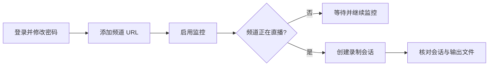

# 完成第一次录制

本流程从已启动的服务开始，以磁盘上出现录制文件为结束。请只录制你拥有或已获授权的频道。



## 1. 确认服务就绪

推荐的 Docker 部署可执行：

```bash
docker compose ps
curl http://localhost:12555/api/health/live
```

后端容器应为健康状态，存活请求应成功返回；就绪和详细健康接口需要认证。存活检查失败时，先执行 `docker compose logs --tail=200 rust-srec` 查看日志。

## 2. 登录并替换默认密码

打开 `http://localhost:15275`，使用以下账号登录：

- 用户名：`admin`
- 密码：`admin123!`

初始账号被标记为必须修改密码；完成修改前，其他需要认证的操作会被拒绝。请设置唯一密码，不要在仍使用默认密码时向网络开放服务。

## 3. 添加主播

1. 打开**主播**页面，选择**添加主播**。
2. 粘贴直播频道的直接链接，例如 `https://www.twitch.tv/<channel>` 或 `https://live.bilibili.com/<room-id>`，并把占位内容替换为真实频道或房间。
3. 输入易识别的名称；有效 URL 旁的自动填充操作可读取名称。
4. 确认识别出的平台正确，然后选择**继续**。
5. 第一次测试保留模板为**无（默认）**，并开启**启用监控**。
6. 选择**创建主播**。

URL 必须指向频道或直播间，不能是视频、个人主页、搜索页或平台首页。可在[支持的平台](../platforms/)查看各平台 URL 格式和凭据要求。

## 4. 观察第一次会话

未开播的频道会保持监控，但不会立即生成录制。频道直播时，主播卡片会经历检查和录制状态；可打开**会话**页面检查进行中或已完成的会话。

标准 Docker 配置会把文件写入安装目录下的 `./output`；容器内对应 `/app/output`。

以下三项都满足才算闭环成功：

- 主播已启用，且没有持续错误；
- 频道直播时创建了会话；
- 配置的输出目录中出现媒体文件，并在录制期间持续增长。

## 5. 停止或禁用监控

不再需要自动检查时，打开主播操作菜单并选择**禁用**。禁用监控只是停止检查，主播及其配置仍会保留。无论禁用还是删除主播，都不会删除已录制的会话或磁盘上的文件——被删除主播的会话会保留下来，并带上它当时的名称。确实需要清除时，请分别删除会话和文件。

## 没有生成录制时

| 现象 | 检查项 |
|---|---|
| 链接被拒绝 | 使用[支持的平台](../platforms/)所列频道或房间直接链接。 |
| 一直显示离线 | 在浏览器确认频道确实正在直播，并检查平台是否需要 Cookie。 |
| 主播显示错误 | 打开编辑页的状态历史，并检查后端日志。 |
| 会话开始但没有文件 | 检查剩余空间、输出目录权限及[存储与容量](../operations/storage.md)。 |
| 平台请求失败 | 仅在后端主机确实需要时配置代理，参见[配置说明](./configuration.md)。 |

首次录制成功后，再通过[配置层级](../concepts/configuration.md)建立复用模板，并配置[处理管道](../concepts/pipeline.md)，然后批量添加频道。
