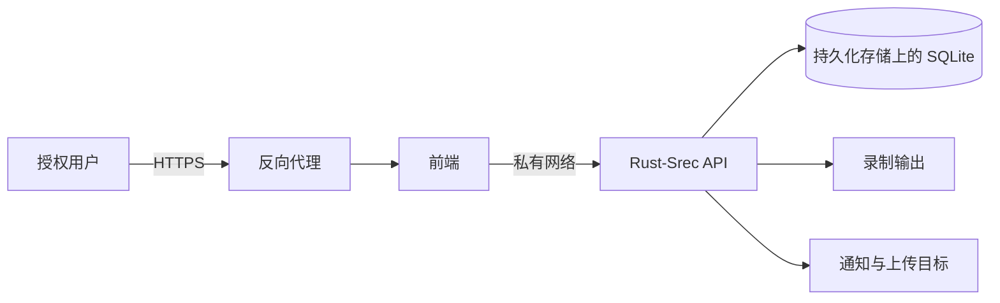

# 生产部署

Rust-Srec 以自托管单节点服务运行。如果必须具备集群或故障转移能力，请先阅读[能力边界](./support.md#能力边界)。

## 参考拓扑

两种部署方式的拓扑相同，只有前端到 API 这一段私有链路不同：Docker 中是 Compose 网络，[systemd 主机](../getting-started/installation.md#systemd-服务-linux)上则是回环地址或私有网卡。

后端、数据库、配置和输出路径应位于同一受信任主机。除非 API 集成确有需要，否则只通过 TLS 反向代理发布前端。

## 部署基线

1. 固定所部署的版本。采用 [Docker 部署](../getting-started/docker.md)时，把两个镜像的 `VERSION` 固定为 `v0.5.1`，变更需审批的环境不要使用 `latest`；采用 [systemd 服务](../getting-started/installation.md#systemd-服务-linux)时，安装正式发布的二进制而非临时构建，并记录对应版本。
2. 为 `JWT_SECRET` 和 `SESSION_SECRET` 生成互不相同的唯一值，并限制 `.env` 文件权限。systemd 主机上，后端密钥保存在 `/etc/rust-srec/rust-srec.env`，权限 `0640`、属主 `root:rust-srec`。
3. 把宿主机端口绑定到私网地址或回环地址。Compose 的回环映射格式为 `127.0.0.1:15275:80` 和 `127.0.0.1:12555:8080`。systemd unit 出厂为 `API_BIND_ADDRESS=0.0.0.0`；不希望 API 离开本机时，在 `/etc/rust-srec/rust-srec.env` 中设置 `API_BIND_ADDRESS=127.0.0.1`。
4. 在持续维护的反向代理终止 HTTPS，并转发 `Host`、`X-Forwarded-For` 与 `X-Forwarded-Proto`。只要反向代理发送 `X-Forwarded-Proto: https`，会话 Cookie 就会自动带上 `Secure` 标记；如果代理无法发送该请求头，请显式设置 `COOKIE_SECURE=true`。
5. 将 `DATA_DIR`、`CONFIG_DIR`、`OUTPUT_DIR` 和 `LOG_DIR` 放在持久化存储上；输出卷应与系统盘分开估算和监控。systemd 主机上这一条只适用于录制卷：`StateDirectory=` 和 `LogsDirectory=` 已经创建并持有 `/var/lib/rust-srec` 与 `/var/log/rust-srec`。大规模录制不要放在 `/var/lib/rust-srec` 内，应单独用卷并写入 `ReadWritePaths=`。
6. 按主机容量设置容器资源限制和应用并发限制。从保守值开始，按预计同时录制数和码率压测。
7. 为录制失败、管道失败、凭据过期和输出根不可写配置通知。
8. 添加生产频道前完成一次备份与恢复演练。

## 网络边界

前端通过私有 Compose 网络中的 `BACKEND_URL=http://rust-srec:8080` 访问 API；后端以 systemd 服务运行在同一主机时，则通过 `http://127.0.0.1:12555` 访问。普通浏览器使用不要求把宿主机 API 端口暴露到互联网；该端口可仅供本机管理和集成。

必须直接访问 API 时，应通过 HTTPS 代理、限制来源网络并使用独立凭据。Swagger 会展示完整攻击面，默认不应公开。

## 容量与可靠性

- SQLite、输出文件和管道处理都受存储延迟影响。未验证锁、原子重命名和持续写入行为前，不要采用不可靠的网络文件系统。
- 录制峰值和转码峰值是不同工作负载，应分别限制下载、CPU 任务、IO 任务和上传并发数。
- Docker 重启策略只能恢复进程，不能提供主机级故障转移；主机本身也必须监控。
- 空闲空间要覆盖活跃录制、管道临时文件和回滚快照。参见[存储与容量](./storage.md)。

## 上线检查清单

- 已修改默认密码并禁用不用的账号。
- 已替换并保护密钥，日志和工单中没有敏感值。
- 已从用户访问地址验证 TLS 和安全 Cookie。
- 没有在非必要情况下公开后端和 Swagger。
- 已验证持久化卷所有权和磁盘空间告警。
- 已监控存活检查和带认证的就绪检查。
- 已完成恢复演练和回滚流程。
- 已审批平台录制授权、保留周期和隐私要求。

systemd 主机还需确认：

- `systemctl is-enabled rust-srec` 返回 `enabled`，重启后服务会自动恢复。
- `/etc/rust-srec/rust-srec.env` 权限为 `0640`、属主为 `root:rust-srec`，且包含 `JWT_SECRET`。
- **全局设置 > 输出文件夹**指向可写目录，且 `RUST_SREC_OUTPUT_ROOTS` 指向同一目录。
- 外部录制卷已写入 `ReadWritePaths=`、已存在，且属主为 `rust-srec`。
- `TimeoutStopSec=` 大于 `RUST_SREC_SHUTDOWN_TIMEOUT_SECS`，录制能在 `SIGKILL` 之前收尾。

继续阅读[安全](./security.md)、[备份与恢复](./backup-restore.md)和[监控](./monitoring.md)。
