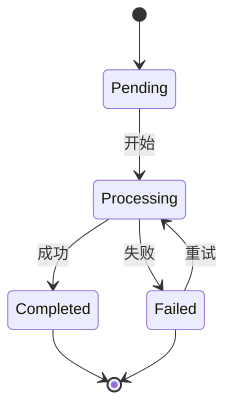

# 工作流参考

本页说明 JSON 定义、执行状态、重试和 API 取消操作。触发时机与文件传递见[工作流指南](../concepts/pipeline.md)。

## 步骤 {#步骤}

每个步骤选择以下定义形式之一。`remux`、`thumbnail`、`rclone` 等具体处理器见[处理器参考](./processors.md)。

| 步骤类型 | 说明 |
|---------|------|
| `preset` | 运行名称与之完全一致的任务预设中的一个步骤。若没有任何预设与之同名，该名称会被当作处理器 ID 处理，因此 `{"type": "preset", "name": "thumbnail"}` 仍会以默认配置运行 `thumbnail` 处理器。 |
| `workflow` | 将名称与之完全一致的管道预设展开为子 DAG。若没有任何管道预设与之同名，整个管道会失败。 |
| `inline` | 使用 DAG 中内嵌的配置运行处理器 |

## DAG 定义 {#dag-定义}

```json
{
  "name": "Post-Process",
  "steps": [
    {
      "id": "remux",
      "step": {"type": "preset", "name": "remux"},
      "depends_on": []
    },
    {
      "id": "thumbnail",
      "step": {"type": "preset", "name": "thumbnail"},
      "depends_on": ["remux"]
    },
    {
      "id": "upload",
      "step": {"type": "preset", "name": "upload"},
      "depends_on": ["remux", "thumbnail"]
    },
    {
      "id": "cleanup",
      "step": {"type": "preset", "name": "delete_source"},
      "depends_on": ["upload"]
    }
  ]
}
```

步骤也可以直接使用内联处理器，而不是引用任务预设：

```json
{
  "id": "thumbnail",
  "step": {
    "type": "inline",
    "processor": "thumbnail",
    "config": {
      "timestamp_secs": 10,
      "width": 640,
      "quality": 2
    }
  },
  "depends_on": ["remux"]
}
```

## 执行状态 {#执行状态}



## 按步骤设置重试与超时 {#按步骤设置重试与超时}

工作流步骤可以在定义中带上自己的重试预算和超时：

```json
{
  "id": "upload",
  "step": {"type": "preset", "name": "upload"},
  "depends_on": ["remux"],
  "retry": {"max_attempts": 3, "backoff_secs": 60},
  "timeout_secs": 7200
}
```

- `retry.max_attempts` 包含首次运行，因此 `3` 表示最多自动重试两次；`1` 或不设置 `retry` 表示不重试。`retry.backoff_secs`（默认 60）是第二次尝试前的等待时间，之后每次翻倍，最长六小时。
- `timeout_secs` 限制该步骤任务单次尝试的时长，替代 Worker 池对它的默认超时。

某次尝试失败或超时且仍有剩余次数时，任务显示为失败，错误信息和 `retry_after` 会给出下一次尝试的时间；步骤继续等待，工作流保持进行中，下游步骤不会被取消。重试在到期后约十五秒内开始，重启后同样如此。处理器根本无法接受其输入的任务不会重试。次数用完后，失败会按上文所述影响工作流，手动重试仍然可用。取消工作流会放弃待执行的重试。工作流编辑器的步骤对话框在**重试与超时**下提供这两项设置。

## 取消运行中的管道 {#取消运行中的管道}

`DELETE /api/pipeline/{pipeline_id}` 用于取消管道。当该 ID 指向一次 DAG 执行时，整个 DAG 都会被停下：进行中的步骤任务被取消，DAG 本身也会进入已取消的终态，而不是停留在处理中——因此等待它的会话不会一直等下去，管道也不会在重启后又变回进行中。

已取消的 DAG 之后可以重试。重试会重新运行处于失败或已取消状态的步骤，已完成的步骤不会重复执行。

该请求是幂等的：无论 ID 未匹配到任何管道，还是对应的 DAG 已处于终态，都会返回 `cancelled_count: 0` 而不是报错。
